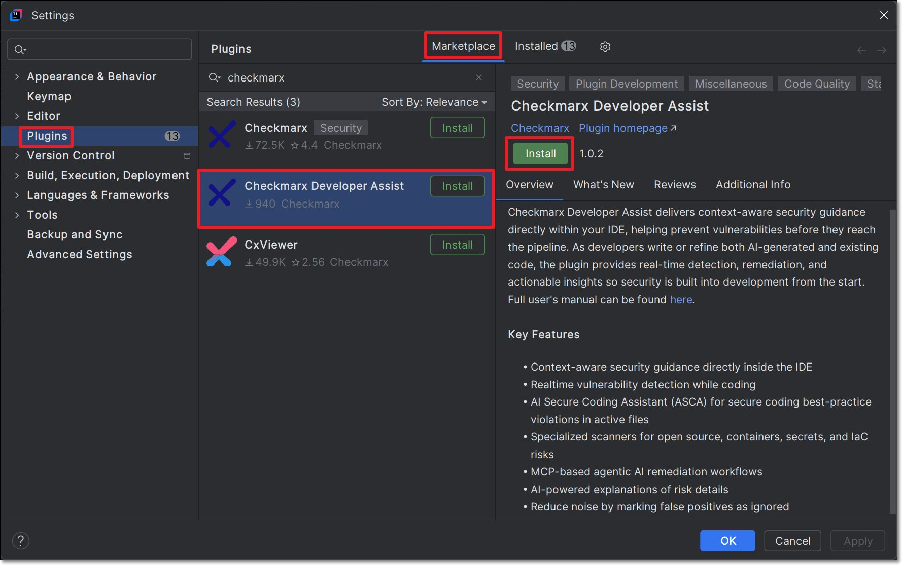
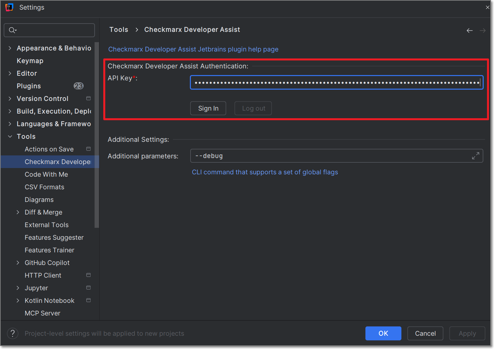
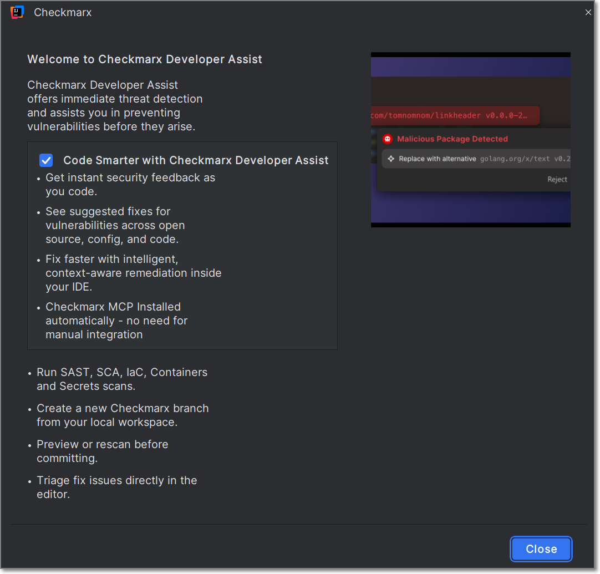

# Installation and Initial Setup


The **Checkmarx Developer Assist** JetBrains plugin provides Developer Assist capabilities as a standalone experience. **Checkmarx One** customers with a Checkmarx One Assist license should use the [Checkmarx JetBrains Plugin](https://checkmarx.com), where Developer Assist is included as part of the Checkmarx One platform. The **Checkmarx Developer Assist** and **Checkmarx** JetBrains plugins are mutually exclusive. To use the Checkmarx Developer Assist plugin, ensure that the Checkmarx plugin is uninstalled before installation.


## Prerequisites

- You have a Checkmarx Developer Activation Key
- You are running IntelliJ version 2022.2+
- You must have **GitHub Copilot Chat** (AI Agent) version 1.5.62-243+ installed

## Installing and Configuring the Plugin

The Checkmarx Developer Assist JetBrains Plugin is available on the JetBrains marketplace and can be installed directly from your JetBrains IDE console.

**To install the plugin from the marketplace:**

1. Open your JetBrains IDE console (e.g., IntelliJ IDEA).
2. Go to **Plugins** and click on the **Marketplace** tab.
3. Search for the **Checkmarx Developer Assist** plugin, then click **Install** for that plugin.

   

**To configure the plugin:**

1. Open the IDE **settings**.
2. Drill down to **tools** > **Checkmarx Developer Assist**.
3. Enter your activation key in the **Developer Assist API Key** field and click **Sign in**.

   

4. A Checkmarx Developer Assist welcome page is displayed immediately after a successful login. Close the window to proceed.

   

5. You can optionally add **Additional Params** to set up custom configurations, such as proxy servers or to run in debug mode.
6. Click on **Go to Realtime Scanners** and select **Install MCP**.

   The Checkmarx MCP is added to your `mcp.json` file.

   
   In some cases the MCP is installed automatically when you authenticate with Checkmarx. However, best practice is to click on **Install MCP** so that the MCP file opens and you can ensure that it starts running.
   

7. You can enable/disable specific realtime scanners. By default, all scanners are enabled.
8. For the IaC Realtime scanner, select the **Containers Management Tool** used in your environment. Options are **docker** or **podman**.
   - For **Windows**: Verify that the Container Management Tool selected is installed on your system.
   - For **macOS** and **Linux**: Verify that docker or podman is installed in `/usr/local/bin`. If installed in a different location, create a symbolic link:



1. Check the installation path (in terminal, *not* in IntelliJ): `which docker`
2. Create a symbolic link: `sudo ln -s <PASTE_THE_PATH_HERE> /usr/local/bin/docker`

   *For example:* if `which docker` returned `/opt/homebrew/bin/docker`, run:
   ```
   sudo ln -s /opt/homebrew/bin/docker /usr/local/bin/docker
   ```
3. Pull the required kics images: `docker pull checkmarx/kics:v2.1.29`

   
   The change will not register until you close and restart the IDE.
   



1. Check the installation path (in terminal, *not* in IntelliJ): `which podman`
2. Create a symbolic link: `sudo ln -s <PASTE_THE_PATH_HERE> /usr/local/bin/podman`

   *For example:* if `which podman` returned `/opt/homebrew/bin/podman`, run:
   ```
   sudo ln -s /opt/homebrew/bin/podman /usr/local/bin/podman
   ```
3. Pull the required kics images: `podman pull checkmarx/kics:v2.1.29`

   
   The change will not register until you close and restart the IDE.
   



### Troubleshooting - Manually Configuring the MCP Server

In case the automatic procedure fails, you can manually configure access to the Checkmarx MCP server as follows:

1. If it does not already exist, create an `mcp.json` file at the following location: `${homeDir}\AppData\Local\github-copilot\intellij\mcp.json`
2. Add the "Checkmarx Developer Assist" MCP using the following snippet, replacing **\<Activation\_Key\>** with your Developer Assist Activation Key.

```json
{
   "servers": {
      "Checkmarx Developer Assist": {
         "url": "https://mea.ast.checkmarx.net/api/security-mcp/mcp",
         "headers": {
            "cx-origin": "Jetbrains",
            "Authorization": "<Activation_Key>"
         }
      }
   }
}
```
