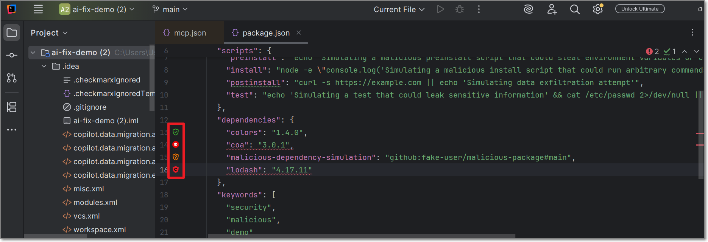
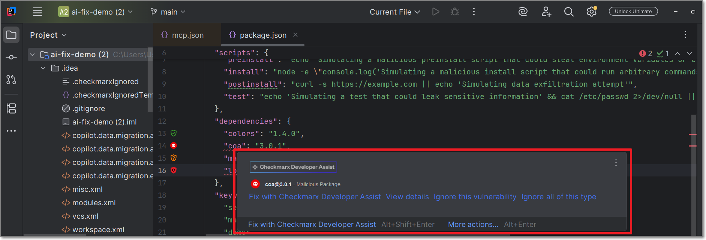
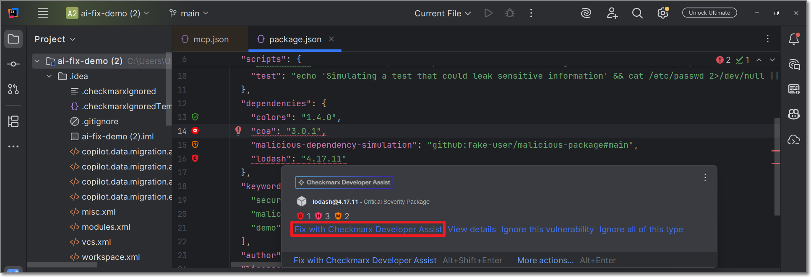
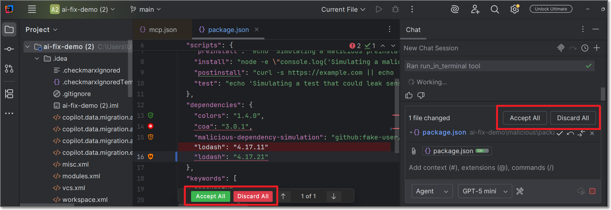
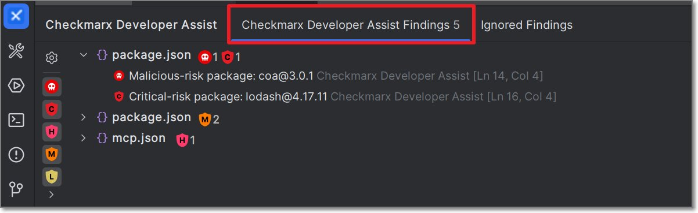
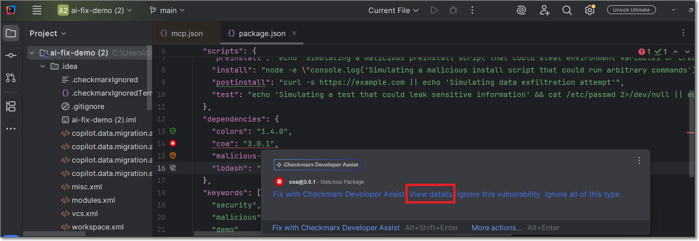
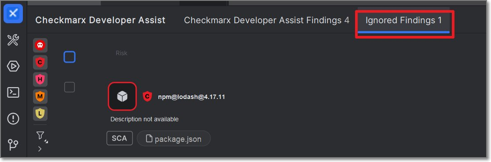

# Using Developer Assist for Detection and Remediation (JetBrains)

## AI Remediation

### How to Remediate Risks Using AI

The following procedure explains how to remediate risks by clicking on the Fix button for a particular risk. Alternatively, you can request remediation via chat with your AI Agent, as described below.

1. Open a project in IntelliJ IDEA.
2. When Checkmarx realtime scanners identify a risk, it is flagged as a **Problem**, which is marked in the code with a squiggly underline and annotated in the margin with an icon that indicates the type of risk.

   

3. Hover over the vulnerable line of code.

   The Checkmarx dialog opens:

   

4. Click on **Fix with Checkmarx Developer Assist**.

   

   A Copilot session opens in the side panel and all relevant info is sent for analysis.

   
   Depending on your IDE configuration, you may need to click **Continue** several times in order to complete the process.
   

5. Copilot automatically makes the necessary changes in the code in order to remediate the risk.

   

   - If you approve the changes, click **Accept All**.
   - If you do not want to implement the suggestion, click **Discard All**.
   - You can also chat with Copilot to improve upon the suggestion.

### Remediation via Chat

You can submit a request for CxOne Dev Assist remediation via natural language chat with your AI Agent. Just say that you want to fix a security risk and indicate which risk or risks you want to fix. Your AI will automatically route the request to the Checkmarx MCP and send all relevant data for analysis. The following are some examples of valid requests:

- "Fix the vulnerability in line 26"
- "Fix all critical vulnerabilities"
- "Fix all SQL Injection risks"
- "Remediate all vulnerable packages"
- "Correct all critical issues in my JavaFile.java"

**Things to Know About Dev Assist Chat**

- No need to mention "Checkmarx" explicitly; once Dev Assist is installed and running, all remediation requests are handled via Checkmarx MCP.
- Support for multi-language prompts.
- Effective in single message context. Improved accuracy in context of an existing thread or finding.
- By default, requests are interpreted in the context of the current open file. You can specify a different file in your workspace.

### The Checkmarx Developer Assist Findings Window

The **Checkmarx Developer Assist Findings Window** provides a centralized view of all detected issues within a project, displaying them in a custom tool window that lists vulnerabilities per file along with the count of issues grouped by severity and file location. It enables users to navigate directly to the exact line in the editor with a single click and supports filtering and sorting capabilities to improve usability and streamline issue review.

To open the **Checkmarx Developer Assist Findings Window**, click on the Checkmarx icon in the left navigation bar and select the Checkmarx Developer Assist Findings tab.

### How to Understand Risks Using AI

1. When Checkmarx realtime scanners identify a risk, it is flagged as a **Problem**, which is marked in the code with a squiggly underline and annotated in the margin with an icon that indicates the type of risk.

   

2. Hover over the vulnerable line of code.

   The Checkmarx dialog opens:

   

3. Click on **View details**.

   

   A Copilot session opens in the side panel and all relevant info is sent for analysis.

   
   Depending on your IDE configuration, you may need to click **Continue** several times in order to complete the process.
   

4. Copilot explains the precise nature of the risk in the context of your code. You can chat with Copilot to ask for further clarification.

### Ignoring Risks

In order to help you focus on actionable risks, Checkmarx Developer Assist enables marking risks as **Ignore**, so that the risks will no longer be shown in your IDE. You can **Revive** a risk at any time to resume showing that risk.


For risks identified in open source packages, a risk instance refers to the entire package that the vulnerability is associated with.


**To ignore a risk:**

1. When Checkmarx realtime scanners identify a risk, it is flagged as a **Problem**.

   

2. Hover over the vulnerable line of code.

   The Checkmarx dialog opens:

   

3. To ignore the risk in this particular instance, click on **Ignore this vulnerability**.
4. To ignore all instances of the risk, click on **Ignore all of this type**.

**To revive a risk:**


This can also be done as a bulk action for all selected items.


1. Click on the **Ignored Findings** tab in the Checkmarx window.

   The Ignored Findings tab opens:

   

2. For the desired vulnerability, click on the **Revive** button.
