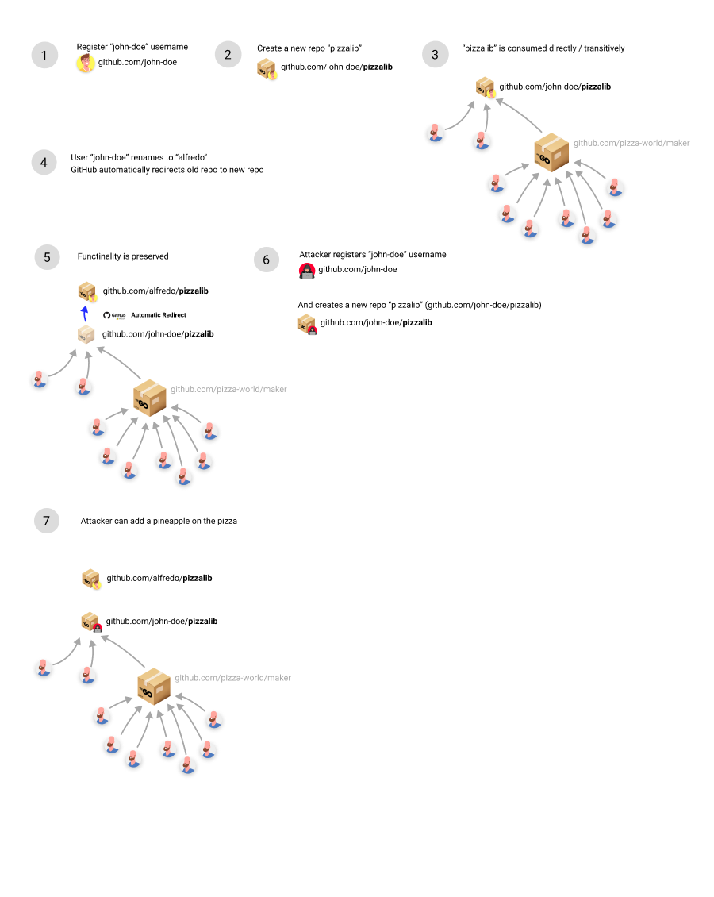

# chainjacking-risks

ChainJacking is when an attacker takes control of a renamed GitHub repository and hijacks its open-source packages in order to serve malicious code through those packages. See diagram [below](chainjacking-risks.md#UUID-e72b4698-078e-b31f-ad45-1ac24f86a42d_id_ChainJackingRisks-ChainJackingDiagram).

Package managers often allow users to consume code directly from version control systems such as GitHub. In fact, several package managers rely on this practice as their primary way of serving code. Hence, an attacker who gains control over a vulnerable GitHub repository can infect the relevant open-source packages. Any package that stores its code in a renamed GitHub repository is vulnerable to this type of attack.

The Checkmarx SCA scanner identifies packages that are vulnerable to ChainJacking. Checkmarx flags these packages as having a Suspected Malware risk and labels the category as ChainJacking.

### ChainJacking Diagram

<figure><figcaption></figcaption></figure>

