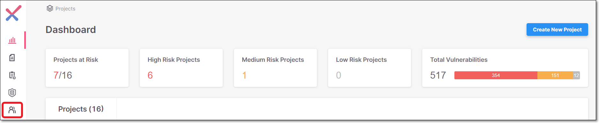
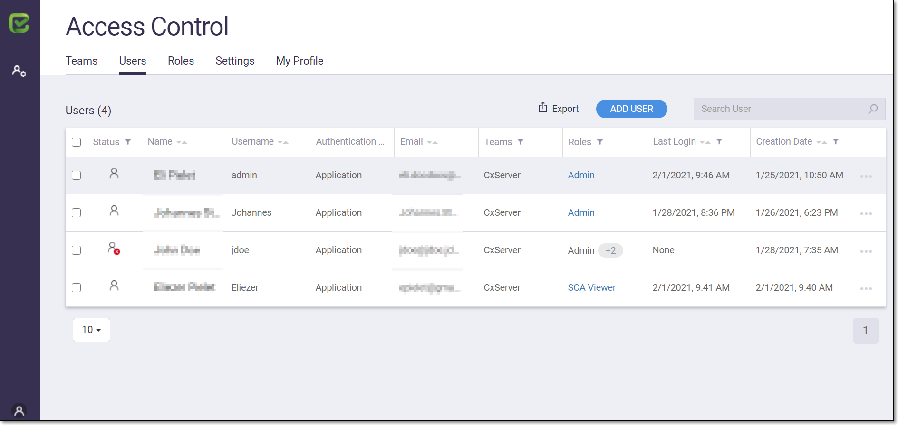

# Access Control Screen Elements

The **Access Control** screen can be accessed by clicking on the User Management icon in the main navigation.

<figure><figcaption></figcaption></figure>

The **Access Control** screen opens in a new browser tab. The Access Control screen enables users to edit their own account profiles. In addition, admin users can manage access control for the entire organization, including creating and editing users, roles and Teams.

<figure><figcaption></figcaption></figure>

The Access Control screen contains the following tabs:

* Teams - Admin users can view and manage all Teams and sub-Teams within the organization. They can also create new Teams. See [Teams](teams.md)
* Users - Admin users can view and manage all user accounts within the organization. They can also create new users. See [User Accounts](user-accounts.md)
* Roles - Admin users can view and modify all roles with the Organization. They can also create new roles. See [Roles](roles.md)
* Settings - Access Control Admin users or Access Control Managers can set up [Master Access Control](using-master-access-control-replica-mode.md) integration or SSO (SAML) integration.
* My Profile - Shows details about the current user. Users can edit these details. See [Managing My Profile](managing-my-profile.md)
