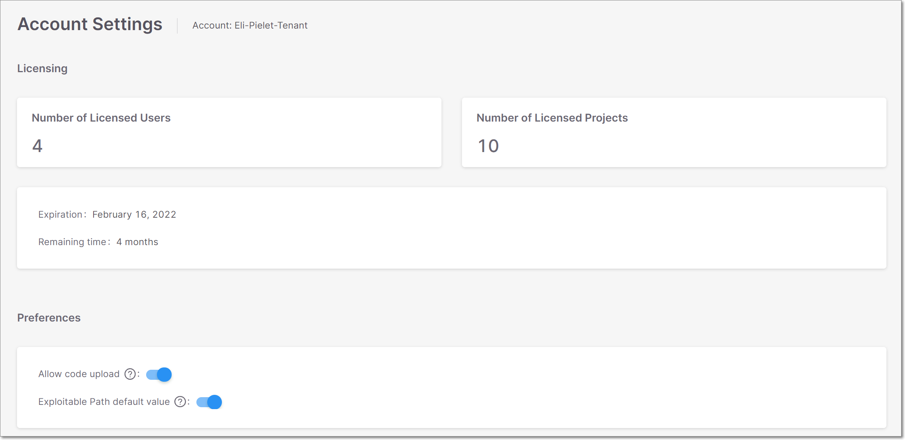

# Configuring Account Settings

## Overview

The Account Settings enables you to view your account’s license info as well to configure the global settings for your account.

To open the Account Settings page, click on the Account Settings icon , located at the bottom left of the screen, in the Navigation pane.

<figure><figcaption></figcaption></figure>

## Licensing

This section shows the following info about the license for your tenant account.

* Number of Licensed Users - the max. number of user accounts that can be created in this tenant account.
* Number of Licensed Projects - the max. number of Projects that can be created in this tenant account.
* Expiration - When this tenant account will expire. Starting from 30 days before the license expiration date, a notification is presented to the user displaying the number of days left until the account expires.


After the license expires, only viewing is allowed in the web application, all editing actions will be blocked. Also, any API requests that require more than viewing permissions will be rejected.


## Preferences

Configure the global settings, which affect the entire tenant account. Only an “Admin” user can change these settings.

### Disable Code Upload

There are several methods for running Checkmarx SCA scans. Some methods enable you to analyze the source code on-prem and send only the extracted evidence files and the manifest files to the cloud. Other methods involve uploading the source code itself to the cloud for processing. If your organization’s security policies require all source code to stay on-prem, you can disable the code upload option, in order to ensure that only on-prem scanning methods are used.


The Allow code upload toggle is only available for users with the SCA Admin role.


When code upload is disabled, users aren’t be able to run scans directly from the Checkmarx SCA web portal. Scans can be triggered via the Checkmarx SCA Resolver or using our plugins (CLI tool, Jenkins etc.). To learn more about which processes are done on-prem and which are done in the cloud, see [Understanding How Checkmarx SCA Scans Run Using Various Methods](https://app.gitbook.com/s/XSPACE_PRODUCT_INFO/understanding-how-checkmarx-sca-scans-run-using-various-methods).


When code upload is disabled, scans that are run via the CLI tool or other plugins must not use the `-includesource` flag.


To disable code upload:

1. In the Checkmarx SCA web portal, go to Account Settings.
2. Disable the Allow code upload toggle.

### Exploitable Path

Exploitable Path is a Checkmarx SCA feature that analyzes whether your source code provides a path that can be exploited by a specific vulnerability. For more information see [Exploitable Path](exploitable-path.md).

To activate this feature by default for all new Projects that are created in this tenant account, toggle the Enable Exploitable Path switch to the right.


Activating this feature does not activate Exploitable Path for Projects that were created prior to the activation. If you would like to activate Exploitable Path for an existing Project, you can do so in the Project Settings for that Project.



Enabling this feature may increase scan time.

