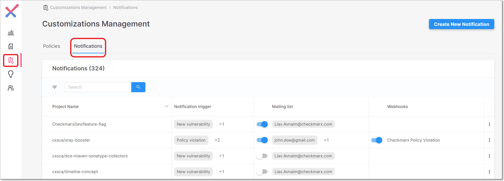
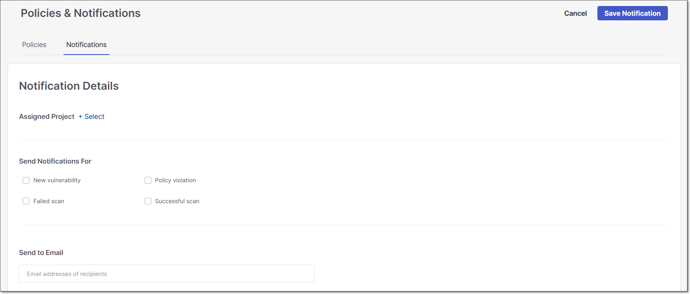

# Notifications

Checkmarx SCA enables you to configure automatically generated Notifications to be sent to the designated recipients when important events occur in your account. Notifications are sent to designated email recipients.

There is a one-to-one relationship between notifications and projects. Meaning that each notification has a single project assigned to it, and each project can only be assigned to a single notification.

You can configure notifications for the following event types.

*   New vulnerability - a new vulnerability was identified in a package that is used in the project.

    

If you re-scan the affected project after the new vulnerability was identified but before the notifications are sent out, then you won't receive a notification.

* Policy violation - a scan of the project identified violations of the security policies that are assigned to the project.
* Successful scan - the project was scanned successfully.
* Failed scan - an attempted scan of the project failed.

By default, for each new project created in SCA a notification is configured to send New vulnerability and Policy violation notifications to the email of the user who created the project. You can edit or delete the notification configuration as described below.

You can change the default behavior by editing the Baseline Notification (Global). In the Baseline Notification configuration you can specify the event types that will trigger notifications as well as the email recipients. These settings will then be applied by default to all new projects that are created in the account.

The Notifications screen is accessed by clicking on Policies & Notifications in the main navigation, and then selecting the Notifications tab.

<figure><figcaption></figcaption></figure>

## Viewing Notifications

The Notifications tab shows detailed information about the Notifications that are currently configured in your account. The Notifications table header bar includes the number of Notifications in your account. You can search for Notifications by the **Project Name** of the assigned project.

* Click on a specific row to open the Notification Details screen for editing.
* Click on the on the right side of a row to show options to Edit or Delete the Notification.

The following table describes the info shown in the Notifications table and the actions that can be taken.

| Item                 | Description                                                                                                                                                                                                                                                                                                                                                                                                                            |
| -------------------- | -------------------------------------------------------------------------------------------------------------------------------------------------------------------------------------------------------------------------------------------------------------------------------------------------------------------------------------------------------------------------------------------------------------------------------------- |
| Project Name         | 
The name of the project that is assigned to this Notification. <strong>Tip</strong> Only one project can be assigned to a particular Notification. <strong>Tip</strong> There is a special notification called Baseline Notifications (with the Global label) which doesn't relate to a specific project. Rather, it establishes that baseline notification configuration that is applied by default to all new projects.
 |
| Notification trigger | The event/s that trigger this notification.                                                                                                                                                                                                                                                                                                                                                                                            |
| Mailing List         | 
Shows emails of notification recipients. Toggle on/off to activate/deactivate email notifications.
                                                                                                                                                                                                                                                                                                                           |
| Webhooks             | NOT SUPPORTED                                                                                                                                                                                                                                                                                                                                                                                                                          |

## Creating a New Notification

You can create a new Notification, and configure which events will trigger the notification and how the notifications will be distributed.


For each project, you can only set up one Notification configuration. If a Notification already exists for this project, then you will need to edit the existing Notification or delete it and then create a new one.


To Create a new Notification:

1.  On the Notifications screen, click Create New Notification.

    The Notification Details form opens.

    
<figure><figcaption></figcaption></figure>

2.  Next to Assigned Project, click +Select and select the radio button next to the desired project. Then, click the Assign Project button at the bottom of the sidebar.

    

Only projects for which Notifications are not yet configured can be selected.

3. Under Send Notifications For, select the checkbox for each type of event for which you want notifications to be sent. Options are: New vulnerability, Policy violation, Failed scan, and Successful scan.
4. Under Send to Email, enter the email address of each desired recipient.
5. Click Save Notification.

## Sending Notifications to a Microsoft Teams Channel

You can send notifications to a Microsoft Teams channel by specifying the channel email address (e.g., abc1234.yourcompany.onmicrosoft.com@emea.teams.ms) in the Send to Email field. In order to ensure that the notifications are received, you need to add "noreply@checkmarx.com" as a member of the relevant channel.

## Editing and Deleting Notifications

You can edit or delete existing Notification configurations.


As long as project is assigned to a Notification (e.g., the default Notification), you can't assign it to an additional Notification. Rather you must either edit the original Notification or delete it and create a new one.


To edit a Notification:

1. Go to the Customization Management > Notifications tab and search for the desired Notification by Project Name.
2.  Click on the desired row or click on more options > Edit.

    The Notification Details form opens.
3. Adjust the configuration as needed.
4. Click Save Notification.

To delete a Notification:

1. Go to the Customization Management > Notifications tab and search for the desired Notification by Project Name.
2.  In the desired row, click on more options > Delete.

    A confirmation dialog is shown.
3. In the confirmation dialog, click Delete.
