# Project Page Tabs

<div align="left"><figure>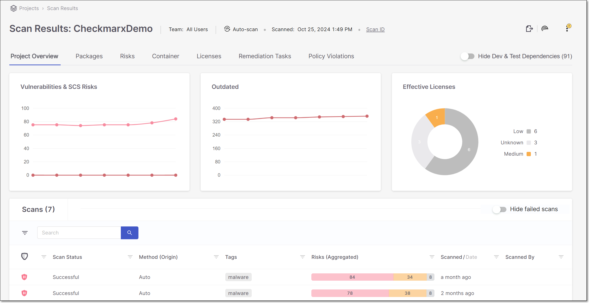<figcaption></figcaption></figure></div>

The following sections describe the info shown in each of the tabs on the Project page.

## Project Overview

The Overview tab shows the overall status of the Project. The page contains the following sections.

* Overview Widgets - these widgets show key info about the Project in a graphical format.
* Scans - shows a list of all scans of the Project. For each scan of the project it shows the risk level, status, scan method, vulnerabilities, when it was scanned, and by whom.

<div align="left"><figure>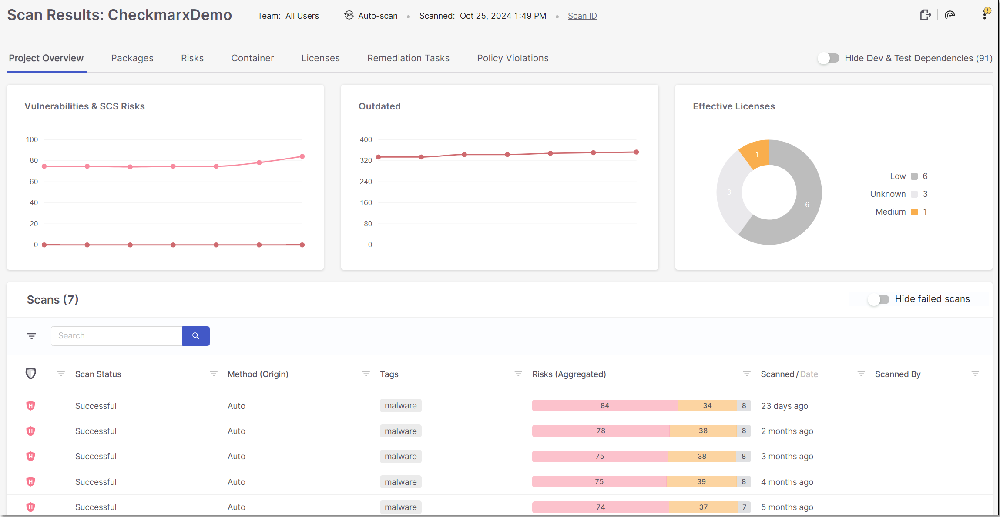<figcaption></figcaption></figure></div>

### Project Overview Widgets

The following table describes the info shown in the Overview widgets.

| Item                        | Description                                                                                                                                                                                                                                                                                                                                                    | Possible Values                                                                            |
| --------------------------- | -------------------------------------------------------------------------------------------------------------------------------------------------------------------------------------------------------------------------------------------------------------------------------------------------------------------------------------------------------------- | ------------------------------------------------------------------------------------------ |
| Vulnerabilities & SCS Risks | A line graph showing the number of vulnerabilities and scs risks over time according to severity. Each point on the graph represents a different scan of the project. Hover over a point to see the exact number of vulnerabilities.                                                                                                                           | <p>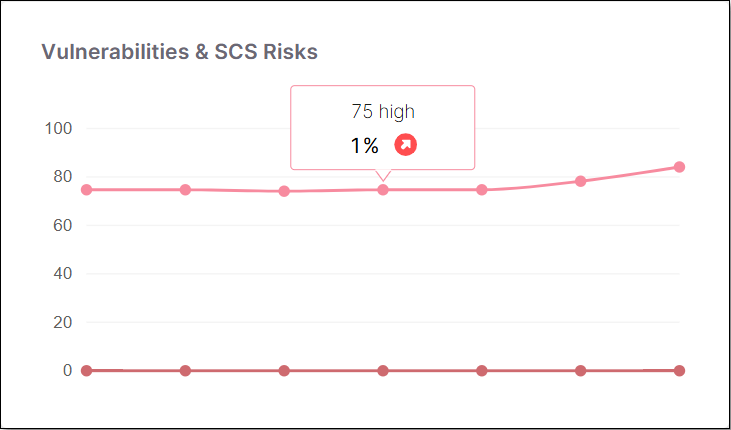<br>-</p> |
| Outdated                    | A line graph showing the number of outdated packages in the Project over time. Each point on the graph represents a different scan of the Project. Hover over a point to see the exact number of outdated packages.                                                                                                                                            | <p>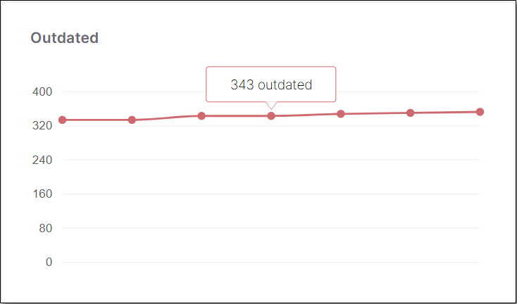<br>-</p> |
| Effective Licenses          | A color coded graph indicating the number of distinct legal risks of each severity level. Hover over the graph or the key to show a breakdown of license names within each Legal Risk level. Click on the graph or the key to open the Packages tab of the Scan Results page, filtered by the Legal Risk level you clicked on (high, medium, low, or unknown). | <p>-<br>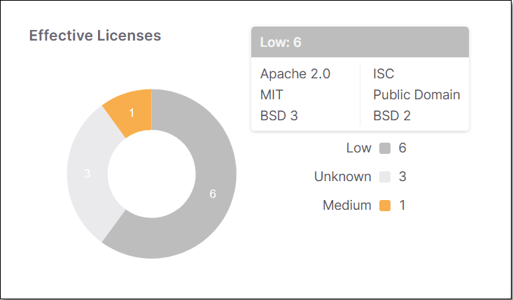</p> |

### Scans

This section shows a list of all scans that were run on the Project. Each record shows general info about the scan as well as overall results for the scan. You can filter the results by entering a specific value for **Scan Method** or **Scanned By** in the search box. You can also sort by column headers and set filters for each column.

You can click on a specific scan to show data for that scan. If you clicked on any scan other than the most recent scan, a message in the header bar indicates that a **Newer Report is Available.** Click on this message to open the most recent Risk Report for the Project.


This screen only shows data for 30-50 of the most recent scans (depending on number and timing of failed scans). Data for earlier scans is still stored in the system and can be retrieved via API.


<div align="left"><figure>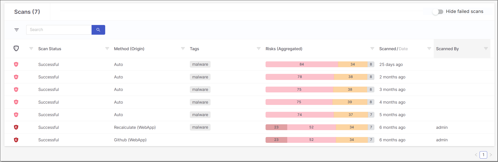<figcaption></figcaption></figure></div>

<table data-header-hidden><thead><tr><th></th><th></th><th></th></tr></thead><tbody><tr><td><strong>Item</strong></td><td><strong>Description</strong></td><td><strong>Possible Values</strong></td></tr><tr><td><strong>Risk Level</strong></td><td>The severity level of the highest vulnerability existing in the package, based on its CVSS score in the NVD.</td><td><ul><li><strong>HIGH</strong></li><li><strong>MEDIUM</strong></li><li><strong>LOW</strong></li><li><strong>NO RISK</strong> (light grey)</li></ul><p>For more info see <a href="https://app.gitbook.com/s/XSPACE_PRODUCT_INFO/severity-levels">Severity Levels</a>.</p></td></tr><tr><td><strong>Scan Status</strong></td><td>The current status of the scan.</td><td><em>Scanning</em>, <em>Successful</em>, <em>Failed</em></td></tr><tr><td><strong>Method (Origin)</strong></td><td>The method that was used to scan the project.</td><td><ul><li><strong>Zip</strong> – zip file, specified in the Project configuration</li><li><strong>CLI</strong> – the scan was run from the Command Line Interface</li><li><strong>Recalculated</strong> - user clicked the <strong>Recalculate</strong> button for an existing scan. This causes the Risks to be recalculated based on current data without re-scanning the project. See <a href="../../document/preview/202168/#UUID-e285b9ca-3c74-ce89-4af7-cedd9802298f">Recalculating SCA Scan Results</a></li><li><strong>Auto-scan</strong> - a scan recalculation was triggered automatically because new vulnerabilities were identified in your packages.</li><li><strong>Github</strong> - GitHub repository, specified in the Project configuration</li><li><strong>Jenkins Plugin</strong> – the scan was run as part of Jenkins CI/CD process</li></ul></td></tr><tr><td><strong>Tags</strong></td><td>The tags assigned to the scan.</td><td>e.g., Dev</td></tr><tr><td><strong>Risks (Aggregated)</strong></td><td>A color coded bar graph indicating the number of risks of each severity level.</td><td><p>e.g.,</p><p>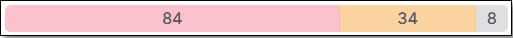</p></td></tr><tr><td><strong>Scanned/Date</strong></td><td>The relative time or complete date that the last scan was performed on your project. Toggle between relative time and date by clicking <strong>Scanned</strong> or <strong>Date</strong> in the column header.</td><td><p>e.g., 19 days ago</p><p>e.g., Jan 28, 2021 11:22 AM</p></td></tr><tr><td><strong>Scanned By</strong></td><td>The user who initiated the scan.</td><td>e.g., admin</td></tr><tr><td colspan="3"><strong>Action Buttons</strong></td></tr><tr><td><strong>Hide failed scans toggle</strong></td><td>In the Header Bar there is a <strong>Hide failed scans</strong> switch that enables you to hide the scans that failed when scanning. Toggle this switch (to the right) in order to hide the failed scans.</td><td>-</td></tr></tbody></table>

## Packages Tab

The Packages tab shows detailed info about the packages that were identified in your source code and the vulnerabilities that they contain.

<div align="left"><figure>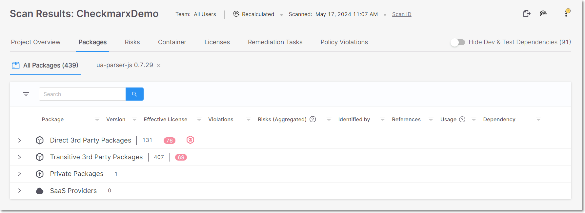<figcaption></figcaption></figure></div>

The Packages tab contains sub-tabs that show two types of pages:

* All Packages – shows a list of all packages that contain vulnerabilities that were identified by this scan. This tab is accessed by clicking on the Scan Results button on the Project page. The results in this table are divided into the following categories:
  * Direct 3rd Party Packages - Shows all 3rd party packages called directly by your source code.
  * Transitive 3rd Party Packages - Shows all 3rd party packages called indirectly by your project.
  *   Private Packages - Shows all private packages identified in your project.

      <div data-gb-custom-block data-tag="hint" data-style="info" data-icon="pencil" class="hint hint-info"><p>A “private package” is a package or library developed in-house that is being used across the organization. For example, a logging library that was developed in-house and is used by several different projects. These packages are only visible to the specific collaborators/teams that were granted access.</p></div>
  * SaaS Providers - Shows all packages used for accessing SaaS services.


Alternatively, you can access this page by clicking on Latest Scan Results in the more options menu in the project's row on the Dashboard). In addition whenever you navigate to the Scan Results page, the All Packages sub-tab is shown under the Packages tab.


* Package Details – shows detailed info about a specific package. Click on a row in the All Packages sub-tab or in the Project page to access this page.


Alternatively, you can access this page by clicking on a package in the Global Inventory & Risks > Packages page.


You can navigate between the various tabs that you have opened.

### All Packages Page

The All Packages sub-tab shows separate tabs for the different types of packages (Direct 3rd Party Packages, Transitive 3rd Party Packages, Private Packages, and Saas Providers). Each tab shows the overall number of packages of this type as well as the number of policy violations for that category.


For a package that is referenced both directly and transitively, the total number of packages shown at the top of the All Packages tab counts that package only once. Therefore, the total number of packages may be fewer than the total of the Direct packages plus the number of Transitive packages.


Clicking on a category heading expands that section, to show a list of packages of that type that were identified by this scan of your Project. For each package, info is shown about the risks related to that package. You can search for specific packages using the search box.

You can also sort by column headers and set filters for each column.

<div align="left"><figure>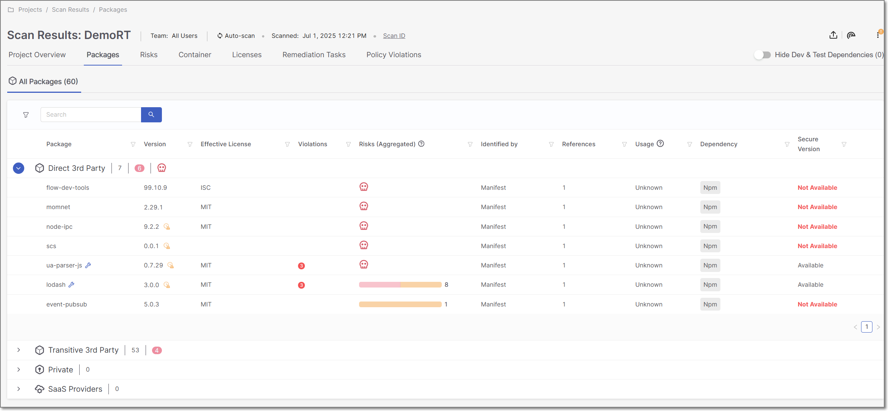<figcaption></figcaption></figure></div>

The following table describes the info shown for each package identified by this scan.

| Item                                                           | Description                                                                                                                                                                                                                                                                                                                                                                                                                                                                                                                                                                                                                                                                                                                               | Possible Values                                                                                                                                                                                                                                                                                                                                                                                                                                                                                                                                                                                                                                                                                                                                                                                                                                                             |
| -------------------------------------------------------------- | ----------------------------------------------------------------------------------------------------------------------------------------------------------------------------------------------------------------------------------------------------------------------------------------------------------------------------------------------------------------------------------------------------------------------------------------------------------------------------------------------------------------------------------------------------------------------------------------------------------------------------------------------------------------------------------------------------------------------------------------- | --------------------------------------------------------------------------------------------------------------------------------------------------------------------------------------------------------------------------------------------------------------------------------------------------------------------------------------------------------------------------------------------------------------------------------------------------------------------------------------------------------------------------------------------------------------------------------------------------------------------------------------------------------------------------------------------------------------------------------------------------------------------------------------------------------------------------------------------------------------------------- |
| Package                                                        | <p>The name of the package.<br>This column also shows the  icon for direct dependencies if a remediated package version exists.<br>Clicking on the icon takes you to that item in the <a href="project-page-tabs.md#UUID-4838541d-dfbc-58bb-cef1-5e9c58de543c">Remediation Tasks Tab</a>.</p>                                                                                                                                                                                                                                                                                                                                                               | e.g., dom4j:dom4j                                                                                                                                                                                                                                                                                                                                                                                                                                                                                                                                                                                                                                                                                                                                                                                           |
| Version                                                        | <p>The version of the package that you are using.<br>This column also shows the  icon for packages that are outdated (i.e., a newer version is available).<br>Hover over the icon to view additional info about more recent versions.</p>                                                                                                                                                                                                                                                                                                                                                                                                                   | e.g., 1.6.1                                                                                                                                                                                                                                                                                                                                                                                                                                                                                                                                                                                                                                                                                                                                                                                                 |
| Effective License                                              | Shows all licenses that are associated with this package. For multiple licenses, hover over the display to show all licenses and the associated legal risks.                                                                                                                                                                                                                                                                                                                                                                                                                                                                                                                                                                              | e.g., GPL 2.0, Apache2.1                                                                                                                                                                                                                                                                                                                                                                                                                                                                                                                                                                                                                                                                                                                                                                                                                                                    |
| Violations                                                     | If the package contains risks that violate one or more security policies that apply to the project in which the package was identified, the number of policy violations is shown in red, see [Policy Management](policy-management.md).                                                                                                                                                                                                                                                                                                                                                                                                                                                                                                   | e.g.,                                                                                                                                                                                                                                                                                                                                                                                                                                                                                                                                                                                                                                                                                                                                                                                                       |
| Risks (Aggregated)                                             | <p>A color coded bar graph indicating the number of vulnerabilities of each severity level. Hover over the bar to view a breakdown of the results by Vulnerability, Legal Risk and Suspected Malware. For a malicious package, the malicious icon  is shown.<br><strong>Tip</strong> You can apply complex filters to show only packages that contain risks of a specific type and of a specific severity.</p>                                                                                                                                                                                                                                              | <p>e.g.,<br></p>                                                                                                                                                                                                                                                                                                                                                                                                                                                                                                                                                                                                                                                                                                                                                                              |
| Identified by                                                  | Indicates how the package was identified.                                                                                                                                                                                                                                                                                                                                                                                                                                                                                                                                                                                                                                                                                                 | <ul><li><strong>Manifest</strong> – identified by resolving the manifest file</li><li><strong>Binary</strong> – identified by analyzing hashes and fingerprints of files in the Project</li></ul>                                                                                                                                                                                                                                                                                                                                                                                                                                                                                                                                                                                                                                                                           |
| References                                                     | <p>Shows the number of paths that reference this package.<br><strong>Tip</strong> Packages that are referenced both directly and transitively, are included in the Direct 3rd Party section and the number of direct (D) and transitive (T) paths are given.</p>                                                                                                                                                                                                                                                                                                                                                                                                                                                                          | e.g., 1D, 12T                                                                                                                                                                                                                                                                                                                                                                                                                                                                                                                                                                                                                                                                                                                                                                                                                                                               |
| <p>Usage<br>(for Projects with Exploitable Path activated)</p> | Indicates whether or not this package is used (called) by your project’s source code.                                                                                                                                                                                                                                                                                                                                                                                                                                                                                                                                                                                                                                                     | <ul><li><strong>Used</strong> – Package is directly used by the source code.</li><li><strong>Potentially</strong> – Package is a dependency of a directly used package.</li><li><strong>Unused</strong> – No usage was detected.</li><li><strong>Unknown</strong> – Usage could not be determined.</li><li><strong>No SAST data</strong> – Relevant SAST results were unavailable.</li><li><strong>Package source code not available</strong> – Package source code was unavailable or could not be analyzed.</li><li><strong>Unsupported language</strong> – Usage analysis is not supported for the package language.</li></ul>                                                                                                                                                                                                                                           |
| Dependency                                                     | Shows labels that Checkmarx applied to the package. There is a label indicating the package manager used for package resolution. Additional labels are applied to special types of dependencies.                                                                                                                                                                                                                                                                                                                                                                                                                                                                                                                                          | <ul><li><strong>Package Manager</strong> - shows the package manager that was used for resolution, e.g., Maven, Pip, Nuget, Npm etc.</li><li><strong>Dev</strong> - is applied to dev dependencies.</li><li><strong>Test</strong> - is applied to all packages that have the word "test" in their file path.</li><li><strong>Verified by NPM</strong> - is applied to packages for which the signatures were verified using <code>npm audit signatures</code>.</li><li><strong>Private Package</strong> - is applied to packages that are hosted on private repositories.</li><li><p><strong>Framework</strong> - is a package that is included in the Framework installation. These packages usually can't be remediated without updating the version of the overall framework.</p><p><strong>Tip</strong></p><p>Currently supported only for .NET projects.</p></li></ul> |
| Suggested Fix                                                  | <p>Provides an at-a-glance indication of upgrade opportunities for each dependency. The column indicates whether a safer package version is available and whether the suggested upgrade fully or partially remediates the associated vulnerabilities.<br>Hover over the Suggested Fix indicator for additional remediation details. For more information, see <a href="../../document/preview/668046/#UUID-e8e89305-536e-1134-95b4-a66f1cccbac4_section-idm33561159681220">Suggested Fix Tooltip</a>.<br>Click See details to open the remediation side panel. For more information, see <a href="../../document/preview/668046/#UUID-e8e89305-536e-1134-95b4-a66f1cccbac4_section-idm33561139493708">Package Details Side Panel</a>.</p> | <ul><li><strong>None</strong> – No vulnerabilities exist, or no better version is available.</li><li><strong>Next</strong> – A safer version is available.</li><li><strong>Latest</strong> – Only the most recent version resolves the issue.</li></ul><p><br>The indicators are color-coded to reflect the effectiveness of the suggested upgrade:<br></p><ul><li><strong>Green</strong> – The suggested version fully resolves all vulnerabilities.</li><li><strong>Purple</strong> – The suggested version improves security but does not fully remediate all vulnerabilities.</li></ul>                                                                                                                                                                                                                                                                                 |
| Explore in AppSec Knowledge Center                             | Click on the icon to learn more about this package in our AppSec Knowledge Center.                                                                                                                                                                                                                                                                                                                                                                                                                                                                                                                                                                                                                                                        |                                                                                                                                                                                                                                                                                                                                                                                                                                                                                                                                                                                                                                                                                                                                                                                                                                                                             |

#### Suggested Fix Tooltip

Hovering over the indicator provides additional context, including the recommended version number and a breakdown of how many vulnerabilities are reduced compared to the current version, segmented by severity level. This allows for quick impact assessment without leaving the view.

<div align="left"><figure>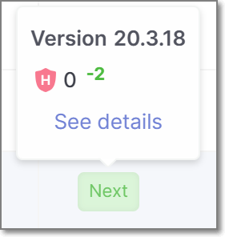<figcaption></figcaption></figure></div>

#### Package Details Side Panel

Clicking See details opens a side panel with deeper remediation insights. This includes the recommended most secure versions, showing both the next version that resolves the issue and the latest available version. A Version Timeline toggle provides visibility into intermediate versions between the current, next, and latest releases. You can also navigate directly to the AppSec Knowledge Center to explore the full package history and all associated vulnerabilities.

<div align="left"><figure>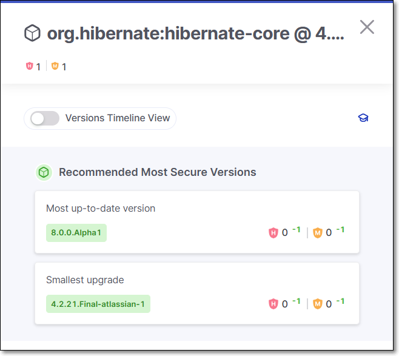<figcaption></figcaption></figure></div>

Hovering over a recommended version in the side panel reveals a Copy Version option, allowing you to quickly copy the version number and paste it directly into your project configuration for faster remediation.

### Package Details Page

The Package Details sub-tab shows detailed info about a specific package. The top info pane gives general info about the package, and the separate cards below it show detailed info about various aspects of the risks posed by the package.

<div align="left"><figure>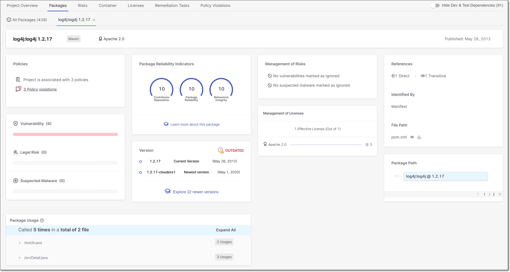<figcaption></figcaption></figure></div>

#### Info Pane

<div align="left"><figure><figcaption></figcaption></figure></div>

| Item                                                                                                      | Description                                                                                                                                                                                                                                                                                                                       |
| --------------------------------------------------------------------------------------------------------- | --------------------------------------------------------------------------------------------------------------------------------------------------------------------------------------------------------------------------------------------------------------------------------------------------------------------------------- |
| Package                                                                                                   | The name and version of the package.                                                                                                                                                                                                                                                                                              |
| <p>Remediation Task<br></p> | <p>The  icon is shown for direct dependencies if a remediated package version exists.<br>Clicking on the icon takes you to that item in the <a href="project-page-tabs.md#UUID-4838541d-dfbc-58bb-cef1-5e9c58de543c">Remediation Tasks Tab</a>.</p> |
| Dependency Type                                                                                           | The type of package manager used for this package.                                                                                                                                                                                                                                                                                |
| License(s)                                                                                                | Shows all licenses that you have that are associated with this package.                                                                                                                                                                                                                                                           |
| Published                                                                                                 | The date that this version of the package was published.                                                                                                                                                                                                                                                                          |

#### Package Details Sections

<div align="left"><figure>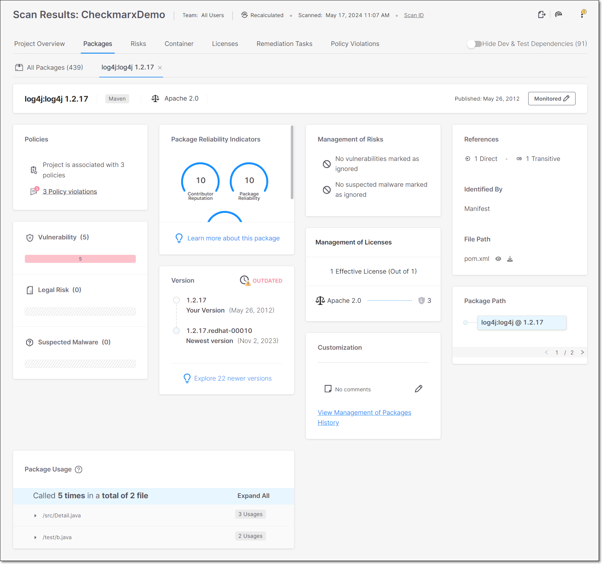<figcaption></figcaption></figure></div>

| Item                                                                   | Description                                                                                                                                                                                                                                                                                                                                                                                                                                                                                                                                                                                                                                                                                                                                          |
| ---------------------------------------------------------------------- | ---------------------------------------------------------------------------------------------------------------------------------------------------------------------------------------------------------------------------------------------------------------------------------------------------------------------------------------------------------------------------------------------------------------------------------------------------------------------------------------------------------------------------------------------------------------------------------------------------------------------------------------------------------------------------------------------------------------------------------------------------- |
| <p>Watch Out!<br>(for malicious packages)</p>                          | This warning card will be displayed if this version of the package is known to be malicious.                                                                                                                                                                                                                                                                                                                                                                                                                                                                                                                                                                                                                                                         |
| Policies                                                               | The total number of policies this project is assigned to, followed by the number of Policy Violations.                                                                                                                                                                                                                                                                                                                                                                                                                                                                                                                                                                                                                                               |
| Vulnerability                                                          | The total number of vulnerabilities in this package, followed by a color coded bar graph indicating the number of vulnerabilities of each severity level.                                                                                                                                                                                                                                                                                                                                                                                                                                                                                                                                                                                            |
| Legal Risk                                                             | The total number of Legal Risks in this package, followed by a color coded bar graph indicating the number of Legal Risks of each severity level.                                                                                                                                                                                                                                                                                                                                                                                                                                                                                                                                                                                                    |
| Suspected Malware                                                      | The total number of Suspected Malware risks affecting this package, followed by a color coded bar graph indicating the number of Suspected Malware risks of each severity level.                                                                                                                                                                                                                                                                                                                                                                                                                                                                                                                                                                     |
| Package Reliability Indicators                                         | Shows gauge widgets representing three risk categories (Reputation, Reliability and Behavior). The scores are given on a scale of 0-10, with 10 indicating the highest level of security.                                                                                                                                                                                                                                                                                                                                                                                                                                                                                                                                                            |
| Version                                                                | Shows the version you are using, the newest version, the number of newer versions released since you last updated and an overall assessment of whether there is a need to update your version.                                                                                                                                                                                                                                                                                                                                                                                                                                                                                                                                                       |
| Learn More About This Package                                          | Shows a link to the AppSec Knowledge Center for more information about this package.                                                                                                                                                                                                                                                                                                                                                                                                                                                                                                                                                                                                                                                                 |
| Management of Risks                                                    | Shows if any vulnerabilities and Suspected Malware risks have been marked as ignored.                                                                                                                                                                                                                                                                                                                                                                                                                                                                                                                                                                                                                                                                |
| Management of Licenses                                                 | <p>Shows the number of Licenses that have been marked as Effective Licenses.<br>In addition, a link is given to view detailed information about this license in the risk details tab.</p>                                                                                                                                                                                                                                                                                                                                                                                                                                                                                                                                                            |
| References                                                             | Shows the number of manifest files that refer to this package and indicates whether it is a direct or transitive dependency.                                                                                                                                                                                                                                                                                                                                                                                                                                                                                                                                                                                                                         |
| Identified By                                                          | <p>Indicates how the vulnerable package was identified. Possible values are:<br></p><ul><li><em>Manifest</em> – identified by resolving the manifest file</li><li><em>Binary</em> – identified by analyzing hashes and fingerprints of files in the Project</li></ul>                                                                                                                                                                                                                                                                                                                                                                                                                                                                                |
| File Path                                                              | The file path to the manifest file where this package was identified is shown. Click on the icons to view or download the file.                                                                                                                                                                                                                                                                                                                                                                                                                                                                                                                                                                                                                      |
| Package Path                                                           | <p>The selected package is displayed in blue. If this is a transitive dependency (i.e., it is accessed via other packages), then the full path by which the package is accessed is shown above it. You can click on any package shown in the path in order to open a new tab showing details for that package. If there are multiple paths to this package, then you can click on the forward and back arrows at the bottom of the pane to view each of the paths.<br><strong>Tip</strong> For packages that were identified by binaries (and not by a manifest file), no data is shown for the package path.<br><strong>Tip</strong> Frequently you can fix the vulnerabilities by updating the transitive packages with their latest versions.</p> |
| <p>Package Usage<br>(for projects with Exploitable Path activated)</p> | Shows the places in your code where the vulnerable package is called. Results are grouped by file path. Expand an item to see the line number and node of each place where the package is called.                                                                                                                                                                                                                                                                                                                                                                                                                                                                                                                                                    |

## Risks Tab

The Risks tab shows info about all of the Risks that are associated with the open source packages used by your project. This includes vulnerabilities (e.g., CVEs), as well as suspected malware risks (e.g., malicious packages), legal risks and outdated packages.

<div align="left"><figure>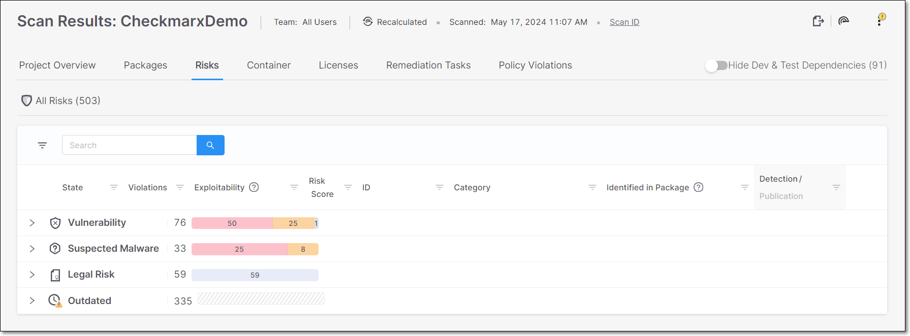<figcaption></figcaption></figure></div>

The Risks tab contains sub-tabs that show two types of pages:

* All Risks – shows a list of all Risks identified by this scan. This tab is accessed by clicking on the Show All button on the Project page and then selecting the Risks tab. The results on the All Risks tabs are divided into the following tabs:
  * Vulnerability - shows a list of vulnerabilities in your open source packages that can be exploited by an attacker. This includes vulnerabilities that have been published as CVEs as well as vulnerabilities identified by the Checkmarx Vulnerability Research Team (i.e., Cx). The summary graph shows the total number of vulnerabilities and a breakdown by severity level.
  * Suspected Malware - shows various types of suspected malware risks that affect the packages in your project, such as packages that are Malicious by design and packages that are vulnerable to ChainJacking attacks etc. The summary graph shows the total number of suspected malware risks and a breakdown by severity level.
  * Legal Risk - shows all of the Legal Risks relating to the licensing of the packages used in your project. The summary graph shows the total number of legal risks and a breakdown by severity level.
  * Outdated - shows a list of all packages that have vulnerabilities or suspected malware risks, for which a more recent package version is available.
*   Risk Details – shows detailed info about a specific Risk. Click on a row in the All Risks tab to access this page.

    <div data-gb-custom-block data-tag="hint" data-style="info" data-icon="pencil" class="hint hint-info"><p>Clicking on a Legal Risk opens the Licenses tab filtered for the relevant license.</p></div>


Alternatively, you can access this page by clicking on a Risk in the Global Inventory & Risks > Risks page.



Clicking on a Legal Risk opens the Licenses tab filtered for the relevant license.

The packages listed in the Outdated section aren’t clickable and don’t have a Risk Details page associated with them.


You can navigate between the various tabs that you have opened.

### All Risks Page

The All Risks sub-tab shows separate tabs for the different types of Risks (Vulnerability, Suspected Malware, Legal Risk and Outdated). Each tab shows the overall number of Risks for this type and the number of Risks for each risk level. Clicking on the arrow on the left of the tab expands a list below it to show all Risks of this type identified by this scan of your Project. For each Risk, info is shown about the nature of the Risk. You can search for specific Risks using the search box.


If a risk affects several packages in your Project, a separate record is listed for each instance of the risk.


You can also sort by column headers and set filters for each column.

<div align="left"><figure>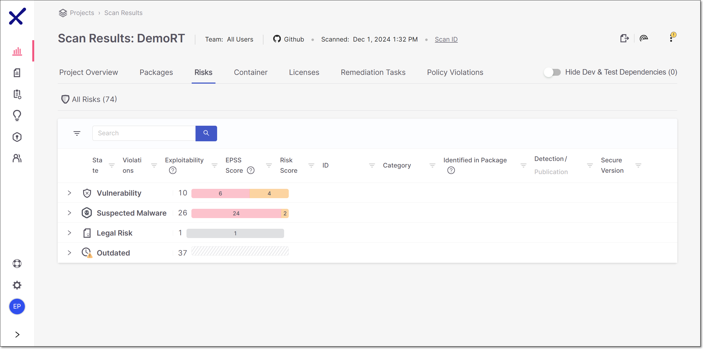<figcaption></figcaption></figure></div>

Clicking on the arrow on the left of the tab expands a list showing all of the risks of that type.


Risks that have been marked as Not Exploitable are shown with a strikethrough line and they aren't counted towards the total number of risks. However, changes to the summary counters only take effect when a subsequent scan or scan recalculation is run.


<div align="left"><figure>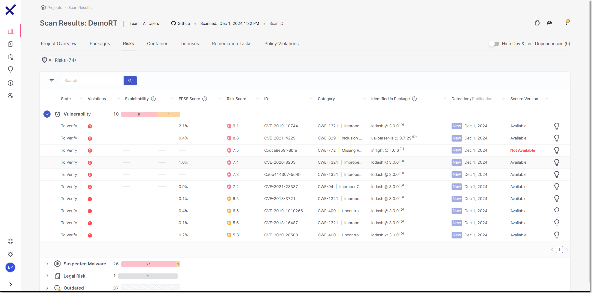<figcaption></figcaption></figure></div>

The following table describes the info shown for each risk identified by this scan.


Not all columns are relevant for each type of risk.


| Item                    | Description                                                                                                                                                                                                                                                                                                                                                                                                                                                     | Possible Values                                                                                                                                                                                                                                                                                                                                                                                                                                                                                                                                                                                                                                                                                                                                                                                                                                                                                                                                                                                                                                                                                                                                                                            |
| ----------------------- | --------------------------------------------------------------------------------------------------------------------------------------------------------------------------------------------------------------------------------------------------------------------------------------------------------------------------------------------------------------------------------------------------------------------------------------------------------------- | ------------------------------------------------------------------------------------------------------------------------------------------------------------------------------------------------------------------------------------------------------------------------------------------------------------------------------------------------------------------------------------------------------------------------------------------------------------------------------------------------------------------------------------------------------------------------------------------------------------------------------------------------------------------------------------------------------------------------------------------------------------------------------------------------------------------------------------------------------------------------------------------------------------------------------------------------------------------------------------------------------------------------------------------------------------------------------------------------------------------------------------------------------------------------------------------ |
| State                   | Indicates the state of this vulnerability for this project.                                                                                                                                                                                                                                                                                                                                                                                                     | <p>For vulnerability or suspected malware risks:<br></p><ul><li><strong>To Verify</strong> - This is the initial state of all vulnerabilities and suspected malware risks, indicating that it is a new finding that hasn’t yet been assessed by your AppSec team.</li><li><strong>Not Exploitable</strong> - Indicates that your team has determined that this risk doesn’t pose a threat to your application (and isn’t expected to cause a risk at any time in the future).</li><li><strong>Proposed Not Exploitable</strong> - Indicates that your team has suggested tentatively that this risk doesn’t pose a threat to your application.</li><li><strong>Confirmed</strong> - Indicates that your team has confirmed that this risk <strong>does</strong> pose a threat and requires mitigation.</li><li><strong>Urgent</strong> -Indicates that your team has determined that this risk poses an imminent threat and requires urgent mitigation.</li></ul><p><br><strong>Tip</strong> When the state is set as Not Exploitable, the risk is marked with a strikethrough line and the Risk Details page is grayed out.<br>Indicates a legal risk that was marked as “effective”.</p> |
| Violations              | Shows the number of violations of security policies that were assigned to this project.                                                                                                                                                                                                                                                                                                                                                                         |                                                                                                                                                                                                                                                                                                                                                                                                                                                                                                                                                                                                                                                                                                                                                                                                                                                                                                                                                                                                                                                                                                                                                                                            |
| Exploitability          | Shows which exploitability indicators apply to this vulnerability.                                                                                                                                                                                                                                                                                                                                                                                              | <ul><li><p><strong>Exploitable Path</strong> - indicates that a path was detected from your source code to the vulnerable method in the package, enabling attackers to exploit the vulnerability.</p><p><strong>Tip</strong></p><p>Results are only returned if Exploitable Path was activated for this project and the project uses a language that is supported for Exploitable Path.</p></li><li><strong>Known</strong> - This vulnerability is cataloged by CISA as a <a href="https://www.cisa.gov/known-exploited-vulnerabilities-catalog">Known Exploited Vulnerability</a> (KEV), indicating that it poses a severe and imminent threat.</li><li><strong>PoC</strong> - A Proof of Concept (POC) for exploiting this vulnerability is available in the wild, making it easy for threat actors to implement an exploitation of this vulnerability. We draw this info from Offensive Security's <a href="https://www.exploit-db.com/">Eploit Database</a>.</li></ul>                                                                                                                                                                                                                 |
| EPSS Score              | The EPSS (Exploit Prediction Scoring System) is a risk score provided by [First](https://first.org), indicating the likelihood of a vulnerability being exploited. The score is presented as a percentage, representing the likelihood of this vulnerability to be exploited within the next 30 days. Hovering over the score will display a percentile indicating the ranking of this risk relative to other vulnerabilities.                                  | e.g., 2.1%                                                                                                                                                                                                                                                                                                                                                                                                                                                                                                                                                                                                                                                                                                                                                                                                                                                                                                                                                                                                                                                                                                                                                                                 |
| Risk Score              | <p>Shows the the severity level of the vulnerability based on its CVSS score in the NVD, as well as the precise CVSS score.<br><strong>Tip</strong> The Common Vulnerability Scoring System (CVSS) is an open framework for communicating the characteristics and severity of software vulnerabilities.</p>                                                                                                                                                     | <ul><li>- this package version is malicious by design.</li><li><strong>HIGH</strong></li><li><strong>MEDIUM</strong></li><li><strong>LOW</strong></li></ul><p><br><strong>Tip</strong> For Legal Risks, risks with UNKNOWN severity are shown in light grey.<br>For more info see <a href="https://app.gitbook.com/s/XSPACE_PRODUCT_INFO/severity-levels">Severity Levels</a>.</p>                                                                                                                                                                                                                                                                                                                                                                                                                                                                                                                                                                                                                                                                                                                                                                                                         |
| ID                      | <p>The ID of the CVE listing. The ID consists of the CVE prefix followed by the year that the CVE was discovered and the serial counter for that year's CVE listings.<br><strong>Tip</strong> Vulnerabilities discovered by the Checkmarx Vulnerability Research Team which are not catalogued as CVEs, are indicated by the “Cx” prefix.</p>                                                                                                                   | e.g., CVE-2020-9488                                                                                                                                                                                                                                                                                                                                                                                                                                                                                                                                                                                                                                                                                                                                                                                                                                                                                                                                                                                                                                                                                                                                                                        |
| Category                | The category of the vulnerability. For CWEs, the CWE is given as well as a brief description of the vulnerability.                                                                                                                                                                                                                                                                                                                                              | e.g., CWE-89\|SQL Injection, Malicious, ChainJacking etc.                                                                                                                                                                                                                                                                                                                                                                                                                                                                                                                                                                                                                                                                                                                                                                                                                                                                                                                                                                                                                                                                                                                                  |
| Identified in Package   | <p>The name and version of the package in which the vulnerability was identified.<br>In addition, an indication is shown for the type of dependency:<br></p><ul><li>D - Direct dependency</li><li>T - Transitive dependency</li><li>M - Mixed dependency (i.e., the package is used in the project both directly and also transitively)</li></ul><p><br>Results can be filtered by dependency type.</p>                                                         | e.g., loadash @ 4.13.1 <sup>(T)</sup>                                                                                                                                                                                                                                                                                                                                                                                                                                                                                                                                                                                                                                                                                                                                                                                                                                                                                                                                                                                                                                                                                                                                                      |
| Detection/Publication   | <p>Click on the desired header to alternate between the detection and publication dates.<br></p><ul><li><strong>Detection</strong> - the date that the risk was first detected in this project. For vulnerabilities that were first identified in this scan, the NEW label is shown next to the date.</li><li><strong>Publication</strong> - the date that this vulnerability was first officially published on a supported public Security Advisory.</li></ul> | e.g., Nov 16, 2020                                                                                                                                                                                                                                                                                                                                                                                                                                                                                                                                                                                                                                                                                                                                                                                                                                                                                                                                                                                                                                                                                                                                                                         |
| Risk Resolution         | <p>Provides an at-a-glance indication of remediation opportunities for a specific vulnerability. The column indicates whether a package version is available that fully or partially remediates the vulnerability.<br><strong>Tip</strong> In the context of the Risks tab, remediation recommendations are vulnerability-specific. Different vulnerabilities within the same package may suggest different upgrade versions.</p>                               | <ul><li><strong>None</strong> – No remediation version is available.</li><li><strong>Next</strong> – the earliest version of the package that solves the risk.</li><li><strong>Latest</strong> – Only the latest version remediates the vulnerability.</li></ul><p><br>The indicators are color-coded to reflect the effectiveness of the suggested upgrade:<br></p><ul><li><strong>Green</strong> – The suggested version fully resolves the vulnerability.</li><li><strong>Purple</strong> –The suggested version reduces the risk but does not fully remediate it.</li></ul>                                                                                                                                                                                                                                                                                                                                                                                                                                                                                                                                                                                                            |
| AppSec Knowledge Center | Click on the icon to learn more about this vulnearbility in our AppSec Knowledge Center.                                                                                                                                                                                                                                                                                                                                                                        |                                                                                                                                                                                                                                                                                                                                                                                                                                                                                                                                                                                                                                                                                                                                                                                                                                                                                                                                                                                                                                                                                                                                                                                            |

### Risk Details Page

The Risk Details sub-tab shows detailed info about a specific Risk. The top info pane gives general info about the vulnerability, and the separate cards below it show detailed info about various aspects of the risks posed by the vulnerability.

The different risk types are:

* Vulnerability - a vulnerability that can be exploited by an attacker. This includes vulnerabilities that have been published as CVEs as well as vulnerabilities identified by Checkmarx AppSec experts (i.e., Cx).
* Suspected Malware - shows various types of suspected malware risks that affect the packages in your project, such as packages that are Malicious by design and packages that are vulnerable to ChainJacking attacks.


There are no Risk Details pages associated with Legal Risks or Outdated packages. Clicking on a Legal Risk opens the Licenses tab, filtered for the relevant license. Outdated packages aren’t clickable.


Each type of risk shows different cards on the details page. The different cards are described in the tables below.

<div align="left"><figure>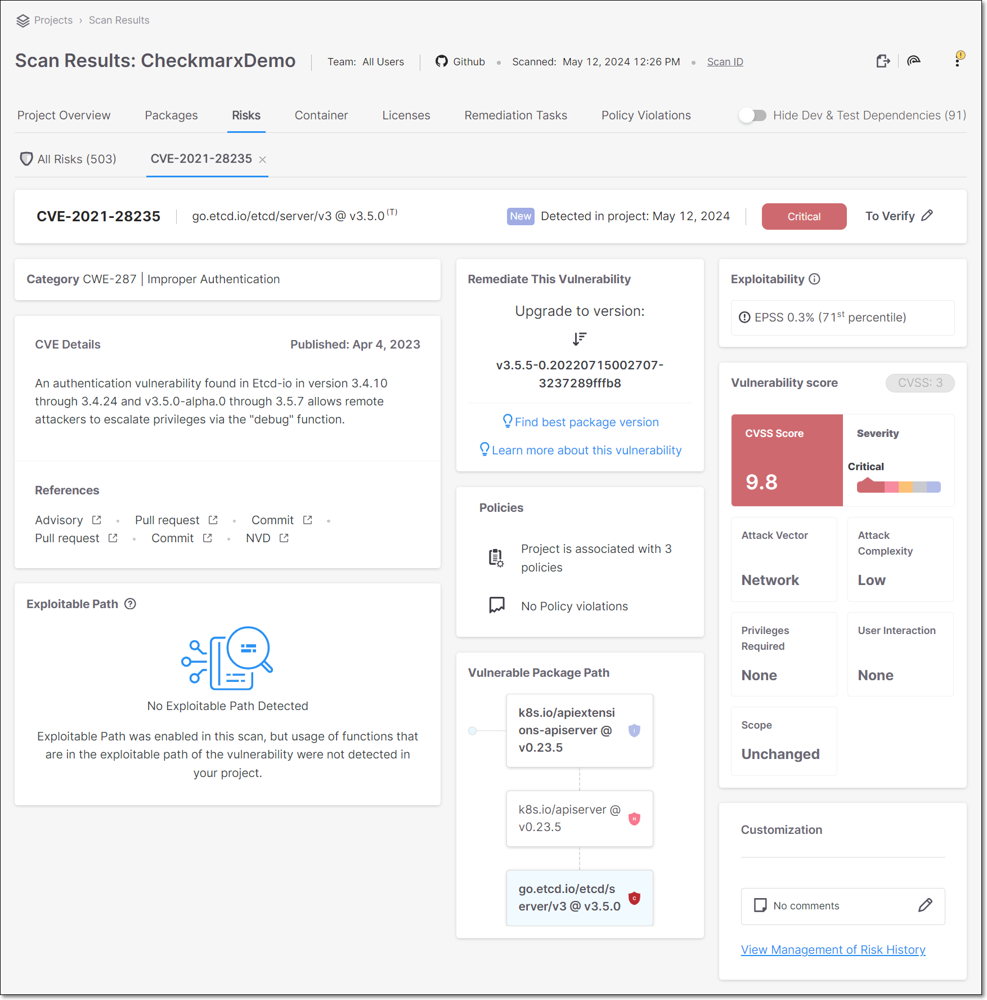<figcaption></figcaption></figure></div>

#### Vulnerability Details

Vulnerabilities are risks that can be exploited by an attacker. This includes vulnerabilities that have been published as CVEs as well as vulnerabilities identified by the Checkmarx Vulnerability Research Team (i.e., Cx).

**Info Pane**

<div align="left"><figure><figcaption></figcaption></figure></div>

| Item                | Description                                                                                                                                                                                                                                                                                                                                                                              | Possible Values                                                                                                                                                                                                                                                                                                        |
| ------------------- | ---------------------------------------------------------------------------------------------------------------------------------------------------------------------------------------------------------------------------------------------------------------------------------------------------------------------------------------------------------------------------------------- | ---------------------------------------------------------------------------------------------------------------------------------------------------------------------------------------------------------------------------------------------------------------------------------------------------------------------- |
| ID                  | <p>The ID of the CVE listing. The ID consists of the CVE prefix followed by the year that the CVE was discovered and the serial counter for that year's CVE listings.<br><strong>Tip</strong> Vulnerabilities discovered by the Checkmarx Vulnerability Research Team which are net yet catalogued as CVEs, are indicated by the “Cx” prefix.</p>                                        | e.g., CVE-2019-12384                                                                                                                                                                                                                                                                                                   |
| Package             | The name of the package in which the vulnerability was identified.                                                                                                                                                                                                                                                                                                                       | e.g., com.fasterxml.jackson.core:jackson-databind 2.9.8                                                                                                                                                                                                                                                                |
| Version             | The version of the package where the vulnerability was identified.                                                                                                                                                                                                                                                                                                                       | e.g., 5.1.26                                                                                                                                                                                                                                                                                                           |
| Exploitability      | Shows which exploitability indicators apply to this vulnerability.                                                                                                                                                                                                                                                                                                                       | <ul><li>KEV</li><li>POC</li><li>Exploitable Path</li></ul>                                                                                                                                                                                                                                                             |
| Detected in Project | The date that the vulnerability was first identified in this project.                                                                                                                                                                                                                                                                                                                    | e.g., May 12, 2024                                                                                                                                                                                                                                                                                                     |
| Rating              | Shows the severity level of the vulnerability based on its CVSS score in the NVD, as well as the precise CVSS score.                                                                                                                                                                                                                                                                     | <ul><li>Critical - 9.0 to 10.0</li><li>High - 7.0 to 8.9</li><li>Medium - 4.0 to 6.9</li><li>Low - 0.1 to 3.9</li><li>Info - 0.0</li></ul><p><br>For more info about SCA risk severity, see <a href="../../document/preview/68521/#UUID-264a00b7-29b2-e358-143d-cd875c858ac0_section-idm234606218084631">here</a>.</p> |
| Risk State          | This indicates the current state of the vulnerability as determined by your AppSec team. All new risks are initially marked as To Verify. A user with `manage-risk` role (e.g., Admin, SCA Manager) can change the Risk state for this Project by clicking on the Risk State field and selecting the radio button for the desired state. See [Risk Management](risk-management-beta.md). | <ul><li>To Verify</li><li>Not Exploitable</li><li>Proposed Not Exploitable</li><li>Confirmed</li><li>Urgent</li></ul><p><br><strong>Tip</strong> When the state is set as Not Exploitable, the page is grayed out and the risk is marked with a strikethrough line on the All Risks tab.</p>                           |

**Vulnerability Details Sections**

<div align="left"><figure><figcaption></figcaption></figure></div>

| Item                         | Description                                                                                                                                                                                                                                                                                                                                                                                                                                                                                                                                            |
| ---------------------------- | ------------------------------------------------------------------------------------------------------------------------------------------------------------------------------------------------------------------------------------------------------------------------------------------------------------------------------------------------------------------------------------------------------------------------------------------------------------------------------------------------------------------------------------------------------ |
| Category                     | The ID and description of the CWE (Common Weakness Enumeration) listing. The ID consists of the CWE prefix followed by the serial counter.                                                                                                                                                                                                                                                                                                                                                                                                             |
| CVE Details                  | A description of the nature of the threat posed by the vulnerability and the date the vulnerabiliity was published in the NVD.                                                                                                                                                                                                                                                                                                                                                                                                                         |
| Exploitable Methods          | Details about the vulnerable methods that expose the vulnerability to exploitation. When the relevant details are available, we show the vulnerable file path, class, and method. This visibility increases transparency into how we evaluate exploitable paths, and provides actionable data for cases where full exploitable path analysis is not possible.                                                                                                                                                                                          |
| References                   | Links to external resources about the vulnerability. Links are given for topics such as: Advisory, Commit, Release Notes, Issue etc.                                                                                                                                                                                                                                                                                                                                                                                                                   |
| Exploitable Path             | If a path was detected from your source code to the vulnerable method in the package, a map of the path is displayed.                                                                                                                                                                                                                                                                                                                                                                                                                                  |
| Remediate this Vulnerability | <p>Recommended steps that should be taken to remediate this vulnerability. If available, a remediated version of the package is recommended for upgrade. Otherwise, the AI Package Finder button is shown that enables you to get AI generated suggestions for non-vulnerable replacement packages.<br><strong>Tip</strong> The recommended package version, is the minimum version that does not contain this particular vulnerability. To find the minimum version that doesn’t contain any vulnerabilities, click on Find best package version.</p> |
| Policies                     | The number of Policies the Project is assigned to and the number of Policy violations.                                                                                                                                                                                                                                                                                                                                                                                                                                                                 |
| Vulnerable Package Path      | <p>The vulnerable package is displayed in blue. If this is a transient dependency (i.e., it is accessed via other packages), then the full path by which the package is accessed is shown above it. You can click on any package shown in the path in order to open a new tab showing details for that package.<br><strong>Tip</strong> Frequently, you can fix the vulnerabilities by updating the transient packages with their latest versions.</p>                                                                                                 |
| Exploitability               | Shows which exploitability indicators apply to this vulnerability. (KEV, POC, EPSS and Exploitable Path)                                                                                                                                                                                                                                                                                                                                                                                                                                               |
| Vulnerability Score          | Shows the CVSS Version, Score, and Severity, as well as the components that make up the CVSS score including: Attack Vector, Confidentiality Impact, Attack Complexity, Integrity Impact, Authentication, and Availability Impact. For a full explanation of the metrics that make up the CVSS score, see [CVSS Score Details](project-page-tabs.md#UUID-07a21b5d-72d7-69da-9320-fc8d5e505317_UUID-cad2fd15-59dd-521f-444e-cec7678aaa3d).                                                                                                              |
| Customization                | Displays comments regarding this vulnerability and a link to view the risk management history.                                                                                                                                                                                                                                                                                                                                                                                                                                                         |

**CVSS Score Details**

The metrics that are used for calculating the CVSS score are different for each version. Therefore, the metrics shown when you click on View Base Metrics on the Risk page differ according to the version. Additional information about CVSS score calculation is available [here](https://www.first.org/cvss/specification-document).

<div align="left"><figure>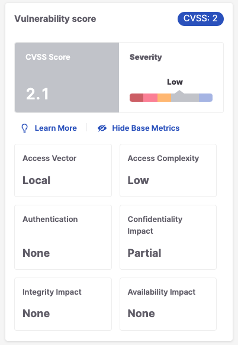<figcaption></figcaption></figure></div>

<div align="left"><figure><figcaption></figcaption></figure></div>

<div align="left"><figure>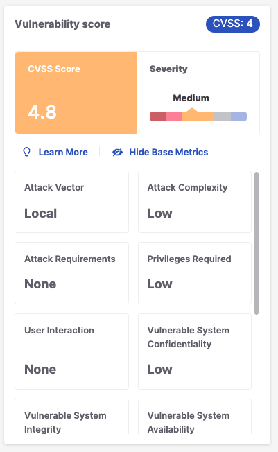<figcaption></figcaption></figure></div>

<details>

<summary>API Responses</summary>

Detailed results for SCA vulnerabilities can be returned using the `GET /results` API. The results for each SCA vulnerability include a `vulnerabilitiesDetails` object. The attributes returned for this object differ depending on the CVSS version that is used for that vulnerability. You may need to adjust some of your workflows to accommodate the schema of the new type of results.

| CVSS 2.0                                                                                                                                                                                                                                                                                                                                                                                                                                                                                                                                                                                                                                                                                            | CVSS 3.1                                                                                                                                                                                                                                                                                                                                                                                                                                                                                                                                                                                                                                                                                                                                                                | CVSS 4.0                                                                                                                                                                                                                                                                                                                                                                                                                                                                                                                                                                                                                                                                                                                                                                                                                                                                                                                                                                                                                                   |
| --------------------------------------------------------------------------------------------------------------------------------------------------------------------------------------------------------------------------------------------------------------------------------------------------------------------------------------------------------------------------------------------------------------------------------------------------------------------------------------------------------------------------------------------------------------------------------------------------------------------------------------------------------------------------------------------------- | ----------------------------------------------------------------------------------------------------------------------------------------------------------------------------------------------------------------------------------------------------------------------------------------------------------------------------------------------------------------------------------------------------------------------------------------------------------------------------------------------------------------------------------------------------------------------------------------------------------------------------------------------------------------------------------------------------------------------------------------------------------------------- | ------------------------------------------------------------------------------------------------------------------------------------------------------------------------------------------------------------------------------------------------------------------------------------------------------------------------------------------------------------------------------------------------------------------------------------------------------------------------------------------------------------------------------------------------------------------------------------------------------------------------------------------------------------------------------------------------------------------------------------------------------------------------------------------------------------------------------------------------------------------------------------------------------------------------------------------------------------------------------------------------------------------------------------------ |
| "vulnerabilityDetails": {         "cvssScore": 2.1,         "cveName": "CVE-2015-3010",         "cweId": "CWE-200",         "cvss": {           "score": 2.1,           "version": 2,           "severity": \["INFO", "NONE", "LOW", "MEDIUM", "HIGH"],           "integrity": \["NONE", "PARTIAL", "COMPLETE"],           "attackVector": \["LOCAL", "ADJACENT NETWORK", "NETWORK"],           "availability": \["NONE", "PARTIAL", "COMPLETE"],           "authentication": \["NONE", "SINGLE", "MULTIPLE"],            "confidentiality": \["NONE", "PARTIAL", "COMPLETE"],            "attackComplexity": \["LOW", "MEDIUM", "HIGH"],            "exploitCodeMaturity": "3.9"         }       } | "vulnerabilityDetails": {         "cvssScore": 5.5,         "cveName": "CVE-2023-50120",         "cweId": "CWE-835",         "cvss": {           "scope": \["CHANGED", "UNCHANGED"],           "score": 5.5,           "version": 3,           "severity": \["INFO", "NONE", "LOW", "MEDIUM", "HIGH", "CRITICAL"],           "integrity": \["NONE", "LOW", "HIGH"],           "attackVector": \["NETWORK", "ADJACENT", "LOCAL", "PHYSICAL"],           "availability": \["NONE", "LOW", "HIGH"],            "confidentiality":\["NONE", "LOW", "HIGH"],            "userInteraction": \["NONE", "REQUIRED"],            "attackComplexity": \["LOW", "HIGH"],            "privilegesRequired": \["NONE", "LOW", "HIGH"], "exploitCodeMaturity": "3.9"         }       } | "vulnerabilityDetails": {         "cvssScore": 4.800000190734863,         "cveName": "CVE-2024-6064",         "cweId": "CWE-416",         "cvss": {           "score": 4.8,           "version": 4,           "severity": \["INFO", "NONE", "LOW", "MEDIUM", "HIGH", "CRITICAL"],           "attackVector": \["NETWORK", "ADJACENT", "LOCAL", "PHYSICAL"],            "userInteraction": \["NONE", "PASSIVE", "REQUIRED"],            "attackComplexity": \["LOW", "HIGH"],            "attackRequirements": \["NONE", "PRESENT"]            "privilegesRequired": \["NONE", "LOW", "HIGH"],            "subsequentSystemIntegrity": \["NONE", "LOW", "HIGH"],            "vulnerableSystemIntegrity": \["NONE", "LOW", "HIGH"],           "subsequentSystemAvailability": \["NONE", "LOW", "HIGH"],            "vulnerableSystemAvailability": \["NONE", "LOW", "HIGH"],            "subsequentSystemConfidentiality": \["NONE", "LOW", "HIGH"],            "vulnerableSystemConfidentiality": \["NONE", "LOW", "HIGH"]         }       } |

Examples of `vulnerabilitiesDetails` object for each CVSS version.

CVSS 2.0

```
"vulnerabilityDetails": {
  "cvssScore" : 2.0999999046325684,
  "cveName" : "CVE-2015-3010",
  "cweId" : "CWE-200",
  "cvss" : {
    "score" : 2.1,
    "version" : 2,
    "severity" : "Low",
    "integrity" : "NONE",
    "attackVector" : "LOCAL",
    "availability" : "NONE",
    "authentication" : "NONE",
    "confidentiality" : "PARTIAL",
    "attackComplexity" : "LOW",
    "exploitCodeMaturity" : "3.9"
  }
}
```

CVSS 3.1

```
"vulnerabilityDetails": {
  "cvssScore" : 7.5,
  "cveName" : "CVE-2024-24265",
  "cweId" : "CWE-401",
  "cvss" : {
    "scope" : "UNCHANGED",
    "score" : 7.5,
    "version" : 3,
    "severity" : "High",
    "integrity" : "NONE",
    "attackVector" : "NETWORK",
    "availability" : "HIGH",
    "confidentiality" : "NONE",
    "userInteraction" : "NONE",
    "attackComplexity" : "LOW",
    "privilegesRequired" : "NONE"
  }
}  
```

CVSSS 4.0

```
"vulnerabilityDetails": {
  "cvssScore" : 4.800000190734863,
  "cveName" : "CVE-2024-6064",
  "cweId" : "CWE-416",
  "cvss" : {
    "score" : 4.8,
    "version" : 4,
    "severity" : "Medium",
    "attackVector" : "LOCAL",
    "userInteraction" : "NONE",
    "attackComplexity" : "LOW",
    "attackRequirements" : "NONE",
    "privilegesRequired" : "LOW",
    "subsequentSystemIntegrity" : "NONE",
    "vulnerableSystemIntegrity" : "LOW",
    "subsequentSystemAvailability" : "NONE",
    "vulnerableSystemAvailability" : "LOW",
    "subsequentSystemConfidentiality" : "NONE",
    "vulnerableSystemConfidentiality" : "LOW"
  }
}
```

</details>

#### Suspected Malware Details

Suspected Malware includes various types of risks that affect the packages in your project, such as packages that are Malicious by design and packages that are vulnerable to ChainJacking attacks.

<details>

<summary>How We Detect Malware Risks</summary>

The Checkmarx One SCA scanner identifies packages with a wide range of known or suspected malware risks, and lists those risks in the scan results. Checkmarx SCA identifies suspected malware vulnerabilities of the following types:

* Reputation - There is reason to suspect the credibility of the owner or contributors of the package, e.g., a newly created user is registered as the package owner.
* Reliability - There are irregularities in the naming or maintenance patterns of the package, e.g., Typeosquatting, or Chainjacking.
* Behavior - The behaviors of the package are unsafe. The package may be malicious by design or it may inadvertently introduce risks into your project. This category includes packages that exfiltrate info about OSs, user credentials etc.

The following table shows some examples of suspected malware risks of each type that are identified by Checkmarx SCA.

<table data-header-hidden><thead><tr><th></th><th></th></tr></thead><tbody><tr><td><strong>Title</strong></td><td><strong>Description</strong></td></tr><tr><td colspan="2">Reputation</td></tr><tr><td>New User</td><td>The owner of this package is a newly created user.</td></tr><tr><td>Protestware</td><td>Software that includes functionality which aims to protest or raise an issue - <a href="https://checkmarx.com/blog/new-protestware-found-lurking-in-highly-popular-npm-package/">learn more</a></td></tr><tr><td>Repojacking</td><td>Taking over the repository of a legitimate package - <a href="https://www.linkedin.com/posts/tzachi-zornstain_supplychainsecurity-github-repojacking-activity-6966415993157922816-ZgDK?utm_source=share&#x26;utm_medium=member_desktop">learn more</a></td></tr><tr><td>Account takeover</td><td>The compromise of a good maintainers account by an attacker which is then used to spread malicious packages - <a href="https://www.linkedin.com/posts/tzachi-zornstain_supplychain-threatintelligence-opensourcesecurity-activity-6971041430546853888-1t7b?utm_source=share&#x26;utm_medium=member_desktop">learn more</a></td></tr><tr><td colspan="2">Reliability</td></tr><tr><td>Typosquatting</td><td>This package mimics the name of a popular package, inducing users to inadvertently call this package. <a href="https://medium.com/checkmarx-security/typosquatting-attack-on-requests-one-of-the-most-popular-python-packages-3b0a329a892d">learn more</a></td></tr><tr><td>StarJacking</td><td>There is a weak link between the package metadata and the referenced Git repository. <a href="https://checkmarx.com/blog/starjacking-making-your-new-open-source-package-popular-in-a-snap/">learn more</a></td></tr><tr><td><a href="https://app.gitbook.com/s/XSPACE_PRODUCT_INFO/preventing-malicious-software-attacks/chainjacking-risks">ChainJacking</a></td><td>This package is stored in a renamed GitHub repository, making it vulnerable to an attacker taking control of the repo and serving malicious code through the package.</td></tr><tr><td colspan="2">Behavior</td></tr><tr><td>Harmful File Download</td><td>This package downloads a harmful file.</td></tr><tr><td><a href="https://app.gitbook.com/s/XSPACE_PRODUCT_INFO/preventing-malicious-software-attacks/malicious-packages">Malicious Package</a></td><td>This package was manually inspected by a security researcher and flagged as being malicious by design.</td></tr><tr><td>Data Exfiltration</td><td>This package exfiltrates sensitive information such as stored credentials or computer and operating system details.</td></tr><tr><td>Network Anomaly</td><td><p>This package initiates one of the following anomalous network behaviors:</p><ul><li>This package sends information via DNS Tunneling, which exploits the highly trusted DNS protocol to tunnel malware and other data through a client-server model.</li><li>This package communicates with a service (domain address) commonly used by attackers.</li></ul></td></tr><tr><td>Crypto Miner</td><td>This package executes crypto mining software.</td></tr></tbody></table>

</details>

**Info Pane**

<div align="left"><figure><figcaption></figcaption></figure></div>

| Item       | Description                                                                                                                                                                                                                                                                                                                                                                                      | Possible Values                                                                                                                                                                                                                                                                              |
| ---------- | ------------------------------------------------------------------------------------------------------------------------------------------------------------------------------------------------------------------------------------------------------------------------------------------------------------------------------------------------------------------------------------------------ | -------------------------------------------------------------------------------------------------------------------------------------------------------------------------------------------------------------------------------------------------------------------------------------------- |
| ID         | An internal ID starting with the “Cx” prefix that was assigned to this risk by the Checkmarx Vulnerability Research Team.                                                                                                                                                                                                                                                                        | e.g., Cx27b685d0-978d                                                                                                                                                                                                                                                                        |
| Package    | The name of the package in which the vulnerability was identified.                                                                                                                                                                                                                                                                                                                               | e.g., com.fasterxml.jackson.core:jackson-databind 2.9.8                                                                                                                                                                                                                                      |
| Version    | The version of the package where the vulnerability was identified.                                                                                                                                                                                                                                                                                                                               | e.g., 5.1.26                                                                                                                                                                                                                                                                                 |
| Risk Level | The severity level of the vulnerability, based on its CVSS score in the CVE database. Malicious (suspected malware) packages are labeled Malicious and the icon is shown.                                                                                                                                                                                                                        | <ul><li>- Malicious</li><li><strong>HIGH</strong></li><li><strong>MEDIUM</strong></li><li><strong>LOW</strong></li></ul><p><br>For more info see <a href="project-page-tabs.md#UUID-07a21b5d-72d7-69da-9320-fc8d5e505317">Severity Levels</a>.</p>                                           |
| Risk State | This indicates the current state of the suspected malware Risk as determined by your AppSec team. All new risks are initially marked as To Verify. A user with `manage-risk` role (e.g., Admin, SCA Manager) can change the Risk state for this Project by clicking on the Risk State field and selecting the radio button for the desired state. See [Risk Management](risk-management-beta.md) | <ul><li>To Verify</li><li>Not Exploitable</li><li>Proposed Not Exploitable</li><li>Confirmed</li><li>Urgent</li></ul><p><br><strong>Tip</strong> When the state is set as Not exploitable, the page is grayed out and the risk is marked with a strikethrough line on the All Risks tab.</p> |

**Suspected Malware Details Sections**

<div align="left"><figure>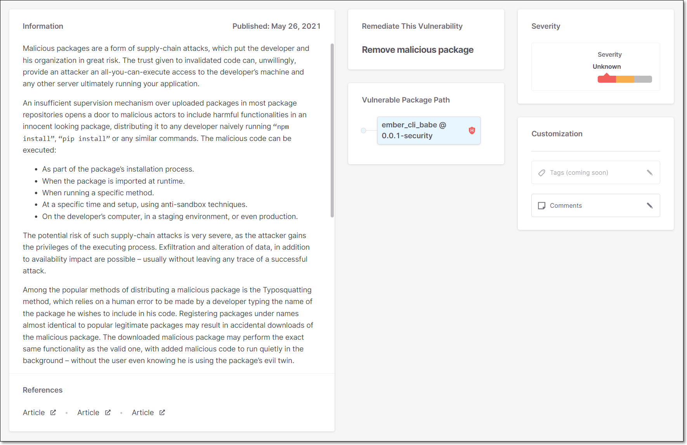<figcaption></figcaption></figure></div>

| Item                         | Description                                                                                                                                                                                                                                                                                                                                                                                                                                            |
| ---------------------------- | ------------------------------------------------------------------------------------------------------------------------------------------------------------------------------------------------------------------------------------------------------------------------------------------------------------------------------------------------------------------------------------------------------------------------------------------------------ |
| Information                  | A description of the nature of the threat posed by the suspected malware and the date the suspected malware was published on the NVD.                                                                                                                                                                                                                                                                                                                  |
| References                   | Links to external resources about the risk. Links are given for topics such as: Article, etc.                                                                                                                                                                                                                                                                                                                                                          |
| Remediate this Vulnerability | Recommended steps that should be taken to remediate this vulnerability.                                                                                                                                                                                                                                                                                                                                                                                |
| Policies                     | The number of Policies the Project is assigned to and the number of Policy violations.                                                                                                                                                                                                                                                                                                                                                                 |
| Vulnerable Package Path      | <p>The vulnerable package is displayed in blue. If this is a transient dependency (i.e., it is accessed via other packages), then the full path by which the package is accessed is shown above it. You can click on any package shown in the path in order to open a new tab showing details for that package.<br><strong>Tip</strong> Frequently, you can fix the vulnerabilities by updating the transient packages with their latest versions.</p> |
| CVSS/Risk Score              | Shows the CVSS Version, Score, and Severity. For a full explanation of the metrics that make up the CVSS score, see section 2 of this [article](https://www.first.org/cvss/specification-document).                                                                                                                                                                                                                                                    |

## Container Tab

In addition to scanning the packages in your source code itself, Checkmarx SCA also scans the containers (i.e., Docker image files) on which your source code runs. Checkmarx SCA identifies each of the Docker files being used, extracts all layers of each Image file and identifies the packages used by each layer.

The Container tab shows the container packages identified in your project and the vulnerabilities associated with them.

<div align="left"><figure>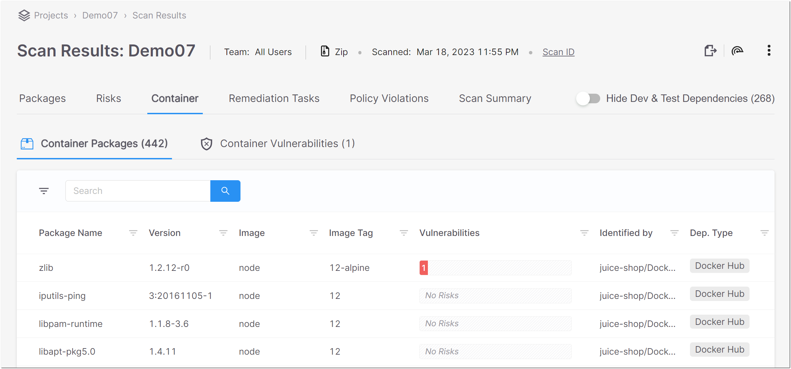<figcaption></figcaption></figure></div>

The Container tab contains two sub-tabs:

* Container Packages – shows a list of all of the packages identified in the container images.
* Container Vulnerabilities – shows a list of all of the vulnerabilities associated with the container packages.



The Container Packages sub-tab shows a list of all of the packages identified in the container images. For each container package, info is shown about the risks related to that package. You can search for specific packages and images using the search box.

You can also sort by column headers and set filters for each column.

<div align="left"><figure>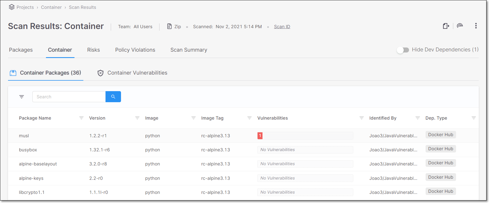<figcaption></figcaption></figure></div>

The following table describes the info shown for each package identified in the containers.

| Item              | Description                                                                                                                                                                 | Possible Values                                                                                |
| ----------------- | --------------------------------------------------------------------------------------------------------------------------------------------------------------------------- | ---------------------------------------------------------------------------------------------- |
| Package Name      | The name of the package.                                                                                                                                                    | e.g., musl                                                                                     |
| Version           | The version of the package.                                                                                                                                                 | e.g., 1.2.2-r1                                                                                 |
| Image             | The name of the image that was scanned.                                                                                                                                     | e.g., python                                                                                   |
| Image Tag         | The version of the image.                                                                                                                                                   | e.g., rc-alpine3.13                                                                            |
| Malicious Package | Indicates whether or not the package is designated as "malicious" in the Checkmarx database. For unsupported package types (e.g., OS related packages), "Unknown" is shown. | <ul><li>Malicious</li><li>Not Malicious</li><li>Unknown</li></ul>                              |
| Vulnerabilities   | A color coded bar graph indicating the number of vulnerabilities of each severity level.                                                                                    | <p>e.g.,<br></p> |
| Identified By     | The path to the Docker file in which the specific image is found. (Hover to view the entire path.)                                                                          | e.g., Joao4/JavaVulnerableLab-dockerfile/JavaVulnerableLab-master/dockerfile1/Dockerfile       |
| Dep. Type         | The repository in which the image is located.                                                                                                                               | e.g., Docker Hub                                                                               |



The Container Vulnerabilities sub-tab shows a list of all of the vulnerabilities associated with the container packages. Detailed information is shown for each vulnerability. You can search for specific vulnerabilities and packages using the search box.

You can also sort by column headers and set filters for each column.

You can click on a vulnerability to open a new tab showing additional info about the vulnerability.

<div align="left"><figure>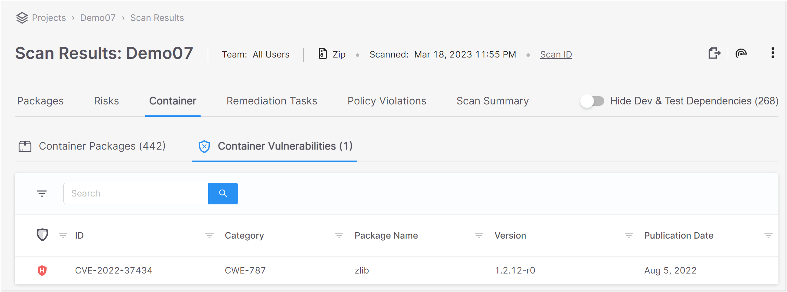<figcaption></figcaption></figure></div>


Container vulnerabilities for which the Category is "unknown" are marked as Low severity. Also, these vulnerabilities are only shown in the summary table, but you can't drill down to view the details page, since there are no details that we can provide.


The following table describes the info shown for each vulnerability that was identified in the containers.

| Item             | Description                                                                                                                                                        | Possible Values                                                                                                                                                                                                                                              |
| ---------------- | ------------------------------------------------------------------------------------------------------------------------------------------------------------------ | ------------------------------------------------------------------------------------------------------------------------------------------------------------------------------------------------------------------------------------------------------------ |
| Risk Level       | The severity level of the vulnerability.                                                                                                                           | <ul><li><strong>HIGH</strong> - 7.0-10.0</li><li><strong>MEDIUM</strong> - 4.0-6.9</li><li><strong>LOW</strong> - 0.0-3.9</li></ul><p><br>For more info see <a href="https://app.gitbook.com/s/XSPACE_PRODUCT_INFO/severity-levels">Severity Levels</a>.</p> |
| ID               | The ID of the CVE listing. The ID consists of the CVE prefix followed by the year that the CVE was discovered and the serial counter for that year's CVE listings. | e.g., CVE-2020-9488                                                                                                                                                                                                                                          |
| Category         | The category of the vulnerability.                                                                                                                                 | e.g., CWE-20                                                                                                                                                                                                                                                 |
| Package Name     | The name of the package in which the vulnerability was identified.                                                                                                 | e.g., musl                                                                                                                                                                                                                                                   |
| Version          | The version of the package in which the vulnerability was identified.                                                                                              | e.g., 1.2.2-r1                                                                                                                                                                                                                                               |
| Publication Date | The date the vulnerability was published in the NVD.                                                                                                               | e.g., Nov 16, 2020                                                                                                                                                                                                                                           |



## Licenses Tab

The Licenses tab shows info about all of the licenses that are associated with the open source packages used by your project.


This page shows all licenses, even those that don't pose any particular legal risk. All license that pose a specific legal risk are shown in the Legal Risks section on the Risks tab.


<div align="left"><figure>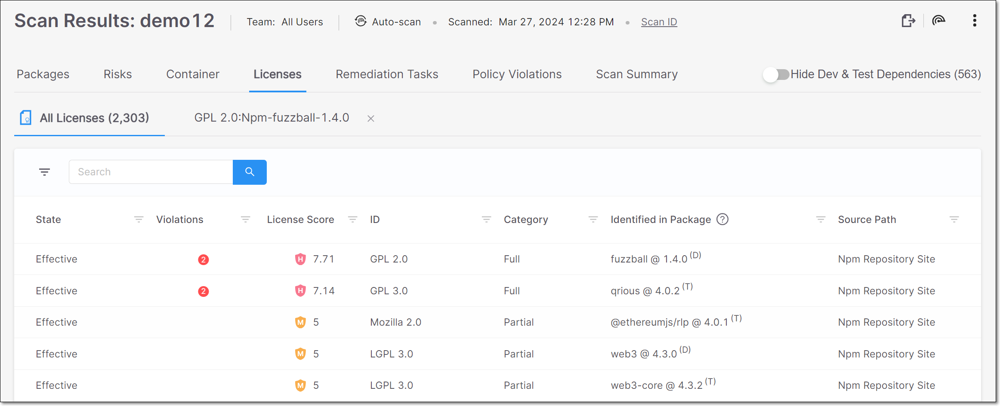<figcaption></figcaption></figure></div>

The Licenses tab contains sub-tabs that show two types of pages:

* All Licenses – shows a list of all licenses associated with the open source packages identified in this scan.
* License Details – shows detailed info about a specific license. Click on a row in the All Licenses tab to access this page.

You can navigate between the various tabs that you have opened.

### All Licenses Page

The All Licenses sub-tab shows a list of all licenses associated with the open source packages identified in this scan. A separate row is shown for each license that applies to a particular package version. Therefore, if a license applies to multiple packages or package versions, then a separate row will be shown for each instance.

You can also sort by column headers and set filters for each column.

<div align="left"><figure>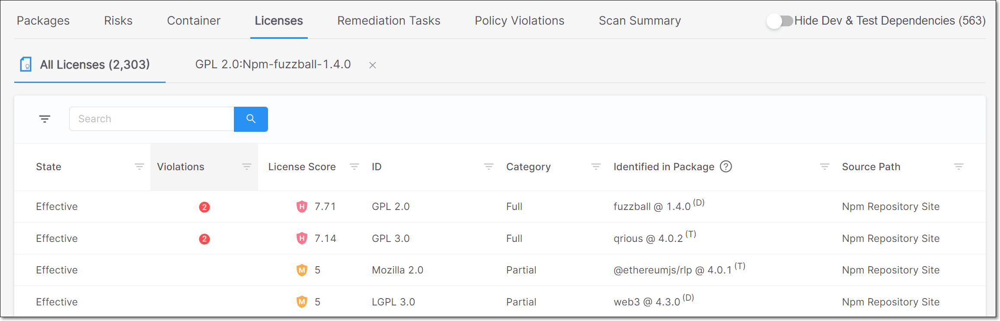<figcaption></figcaption></figure></div>

The following table describes the info shown for each license identified by this scan.

| Item                  | Description                                                                                                                                                                                                                                                                                                                                                                     | Possible Values                                                                                                                                                                                                                                                                        |
| --------------------- | ------------------------------------------------------------------------------------------------------------------------------------------------------------------------------------------------------------------------------------------------------------------------------------------------------------------------------------------------------------------------------- | -------------------------------------------------------------------------------------------------------------------------------------------------------------------------------------------------------------------------------------------------------------------------------------- |
| State                 | <p>Indicates whether or not this license is the "effective" license for your organization's use of this package.<br><strong>Tip</strong> A license that was identified from a reliable source and is the sole license for the package is automatically marked as Effective. Otherwise it is marked as Not Effective by default and it can be manually changed to Effective.</p> | <ul><li>To Verify</li><li>Effective</li><li>Not Effective</li></ul>                                                                                                                                                                                                                    |
| Violations            | If the license is associated with one or more Policy violations, then number of policy violations is shown in red, see [Policy Management](policy-management.md). Hover over the number to view additional details.                                                                                                                                                             | e.g.,                                                                                                                                                                                                                  |
| License Score         | <p>Shows a score indicating the overall risk level associated with this license.<br><strong>Tip</strong> If this isn't the effective license for this package, then a high license score doesn't necessarily pose a legal risk.</p>                                                                                                                                             |                                                                                                                                                                                                                                                                                        |
| ID                    | The name of the license                                                                                                                                                                                                                                                                                                                                                         | e.g., GPL 3.0, MIT etc.                                                                                                                                                                                                                                                                |
| Category              | The category of the license.                                                                                                                                                                                                                                                                                                                                                    | <ul><li>No Copyleft</li><li>Full</li><li>Partial</li><li>Empty</li></ul>                                                                                                                                                                                                               |
| Identified in Package | <p>The name and version of the package that the license is associated with.<br>In addition, an indication is shown for whether this is a direct or transitive dependency (D or T). Results can be filtered by Direct/Transitive.</p>                                                                                                                                            | e.g., loadash @ 4.13.1 <sup>(T)</sup>                                                                                                                                                                                                                                                  |
| Source Path           | The source from which the license was identified.                                                                                                                                                                                                                                                                                                                               | <p>e.g., Manifest File, Npm Repository Site, Official Website, Statically Observed etc.<br><strong>Tip</strong> The category "Statically Observed" indicates that the license was identified in the source code (e.g., README files) using regex and other identification methods.</p> |

### License Details Page

This tab shows detailed information about a specific license, including the Legal Risks relating to the license.

<div align="left"><figure>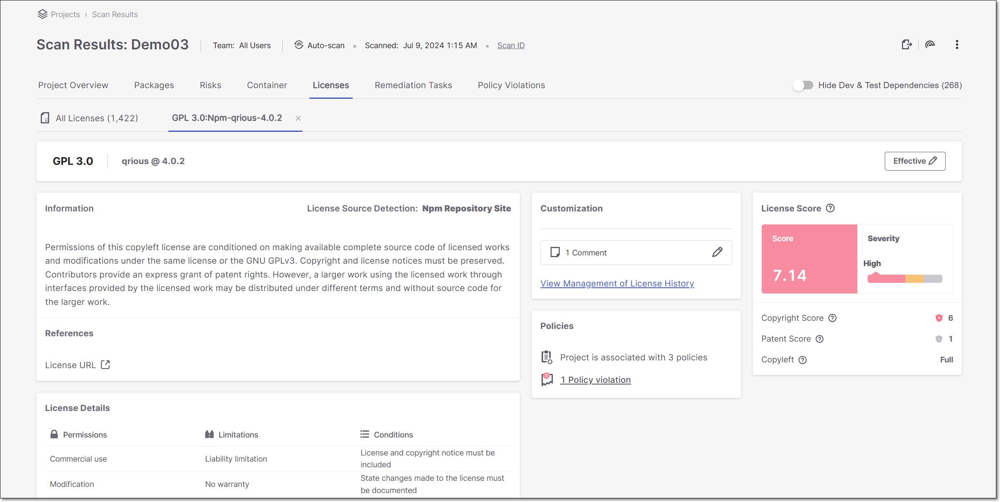<figcaption></figcaption></figure></div>

#### Info Pane

<div align="left"><figure>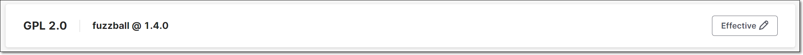<figcaption></figcaption></figure></div>

| Item    | Description                                                              | Possible Values                                                                                                        |
| ------- | ------------------------------------------------------------------------ | ---------------------------------------------------------------------------------------------------------------------- |
| ID      | The name of the License.                                                 | e.g., MIT                                                                                                              |
| Package | The name and version of the package that the license is associated with. | e.g., Fuzzball@1.4.0                                                                                                   |
| State   | The current state of the license.                                        | <ul><li><strong>To Verify</strong></li><li><strong>Effective</strong></li><li><strong>Not Effective</strong></li></ul> |

#### Legal Risk Details Sections

| Item            | Description                                                                                                                                                                                                                       |
| --------------- | --------------------------------------------------------------------------------------------------------------------------------------------------------------------------------------------------------------------------------- |
| Information     | The source of the license detection followed by a description of the nature of the threat posed by the legal risk.                                                                                                                |
| References      | Links to external resources about the vulnerability. Links are given for topics such as: License URL, etc.                                                                                                                        |
| Customization   | View state changes and comments for this license. An admin user can mark a license as “Effective” for this package (i.e., if they intend to consume this package in accordance with the licensing restrictions of this license.). |
| Policies        | The number of Policies the Project is assigned to and the number of Policy violations.                                                                                                                                            |
| Legal Score     | Shows the License Score and Severity, as well as the components that make up the License score including: Copyright Risk, Patent Risk and Copyleft. For an explanation on the calculation of these scores, see below.             |
| License Details | Additional details about the terms of use of the license. This is divided into sections for Permissions, Limitations and Conditions.                                                                                              |

#### Understanding the License Score Section

The License Score pane shows the overall License Score and severity as well as information about specific license risk characteristics. The following table explains these items:


The License Score represents the level of risk associated with using a package under that license. However, the license doesn't pose an actual risk to your project unless you are actually using the package under that license (i.e., it is your Effective license).


| Field                | Value type and range                                                                                                               | Details                                                                                                                                                                                                                                                                                                                                                                                                                                                                                                                                                                                                                                                                                                                                                                                                                                                                                                                                                                                                                                                                                                                                                                                                                                                                                                                                                                                                                                                                                                                                                                                                  |
| -------------------- | ---------------------------------------------------------------------------------------------------------------------------------- | -------------------------------------------------------------------------------------------------------------------------------------------------------------------------------------------------------------------------------------------------------------------------------------------------------------------------------------------------------------------------------------------------------------------------------------------------------------------------------------------------------------------------------------------------------------------------------------------------------------------------------------------------------------------------------------------------------------------------------------------------------------------------------------------------------------------------------------------------------------------------------------------------------------------------------------------------------------------------------------------------------------------------------------------------------------------------------------------------------------------------------------------------------------------------------------------------------------------------------------------------------------------------------------------------------------------------------------------------------------------------------------------------------------------------------------------------------------------------------------------------------------------------------------------------------------------------------------------------------- |
| Copyright Risk Score | A number between 1 and 7                                                                                                           | <p>The score is defined as follows:<br></p><ul><li>1 - Licensed users may use code without restriction.</li><li>2 - Anyone who distributes the code must retain any attributions included in original distribution.</li><li>3 - Anyone who distributes the code must provide certain notices, attributions and/or licensing terms in documentation with the software.</li><li>4 - Anyone who distributes a modification of the code may be required to make the source code for the modification publicly available at no charge.</li><li>5 - Anyone who distributes a modification of the code or a product that is based on or contains part of the code may be required to make publicly available the source code for the product or modification, subject to an exception for software that dynamically links to the original code.</li><li>6 - Anyone who distributes a modification of the code or a product that is based on or contains part of the code may be required to make publicly available the source code for the product or modification.</li><li>7 - Anyone who develops a product that is based on or contains part of the code, or who modifies the code, may be required to make publicly available the source code for that product or modification if s/he (a) distributes the software or (b) enables others to use the software via hosted or web services.</li></ul><p><br><strong>Tip</strong> The Legal Risk calculation is based on the copyright risk score, where Level 1-3 is considered as a low risk, Level 4-5 as a medium risk, and Level 6-7 as a high risk.</p> |
| Patent Risk Score    | <p>A number between 1 and 4<br>Sometimes represented as multiplications of 20, since in CxOSA is presented on a scale of 1-100</p> | <p>Ranks the license based on<br></p><ul><li>1- Royalty free and no identified patent risks</li><li>2- Royalty free unless litigated</li><li>3- No patents granted</li><li>4- Specific identified patent risks</li></ul>                                                                                                                                                                                                                                                                                                                                                                                                                                                                                                                                                                                                                                                                                                                                                                                                                                                                                                                                                                                                                                                                                                                                                                                                                                                                                                                                                                                 |
| Copyleft             | <p>One of the following:<br>Full, Partial, No</p>                                                                                  | <p>Copyleft is a property of the license that means that the package is free to use, but it is forbidden to make it proprietary.<br>A copyleft license is also viral since any work containing a package that has a copyleft-license must also retain this property.<br>The valid values are described as follows:<br></p><ul><li>Full - Full copyleft license</li><li>Partial - Copyleft applies on modifications only</li><li>No - Not a copyleft license</li></ul>                                                                                                                                                                                                                                                                                                                                                                                                                                                                                                                                                                                                                                                                                                                                                                                                                                                                                                                                                                                                                                                                                                                                    |

## Remediation Tasks Tab

The Remediation Tasks tab shows detailed information about specific remediation tasks that Checkmarx recommends implementing for your Project. These tasks involve replacing vulnerable packages in your project with non-vulnerable versions of those packages.

<div align="left"><figure><figcaption></figcaption></figure></div>


Remediation tasks are currently supported only for JavaSript npm packages and for Nuget packages with .csproj manifest files, otherwise this tab isn't shown.


The Remediation Tasks tab contains sub-tabs that show two types of pages:

* All Remediation Tasks – shows a list of remediation tasks that are recommended for this Project, with general info about each task.
* Task Details – shows detailed info about a specific task. The task details tab is opened by clicking on the How to fix button in a task row in the All Remediation Tasks sub-tab.

You can navigate between the various tabs that you have opened.

### All Remediation Tasks

The All Remediation Tasks sub-tab shows a list of remediation tasks that are recommended for this Project.


Each task relates to a specific direct package in your project.


The data shown for each task relates to the vulnerabilities identified in the direct package as well as in the transitive dependencies associated with it. You can click on the “+” button for a task to expand the view of that task to show the transitive dependencies called by the package. The number of vulnerabilities of each severity level is shown for each transitive package.

<div align="left"><figure><figcaption></figcaption></figure></div>

The following table describes the info shown for each task:

| Parameter           | Description                                                                                                                                                                                                          |
| ------------------- | -------------------------------------------------------------------------------------------------------------------------------------------------------------------------------------------------------------------- |
| +/- Button          | Expand the display to show the transitive packages or collapse the display to show only the direct package.                                                                                                          |
| Package             | The name of the package and its version number.                                                                                                                                                                      |
| Vulnerabilities     | The number of vulnerabilities of each severity level in the package.                                                                                                                                                 |
| Total               | The total number of vulnerabilities in the package.                                                                                                                                                                  |
| Effort Required     | An assessment of the degree of effort required to implement the recommended remediation task, e.g., if it requires fixing broken API methods.                                                                        |
| Impact              | An assessment of the impact that the remediation task will have on your Project, i.e., the extent to which the procedure will remove risks from your Project.                                                        |
| Is Exploitable      | <p>Indicates whether the vulnerabilities in this package are exploitable in the context of your Project.<br><strong>Tip</strong> This data is only shown for scans which ran using the Exploitable Path feature.</p> |
| “How to fix” button | Click on this button to open a new sub-tab showing details about this remediation task.                                                                                                                              |

### Remediation Task Details

The Remediation Task Details sub-tab shows detailed info about a specific remediation task.


Each task relates to a specific direct package in your project.


The info on this screen is shown in the following panes.

* Overview - shows key metrics for the remediation task.
* Summary - shows general info about the remediation task.
* Remediation Impact - shows a comparison between the current vulnerabilities and the vulnerabilities that will remain after remediation.
* Developer Walkthrough - shows a breakdown of the steps that need to be taken to remediate this package.

#### Overview

<div align="left"><figure><figcaption></figcaption></figure></div>

This pane shows gauge widgets indicating the overall risk level for the specified package, the effort required to implement the suggested remediation procedure and the impact of remediation.

#### Summary

<div align="left"><figure>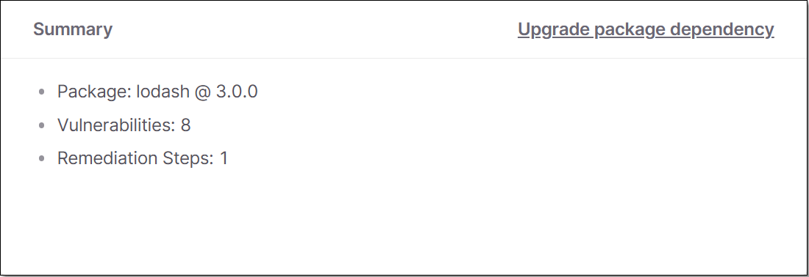<figcaption></figcaption></figure></div>

This pane shows a summary of the remediation task, including the package name, number of vulnerabilities and total number of remediation steps.

#### Remediation Impact

<div align="left"><figure>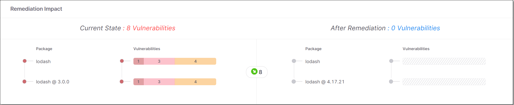<figcaption></figcaption></figure></div>

This pane shows a side-by-side comparison between the vulnerabilities currently in the direct and transitive dependencies and the vulnerabilities that will remain after remediation.


Checkmarx SCA shows recommendations to upgrade each transitive dependency to the next suitable version, even if the current version doesn't have vulnerabilities. You should use your judgement to decide whether the benefit of upgrading is worth the effort of ensuring compatibility of the new version.


#### Developer Walkthrough

<div align="left"><figure>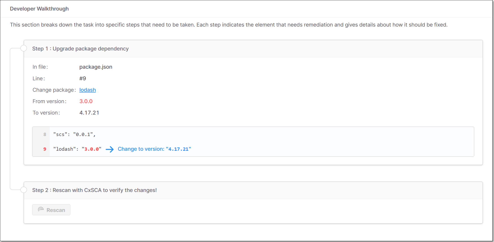<figcaption></figcaption></figure></div>

This section breaks down the task into specific steps that need to be taken. Each step indicates the element that needs remediation and gives details about how it should be fixed. There are three types of steps:

* Upgrade package dependency - indicates the direct package that needs to be upgraded, where it appears in your code, and which version it should be upgraded to.
*   Add package dependency - indicates a specific version of a package that needs to be added to your manifest file (for transitive dependencies).

    <div data-gb-custom-block data-tag="hint" data-style="info" data-icon="pencil" class="hint hint-info"><p>Recommended steps for remediating transitive vulnerabilities are given for each package independently. We recommend a secure version of the package that can be added to the manifest file in order to ensure that only that version will be used.</p><p>In some cases it may be possible to remediate transitive dependencies by upgrading the direct dependency to a version that references a newer, secure version. For Maven packages, the Maven repository shows the transitive package versions referenced by each package.</p></div>
*   Fix broken API methods - shows each of the API methods that was broken and which upgrade caused the API to break. Fix broken API methods is shown as a sub-step under the “Upgrade package dependency” step that causes the broken method.

    <div data-gb-custom-block data-tag="hint" data-style="info" class="hint hint-info"><p>Broken methods are only identified in scans for which the Exploitable Path feature is run.</p><p>Checkmarx SCA identifies broken API methods by comparing the number of parameters used in the public method for the new package with the number of parameters used for the original package. If the number of parameters is different, then we notify of the need to fix the API method.</p></div>

## Policy Violations Tab

Users can create security Policies in Checkmarx SCA. These Policies comprise a series of rules that define a custom threshold for compliance. These Policies can be applied to Projects so that when a scan identifies risks that exceed the specified threshold, a **Policy Violation** is registered. For more information about Policies, see [Policy Management](policy-management.md).

The Policy Violations tab shows info about all Policies that were violated by the scan.

<div align="left"><figure>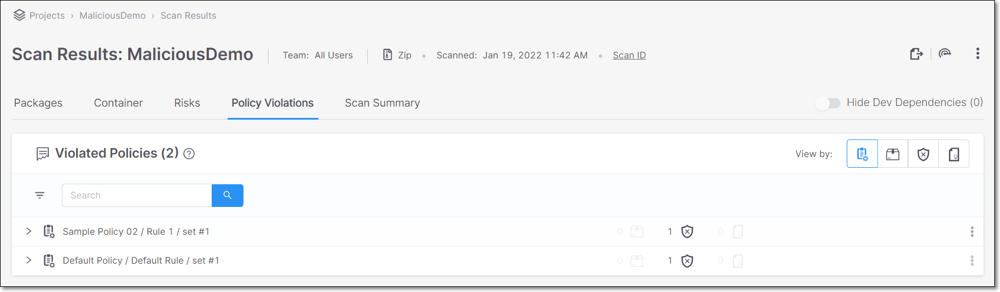<figcaption></figcaption></figure></div>

The header bar shows the total number of violated Policies. You can search for a specific item using the search box.

The results are grouped by a series of elements in an expandable tree structure. You can change the primary grouping of the Policies to be viewed by **Policy’s set of Conditions (default), Package Instance, Vulnerability, Supply Chain,** or **License**.

Clicking on the top level grouping expands the sub-groupings underneath. For example, when results are grouped by Policy Conditions, clicking on a Policy condition shows all of the packages that violate the Policy, and clicking on a package shows the list of vulnerabilities in that package that violate the Policy.

<div align="left"><figure>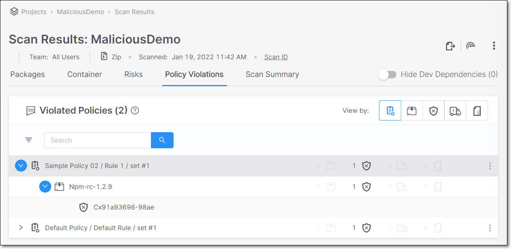<figcaption></figcaption></figure></div>

Clicking on a Policy opens a side panel that displays information about the rules that apply to the selected Policy. You can click on Policy Management to edit the Policy rules.

<div align="left"><figure>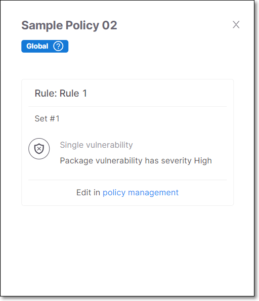<figcaption></figcaption></figure></div>
