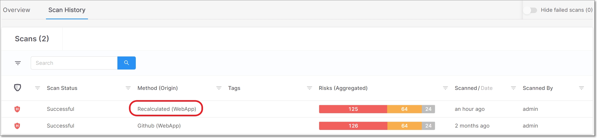
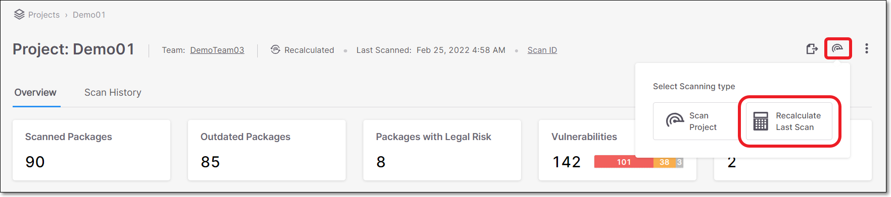

# Recalculating Scan Results

Checkmarx SCA does Scan Recalculation by taking the dependencies identified in a previous scan and re-assessing the risks affecting your project based on the current data. There is no need to resubmit the source code in order to run scan recalculation since it uses the dependency resolution output from the previous scan. Results from scan recalculation are shown in SCA as a separate scan with the scan method marked as “Recalculated”.

<figure><figcaption></figcaption></figure>

Results from a recalculation may differ from the original results in the following ways:

* If you made "Risk Management" changes (i.e., change state of a result or add comment) since the last scan of the project, those changes will be applied to the recalculated scan.
* We are constantly updating our vulnerability database. We may have identified additional vulnerabilities associated with the dependencies in your project that were not shown in your original results.
* If you have changed the Policies that apply to your project since the last scan, the policy violations for the project will be updated.

## Automatic Scan Recalculation

If your project uses a package for which a new associated vulnerability has been added to our database, then Checkmarx SCA will automatically initiate a scan recalculation of that project.

## Manual Risk Recalculation

You can manually initiate a scan recalculation by clicking Recalculate Last Scan in the web portal. This is useful when you make "Risk Management" changes or change the policy rules affecting a project and want to check which of the current policies are violated by this project. This method should be used for “static” projects, where no significant changes have been made to the source code since the previous scan.

You can perform a risk recalculation on demand by hovering over the Scan icon located at the top right corner of the Project page and clicking the Recalculate Last Scan button.

<figure><figcaption></figcaption></figure>

