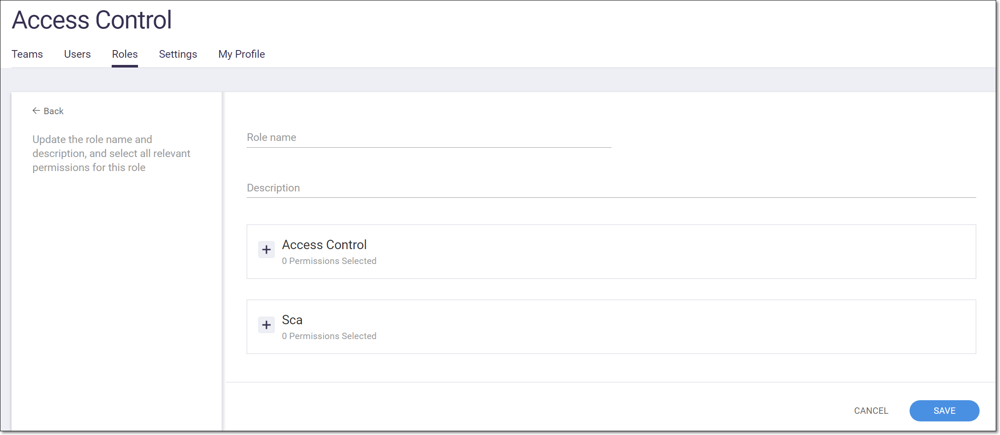
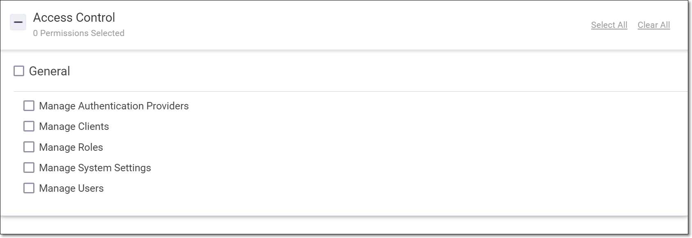
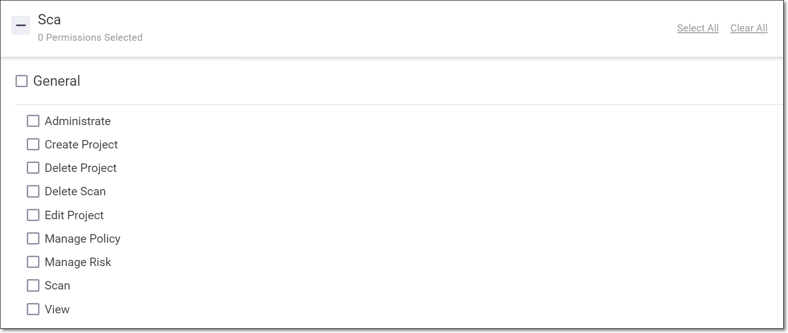

# Roles

Roles define a set of permissions in the system. Each user is assigned one or more roles. There are two general types of roles, **Access Control** roles and **SCA activity** roles. The system comes with a set of predefined roles. You can also create custom roles, specifying the set of permissions included in the role.


In addition to roles, there is an additional layer of access control based on Teams. Independent of their roles, users can only access Projects that are assigned to Teams of which they are a member, see [Teams](teams.md).


## Predefined Roles

The following table describes the pre-defined roles.

<table data-header-hidden><thead><tr><th></th><th></th><th></th></tr></thead><tbody><tr><td><strong>Role</strong></td><td><strong>Description</strong></td><td><strong>Permissions</strong></td></tr><tr><td>Admin / SCA Admin</td><td>Global administrator for your organization’s SCA account</td><td>
All access control permissions (Manage Authentication Providers, Manage Clients, Manage Roles, Manage System Settings, Manage Users) +

All SCA activity permissions (Administrate, Create Project, Delete Project, Edit Project, Manage Policy, Manage Risk, Scan, Delete Scan, View)
</td></tr><tr><td colspan="3">Access Control Roles</td></tr><tr><td>Access Control Manager</td><td>Administrator who manages access control but does not take action in the actual SCA functionality.</td><td>All access control permissions (Manage Authentication Providers, Manage Clients, Manage Roles, Manage System Settings, Manage Users)</td></tr><tr><td>User Manager</td><td>Can manage the users in the system</td><td>Manage Users</td></tr><tr><td colspan="3">SCA Activities Roles</td></tr><tr><td>SCA Manager</td><td>Manage all aspects of SCA functionality except for administrative actions.</td><td>Create Project, Delete Project, Edit Project, Manage Policy, Manage Risk, Scan, Delete Scan, View</td></tr><tr><td>SCA External Platform User</td><td>A user who accesses SCA via an external app, e.g., CxGo. This is a read-only user who also has the ability to manage risk state (e.g., mark vulnerabilities as “Not Exploitable”).</td><td>Manage Risk, View</td></tr><tr><td>SCA Scanner</td><td>Manages Projects and runs and views scans.</td><td>Create Project, Delete Project, Edit Project, Scan, View</td></tr><tr><td>SCA Viewer</td><td>Can only view risk reports</td><td>View</td></tr></tbody></table>

## Creating Custom Roles

You can create custom roles which defines a set of permissions that will be assigned to users with that role.

To create a custom role:

1.  In the main navigation, click User Management.

    The Access Control screen opens in a new tab.
2. On the Access Control screen select the Roles tab.
3.  Click on the New Role button.

    A form opens for creating a new role.

    
<figure><figcaption></figcaption></figure>

4. In the Role name field enter a name for the role.
5. In the Description field enter a brief description of the role (required).
6. If you would like to assign Access Control permissions, do the following:
   1.  Click on the + button next to Access Control.

       A list of Access Control permissions is shown.

       
<figure><figcaption></figcaption></figure>

   2. Select the checkbox for the permissions that you would like to assign.
7. If you would like to assign SCA Activity permissions, do the following:
   1.  Click on the + button next to SCA.

       A list of SCA Activity permissions is shown.
   2.  Select the checkbox for the permissions that you would like to assign.

       
<figure><figcaption></figcaption></figure>

8. Click Save.


The new role is created. You can assign this role to users.


## Actions on Roles

You can perform the following actions on roles. These actions can be done both for predefined and custom roles.

* Edit role - adjust the name, description and permissions for the role.
* Duplicate role - create a new role based on an existing role (while maintaining the original role).
* Delete role - delete a role.

To edit a role:

1. On the Access Control > Roles screen, click on the context menu at the end of the row of the relevant role.
2.  Click Edit.

    The role form with the current info filled in is displayed.
3. Edit the Role name and Description fields as desired.
4. If you would like to adjust the Access Control permissions, do the following:
   1.  Click on the + button next to Access Control.

       A list of Access Control permissions is shown.
   2. Select/deselect the checkboxes for the permissions that you would like to add/remove for the role.
5. If you would like to adjust the SCA Activity permissions, do the following:
   1.  Click on the + button next to SCA.

       A list of SCA Activity permissions is shown.
   2. Select/deselect the checkboxes for the permissions that you would like to add/remove for the role.
6. Click Save.


The new role configuration is saved and is applied to users with this role.


To duplicate a role:

1. On the Access Control > Roles screen, click on the context menu at the end of the row of the relevant role.
2.  Click Duplicate.

    The role form with the current info filled in and the name “Copy of…” is displayed.
3. Edit the Role name and Description fields as desired.
4. If you would like to adjust the Access Control permissions, do the following:
   1.  Click on the + button next to Access Control.

       A list of Access Control permissions is shown.
   2. Select/deselect the checkboxes for the permissions that you would like to add/remove for the role.
5. If you would like to adjust the SCA Activity permissions, do the following:
   1.  Click on the + button next to SCA.

       A list of SCA Activity permissions is shown.
   2. Select/deselect the checkboxes for the permissions that you would like to add/remove for the role.
6. Click Save.


The new role is created in addition to the original role which remains unchanged.


To delete a role:

1. On the Access Control > Roles screen, click on the context menu at the end of the row of the relevant role.
2.  Click Delete.

    A confirmation dialog appears.
3. Click Delete again.


The role is permanently deleted from the system.

