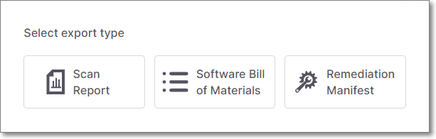
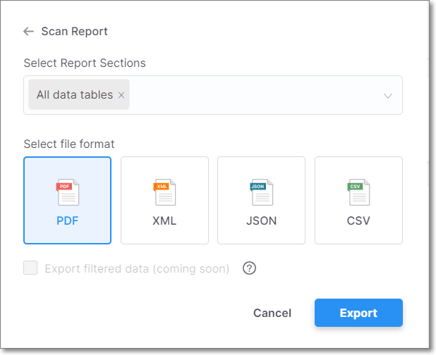
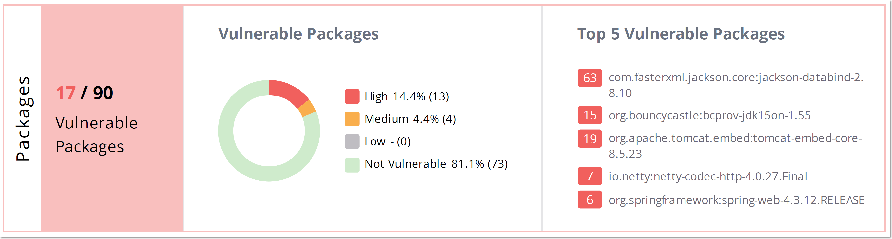
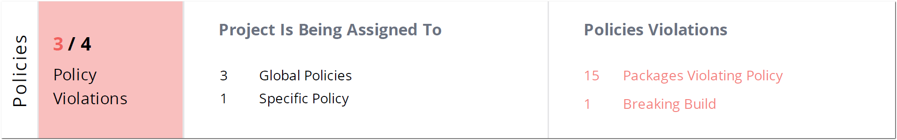
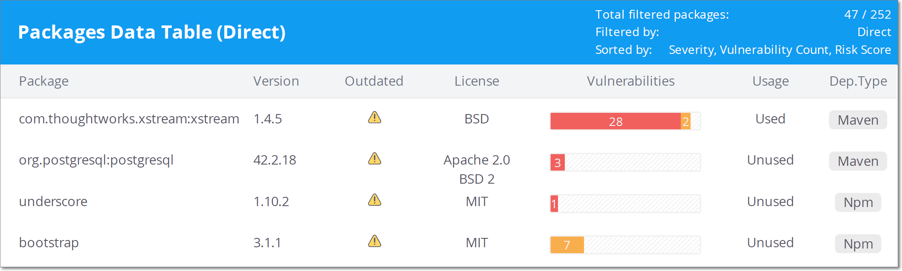
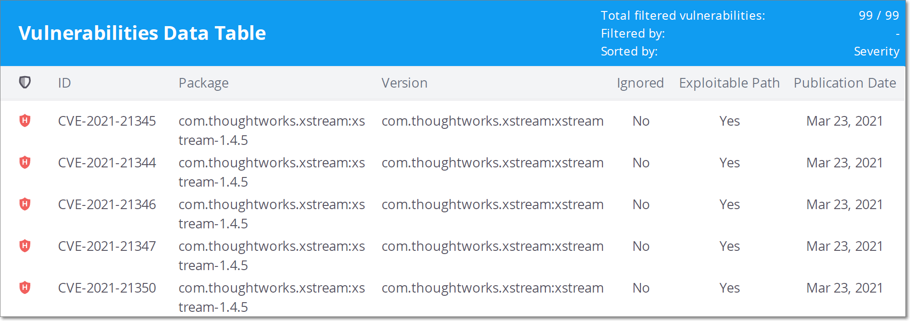
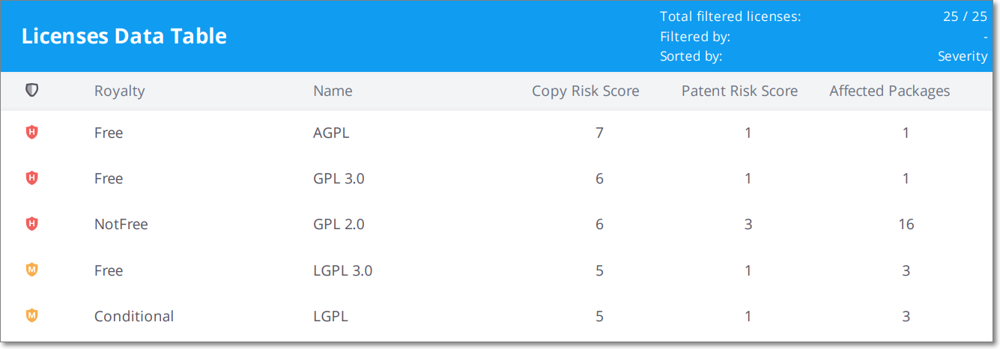
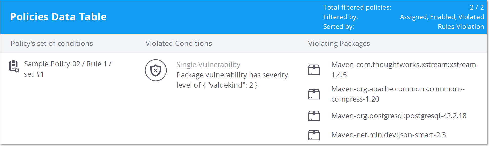

# SCA Scan Reports

You can export comprehensive Scan Reports for scans run using the Checkmarx One SCA scanner. The report shows an overview of the security of your project as well as specific vulnerabilities, legal risks, and outdated versions identified by the scan. Reports can be generated in pdf, xml, json, or csv format and downloaded locally.


The info shown in the Scan Report is similar to the info shown in the web portal on the SCA [Results Viewer](/document/preview/324320#UUID-a5fb3fa5-578e-3f6a-bcd8-54357376fda1) page.

We do not currently support the option to filter results included in a Scan Report. However, it is possible to filter the data exported as a CSV file from the Global Inventory & Risks page. So, on the Global Inventory & Risks page, you can filter for a specific Project and then apply additional filters as needed in order to generate a customized report for a particular Project.


Reports show data for the following subjects:

- Packages - shows info about the open source packages used by your project that contain risks, including: security vulnerabilities, license violations, and outdated versions. The info is separated into a direct packages table and a transitive packages table.
- Vulnerabilities - shows info about all of the security vulnerabilities that were identified in the open source packages used by your project, including: severity level, CVE references, remediation recommendations etc.
- Licenses - shows the licenses that you have for the packages in your project and the legal risks associated with those packages.
- Policy Violations - shows any security Policies which the Project violates.

When you generate a report, you can specify whether you want to include all sections or only specific sections.

## Generating an SCA Scan Report

### To generate an SCA Scan Report, use the following procedure:

1. Navigate to the SCA Results Viewer, and hover over the Export  icon (top right of page).

2. Select the Scan Report option.

3. Click on the Select Report Sections field and choose which data tables to include in the report. Options are: All data tables, Packages, Risks (Vulnerabilities and Suspected Malware), Licenses, Legal Risks and Risks by Package. By default, All data tables is selected.

4. Select a file format. Options are PDF, XML, JSON, and CSV.

5. Select the Hide Private Packages checkbox if you want to exclude private packages from the report.

6. Select the Exclude Dev and Test packages checkbox to exclude Dev and Test packages from the report.

   
   To learn more about Dev and Test dependencies, see [here](https://docs.checkmarx.com/en/34965-322318-sca-scanner.html#UUID-2865b187-60e6-84f0-67c8-c5313ef205fc_UUID-ce0b5676-9ab8-dee1-1004-5c32410eaa0a).
   

7. Select the Include only effective licenses checkbox if you want to exclude licenses that haven't been designated as effective from the report. By default, the checkbox is selected.

8. Click Export.

The SCA Scan Report is generated and ready for download

## Generating Scan Reports

You can generate a scan report (to export your scan results) via the web portal (UI). You can generate a report for the most recent successful scan of a Project from the Project page, as described below. It is also possible to generate a report from the Scan Results page (which makes it possible to generate reports for older scans).


Alternatively, when running a scan using Checkmarx SCA Resolver you can add a flag to generate a “Risk” report for that scan.


To generate a scan report:

1. Navigate to the Project screen for the desired Project.

2. Click on the Export button in the header bar.

   The export type menu opens.

   
<figure></figure>

3. Click on Scan Report.

   The Scan Report configuration dialog opens.

   
<figure></figure>

4. In the Select data tables field, select the sections of the report you would like to print. Options are: **All data tables** (default), **Packages**, **Vulnerabilities**, **Licenses**, and **Policy Violations**.

5. Select the format you would like to generate. Options are: **pdf** (default), **xml**, **json**, and **csv**.

6. Click the Export button.

   The report is saved on your local machine.

## Viewing SCA Scan Reports

A Scan Report shows information about a specific scan that ran on one of your Checkmarx SCA Projects.

Reports are generated in the specified file type. A csv report is downloaded as a zip file, from which separate csv’s are extracted for each section.

Reports in xml, json and csv contain the raw data from the scan, divided into the following sections: **Summary**, **Packages**, **Vulnerabilities** and **Licenses**.

Pdf reports contain the following sections.

- Title bar - shows general info about the Report as well as a link to view the full results in the web application.
- Overview section - shows an overview pane with a graphic display of the overall results for each element that is included in the report (**Packages**, **Vulnerabilities**, **Licenses**, **Policies**).


Only elements included in the report are represented in the overview pane, i.e if the report doesn’t include the Packages section then there won’t be a Packages overview pane.


- Packages Data Table (Direct) - shows a list of all packages called directly by your project. For each package, detailed info is shown about versions, licenses, vulnerabilities etc.
- Packages Data Table (Transitive) - shows a list of all packages called indirectly (via other packages). For each package, detailed info is shown about versions, licenses, vulnerabilities etc.
- Vulnerabilities Data Table - shows a list of all of the security vulnerabilities that were identified in the open source packages used by your Project. For each vulnerability, detailed info is shown about the severity, CVE ID, package where it is found etc.
- Licenses Data Table - shows a list of all of your licenses for the packages used by your project. For each license, detailed info is shown about the legal risks.

### Overview Section

The Title bar shows the following info about the report: **Project name**, **Date scanned**, **Date created**, **Printed Date**, and **Scan Origin**.

The Overview panes show a high level overview of the scan results for each of the sections that are included in the report (**Packages**, **Vulnerabilities**, and **Licenses)**.

There is also a Policies pane that shows any security Policies that are violated by this Project.

#### Packages

<figure></figure>

The **Packages Overview** shows the number of vulnerable packages over the total number of packages identified in the Project. It also shows a color coded graph indicating the number of vulnerable packages of each severity level. In addition, it shows the top five vulnerable packages along with the number of vulnerabilities in each of those packages.

#### Vulnerabilities

<figure></figure>

The **Vulnerabilities Overview** shows the number of high severity vulnerabilities over the total number of vulnerabilities in the Project. It also shows a color coded graph indicating the number of vulnerabilities of each severity level. In addition, it shows a breakdown of vulnerabilities based on other characteristics.

#### Licenses

<figure></figure>

The **Licenses Overview** shows the number of high severity legal risks over the total number of legal risks in the Project. It also shows a color coded graph indicating the severity of the legal risks with the licenses. In additions, it shows the seven licenses with the greatest legal risk.

#### Policies

<figure></figure>

The **Policies** section shows the number of violated Policies over the total number of Policies that apply to the Project. It also shows a breakdown of the number of Global and Specific policies as well as the number of packages that violate Policies and the number of Policies that cause builds to break.

### Packages Data Table

This table shows detailed info about each open source package used by your Project. Separate tables are shown for **Direct** and **Transitive** packages.

The header for each table shows how the table was filtered, the total number of filtered packages, and how the table is sorted.

<figure></figure>

The following table describes the info shown for each package identified by this scan.

<table>
<thead>
<tr><th>
<strong><strong>Item</strong></strong>
</th><th>
<strong><strong>Description</strong></strong>
</th><th>
<strong><strong>Possible Values</strong></strong>
</th></tr>
</thead>
<tbody>
<tr><td>
<strong><strong>Package</strong></strong>
</td><td>
The name of the package.
</td><td>
e.g., dom4j:dom4j
</td></tr>
<tr><td>
<strong><strong>Version</strong></strong>
</td><td>
The version of the package that you are using.
</td><td>
e.g., 1.6.1
</td></tr>
<tr><td>
<strong><strong>Outdated</strong></strong>
</td><td>
Indicates whether or not a more recent version of the package is available.
</td><td>
 The package is outdated.

 The package is up to date.
</td></tr>
<tr><td>
<strong><strong>License</strong></strong>
</td><td>
Shows all licenses that you have that are associated with this package.
</td><td>
e.g., GPL 2.0, Apache2.1
</td></tr>
<tr><td>
<strong><strong>Vulnerabilities</strong></strong>
</td><td>
A color coded bar graph indicating the number of vulnerabilities of each severity level.
</td><td>
e.g.,
<figure></figure></td></tr>
<tr><td>
<strong><strong>Usage</strong></strong>
</td><td>
Indicates whether or not the package is being called by the source code.
</td><td><ul><li>
<strong><strong>Used</strong></strong> - This package is used by your project’s source code.
</li><li>
<strong><strong>Potentially Used</strong></strong> - This package is a dependency of a direct package that is used by your project’s source code.
</li><li>
<strong><strong>Unused</strong></strong> - No usage of this package was found.
</li><li>
<strong><strong>Unknown</strong></strong> - Checkmarx SCA could not determine whether the package is used.
</li></ul></td></tr>
<tr><td>
<strong><strong>Dep. Type</strong></strong>

(Dependency Type)
</td><td>
Shows labels that Checkmarx applied to the package. There is a label indicating the package manager used for package resolution. In addition, the label “Dev” is applied to dev dependencies, and “Test” is applied to all packages that have the word “test” in their file path.
</td><td>
e.g., Maven, Pip, Nuget, Npm, Dev, Test
</td></tr>
</tbody>
</table>

### Vulnerabilities Data Table

This table shows detailed info about each vulnerability that was identified in the open source packages used by your Project.

The header for the table shows how the table was filtered, the total number of filtered vulnerabilities, and how the table is sorted.

<figure></figure>

The following table describes the info shown for each vulnerability identified by this scan.

| Item | Description | Possible Values |
| --- | --- | --- |
| Risk Level | The severity level of the vulnerability, based on its CVSS score in the NVD. | <ul><li>
<strong><strong>HIGH</strong></strong> - 7.0-10.0
</li><li>
<strong><strong>MEDIUM</strong></strong> - 4.0-6.9
</li><li>
<strong><strong>LOW</strong></strong> - 0.0-3.9
</li></ul> For more info see [Severity Levels](https://app.gitbook.com/s/XSPACE_PRODUCT_INFO/severity-levels). |
| ID | The ID of the CVE listing. The ID consists of the CVE prefix followed by the year that the CVE was discovered and the serial counter for that year's CVE listings. Note: Vulnerabilities discovered by the Checkmarx Vulnerability Research Team which are not yet cataloged as CVEs, are indicated by the “Cx” prefix. | e.g., CVE-2020-9488 |
| Package | The name of the package in which the vulnerability was identified. | e.g., mysql:mysql-connector-java |
| Version | The version of the package where the vulnerability was identified. | e.g., 5.1.26 |
| Ignored | Indicates whether or not the vulnerability has been marked to be Ignored for this Project. Ignored vulnerabilities aren’t included in the count of vulnerabilities for the Project. | **Yes**, **No** |
| Exploitable Path | Indicates whether an exploitable path was detected by which the vulnerable package is called by your Project. | <ul><li>
<strong><strong>Yes</strong></strong> - an exploitable path was detected
</li><li>
<strong><strong>No</strong></strong> - no exploitable path was detected
</li><li>
<strong><strong>Unknown</strong></strong> - the Exploitable Path feature wasn’t activated for the scan
</li></ul> |
| Publication Date | The date the vulnerability was published in the NVD. | e.g., Nov 16, 2020 |

### Licenses Data Table

This table shows detailed info about all of the licenses that were identified in the open source packages used by your Project.

The header for the table shows how the table was filtered, the total number of filtered licenses, and how the table is sorted.

<figure></figure>

| Item | Description | Possible Values |
| --- | --- | --- |
| Legal Risk Level | The Legal Risk calculation is based on the copyright risk score (below), where Level 1-3 is considered as a low risk, Level 4-5 as a medium risk, and Level 6-7 as a high risk. | <ul><li>
<strong><strong>High (Red)</strong></strong> – (6 to 7)
</li><li>
<strong><strong>Medium (Orange)</strong></strong> – (4 to 5)
</li><li>
<strong><strong>Low (Grey)</strong></strong> – (1 to 3)
</li><li>
<strong><strong>Unknown (Light Grey)</strong></strong>
</li></ul> |
| Royalty | Indicates whether or not a patent license is granted for free. | <ul><li>
<strong><strong>Free</strong></strong> – patent license is granted
</li><li>
<strong><strong>NotFree</strong></strong> – patent license is not granted
</li><li>
<strong><strong>Conditional</strong></strong> – patent license granted under some condition (e.g., if sued by user license is revoked) – this may change according to each license and requires consultation.
</li><li>
<strong><strong>Empty</strong></strong> – status not known
</li></ul> |
| Name | The name of the license. | e.g., GPL 2.0, Apache2.1 |
| Copy Risk Score | The score is defined as follows: <ul><li>
<strong><strong>1</strong></strong> – Licensee may use code without restriction.
</li><li>
<strong><strong>2</strong></strong> – Anyone who distributes the code must retain any attributions included in original distribution.
</li><li>
<strong><strong>3</strong></strong> – Anyone who distributes the code must provide certain notices, attributions and/or licensing terms in documentation with the software.
</li><li>
<strong><strong>4</strong></strong> – Anyone who distributes a modification of the code may be required to make the source code for the modification publicly available at no charge.
</li><li>
<strong><strong>5</strong></strong> – Anyone who distributes a modification of the code or a product that is based on or contains part of the code may be required to make publicly available the source code for the product or modification, subject to an exception for software that dynamically links to the original code.
</li><li>
<strong><strong>6</strong></strong> – Anyone who distributes a modification of the code or a product that is based on or contains part of the code may be required to make publicly available the source code for the product or modification.
</li><li>
<strong><strong>7</strong></strong> – Anyone who develops a product that is based on or contains part of the code, or who modifies the code, may be required to make publicly available the source code for that product or modification if s/he (a) distributes the software or (b) enables others to use the software via hosted or web services.
</li></ul> | A number between 1 and 7 |
| Patent Risk Score | Ranks the license based on: <ul><li>
<strong><strong>1</strong></strong> – Royalty free and no identified patent risks
</li><li>
<strong><strong>2</strong></strong> – Royalty free unless litigated
</li><li>
<strong><strong>3</strong></strong> – No patents granted
</li><li>
<strong><strong>4</strong></strong> – Specific identified patent risks
</li></ul> | A number between 1 and 4 |
| Affected Packages | The number of packages in the Project in which the license was identified. | e.g., 3 |

### Policies Data Table

This table shows detailed info about each security Policy that was violated by your Project.

The header for the table shows the number of violated Policies, as well as how the table is filtered and sorted.

<figure></figure>

The following table describes the info shown for each Policy violation identified by this scan.

| Item | Description | Possible Values |
| --- | --- | --- |
| Policy's set of conditions | The name of the Policy and set of conditions that was violated. | e.g., Sample Policy 02 / Rule 1 / set #1 |
| Violated Conditions | A description of the specific rule that was violated. | e.g., Single Vulnerability Package vulnerability has severity level of { "valuekind": 2 } |
| Violating Packages | A list of all of the packages that violated this Policy. | e.g., Maven-com.thoughtworks.xstream:xstream- 1.4.5 |
