# SSO Authentication

Checkmarx SCA supports SSO (Single Sign-on) through SAML 2.0 protocol. When logging in to Checkmarx SCA, the SSO feature makes it possible for users in your organization to authenticate through your company's identity provider, without the need to enter Checkmarx SCA credentials. You can enable SSO login via the Checkmarx SCA login screen or from an app on the identity provider’s desktop.

SSO configuration can be set up for any identity provider that supports SAML 2.0.


You need to have admin privileges in Checkmarx SCA in order to configure the Access Control settings.



For generalized instructions for configuring SSO for Checkmarx SCA, see[Setting up a New SSO Connection - SAML](sso-authentication.md#UUID-b479e22c-00e6-aa2f-f0ca-16d243adc03a). For a detailed tutorial about configuring SSO using Okta, see [How to Configure Checkmarx SCA SSO Integration for Okta](sso-authentication.md#UUID-2805de14-92ba-5ce6-87c4-48fe63d8d467).


## Setting up a New SSO Connection - SAML

This section explains how to set up a new SSO integration in Checkmarx SCA using SAML 2.0 protocol. For detailed instructions for configuring SSO using Okta, see [How to Configure Checkmarx SCA SSO Integration for Okta](sso-authentication.md#UUID-2805de14-92ba-5ce6-87c4-48fe63d8d467).


You will need to exchange configuration info between your identity provider account and your Checkmarx SCA account, so it is recommended to keep both consoles open in parallel.



The following attributes are required in Checkmarx SCA: **First Name**, **Last Name**, and **Email**. Each user that you would like to assign to Checkmarx SCA via SSO must have a user profile in the identity provider that has all of these attributes filled in.


To set up a new SSO integration:

1. Log in to the identity provider and follow the directions for that provider to add a new application using the SAML protocol.
2. Log in to the Checkmarx SCA web portal using an admin account.
3. Go to the User Management (Access Control) > Settings tab.
4.  On the SAML subtab (default) click on the Service Provider subtab and then click Download Metadata.

    
<figure>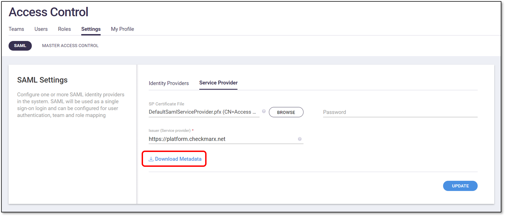<figcaption></figcaption></figure>

    Make a note of where the Metadata file is saved, as you will need to access it soon.
5. Click on the Identity Providers subtab.
6.  Click Add Identity Providers.

    
<figure><figcaption></figcaption></figure>

    The Add New SAML Identity Provider form is shown.

    
<figure>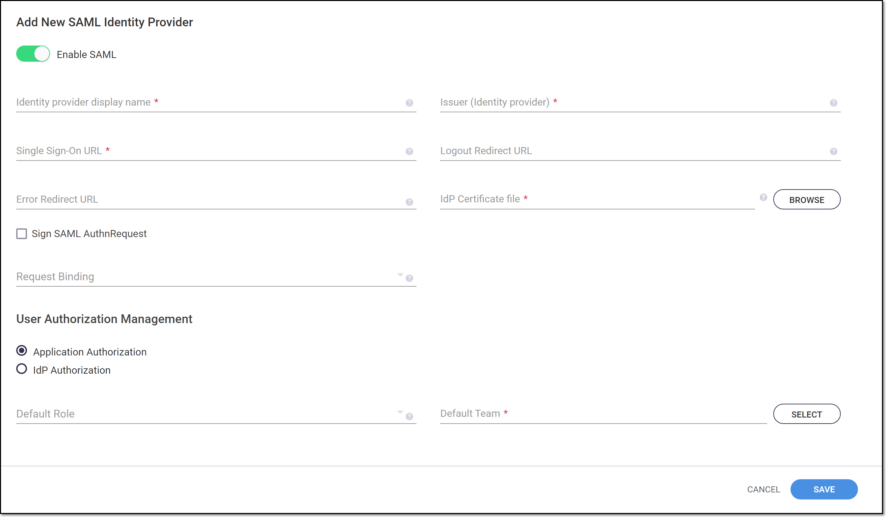<figcaption></figcaption></figure>

7.  Open the Metadata file from Step 4, and make note of the entityID, Location, and required attributes.

    
<figure><figcaption></figcaption></figure>

8.  Copy the entityID, Location, and required attributes, and paste them in the appropriate places in your identity provider’s console for the new application that you created.

    (Sample screenshot for Okta)

    
<figure>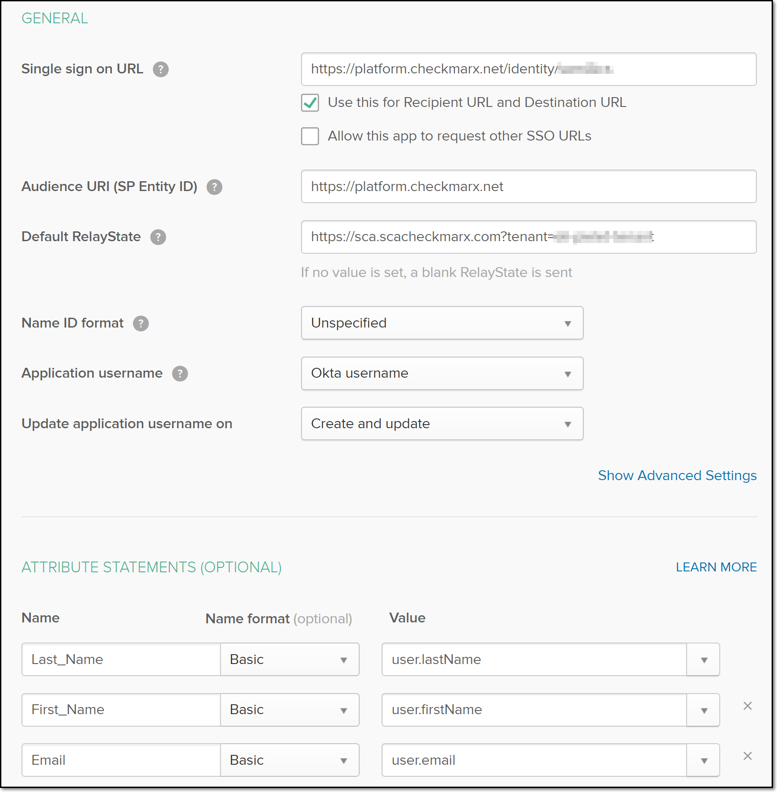<figcaption></figcaption></figure>

9. If you would like to set up **IdP Authorization** (i.e., enable login from the SCA app on the IdP desktop), enter the following information into the relay state field of your IdP: {application\_url}?tenant={tenantName}, where {application\_url} is the product URL, and {tenantName} is the name of your tenant account. For example: https://sca.scacheckmarx.com?tenant=john-doe-tenant.
10. In your identity provider’s console, map the attributes to the names designated for them in Checkmarx SCA.
11. If you would like to, you may map optional attributes as well.
12. In your identity provider’s console assign users to your new Checkmarx SCA application.
13. In Checkmarx SCA, in the Add New SAML Identity Provider form, verify that the Enable SAML toggle is on (to the right).
14. In Checkmarx SCA, in the Identity provider display name field, enter the name of the SSO provider you are using, e.g., “Okta”.

    

This is the name that will be shown on the SSO button on the login screen.

15. Locate the Issuer in your identity provider’s console, and copy it to the Issuer (Identity provider) field in Checkmarx SCA.
16. Locate the SSO URL in your identity provider’s console, and copy it to the Single Sign-On URL field in Checkmarx SCA.
17. In Checkmarx SCA, you can optionally enter your desired URLs in the Logout Redirect URL and Error Redirect URL fields.
18. Download the IdP certificate (X.509 certificate) from your identity provider’s console to your local machine.

    

For Azure AD, use the “Base64” Certificate and not the “Raw” Certificate.

19. In Checkmarx SCA, click Browse next to the IdP Certificate field and navigate to the IdP Certificate file.

    
<figure><figcaption></figcaption></figure>

20. Optionally select the checkbox next to Sign SAML AuthnRequest.
21. In the Request Binding field, optionally select from the dropdown list the SAML Protocol binding used for sending the request. Options are: **HTTP-Redirect** and **HTTP-Post**.
22. In theUser Authorization Managementsection, select the desired authentication method, options are:
    * Application Authorization - users log in via the Checkmarx SCA login page by clicking on the IdP button.
    * IdP Authorization - users log in from a Checkmarx SCA app button on the IdP desktop.
23. In the Default Role field, optionally select from the dropdown list the role that you would like to assign by default to all users that access Checkmarx SCA via the identity provider. Options are: **Admin**, **Access Control Manager**, **User Manager**, **SCA Admin**, **SCA Manager**, **SCA Scanner**, **SCA Viewer**, and **SCA External Platform User**.

    

If no role is specified, then users will initially be able to access the web platform but will not have any privileges in the system.

    

If you want to assign a specific or additional role (other than the default role) to a user, you can do this through the Checkmarx SCA web platform’s User Management after the user has initially signed on through the IdP. If you are using the <strong>IdP Authorization</strong> method, you can also map specific roles directly from the IdP.

24. Click on the Select button next to the Default Team field.

    The Select Team window is shown.

    
<figure><figcaption></figcaption></figure>

25. Select a Team from the expandable tree. You can search for the desired Team using the search box.
26. Click Select Team.

    

If you want to assign a specific or additional team (other than the default team) to a user, you can do this through the Checkmarx SCA web platform’s User Management after the user has initially signed on through the IdP. If you are using the <strong>IdP Authorization</strong> method, you can also map specific Teams directly from the IdP.

27. If IdP Authorization was selected, then you have the option to map roles and Teams for specific users directly from the IdP. If you would like to map roles and Teams, use the following procedure:
    1. Verify that the Enable IDP mapping toggle is on (to the right).
    2. In the SAML IdP role mapping attribute field, enter a name to use for the Checkmarx SCA role attribute, e.g., “CxSCA\_Role”.
    3. In the SAML IdP team mapping attribute field, enter a name to use for the Checkmarx SCA Team attribute, e.g., “CxSCA\_Team”.
    4. In the IdP console, configure the attribute mapping using the names that you designated above.
28. At the bottom of the form, click Save.

    The SAML identity provider is added to the system.

    
<figure><figcaption></figcaption></figure>

    The SSO configuration is completed. Users who were assigned to the Checkmarx SCA app can now log in via the IdP.

## How to Configure Checkmarx SCA SSO Integration for Okta

### Overview

Checkmarx SCA supports SSO (Single Sign-on) through SAML 2.0 protocol. When logging in to Checkmarx SCA, the SSO feature makes it possible for users in your organization to authenticate through your company's identity provider, without the need to enter Checkmarx SCA credentials. You can enable SSO login via the Checkmarx SCA login screen or from an app on the identity provider’s desktop.

SSO configuration can be set up for any identity provider that supports SAML 2.0. The system has been tested and found to be effective for Okta.


This article gives detailed instructions for configuring SSO using Okta with SAML 2.0. You can generalize from these instructions to configure SAML integration using an alternative identity provider of your choice.


#### Prerequisites

* You need to have admin privileges both in Okta and in Checkmarx SCA. This will enable you to access the **Applications** screen in Okta and the **SAML Settings** screen in Checkmarx SCA.
* Each user that you would like to assign to Checkmarx SCA via SSO must have a user profile in Okta that has the following attributes filled in: **First Name**, **Last Name**, and **Email**.

### Setting up Okta SSO Integration

This section gives instructions for setting up SSO authentication for Checkmarx SCA through your Okta account.


You will need to exchange configuration info between your Okta account and your Checkmarx SCA account, so it is recommended to keep both consoles open in parallel.


#### Step 1: Create a Checkmarx SCA application in Okta

1. Log in to the Okta console using an admin account.
2. Log in to the Checkmarx SCA web portal using an admin account.
3. On the Okta home page, click Applications.
4.  On the Applications page, click Add Application.

    
<figure>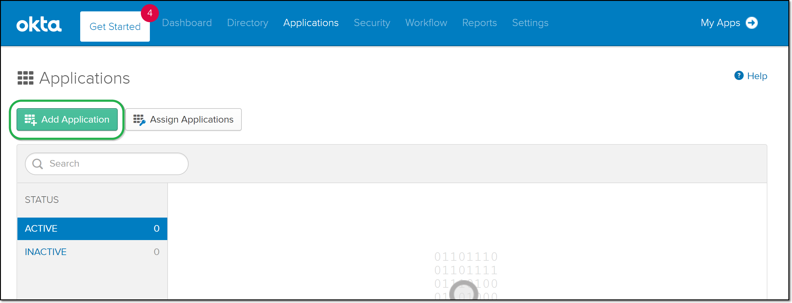<figcaption></figcaption></figure>

    The Add Application screen opens.
5.  Click Create New App.

    
<figure>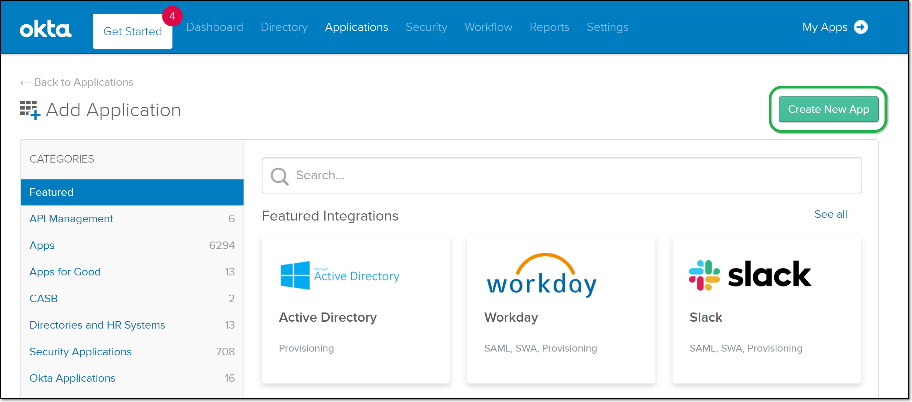<figcaption></figcaption></figure>

    The Create a New Application Integration window opens.
6. In the Platform field, verify that Web is selected (default).
7.  In the Sign on method field, select SAML 2.0.

    
<figure>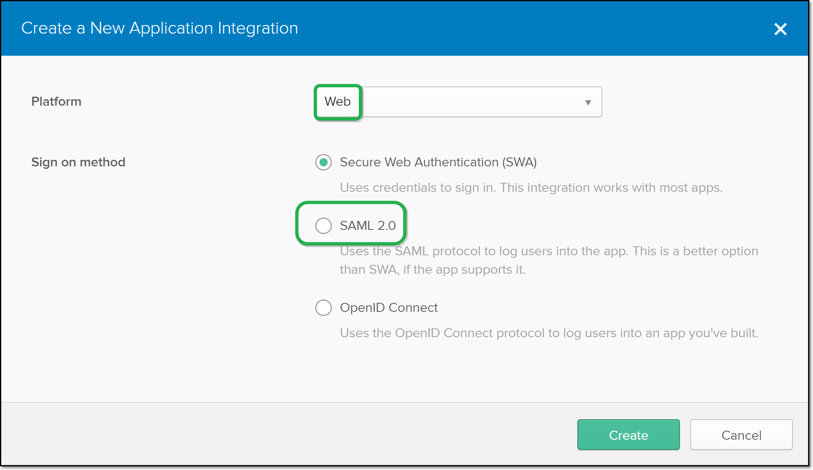<figcaption></figcaption></figure>

8.  Click Create.

    The Create SAML Integration screen opens.

    
<figure>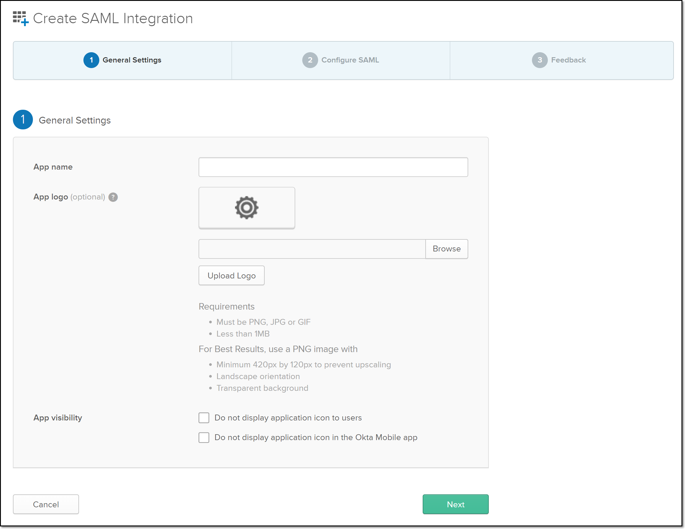<figcaption></figcaption></figure>

9. In the App name field, enter a name for the SSO app. This name is used to identify this integration in Okta, so you should give a name relevant to your Checkmarx SCA account e.g., “CxSCAWebPortal”.
10. Fill in the optional fields and settings as desired.
11. Click Next.

    The SAML Settings screen opens.
12. In Checkmarx SCA, go to the User Management (Access Control) > Settings tab.
13. On the SAML subtab (default) click on the Service Provider subtab and then click Download Metadata.

    
<figure><figcaption></figcaption></figure>

    Make a note of where the Metadata file is saved.
14. Open the Metadata file, and take note of the entityID, Location, and required attributes.

    
<figure>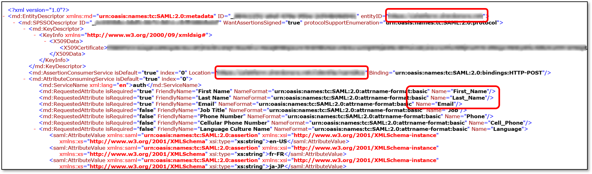<figcaption></figcaption></figure>

15. Copy the entityID to your clipboard.
16. In the Okta portal SAML Settings section, paste the entityID in the Audience URI (SP Entity ID) field.
17. In the Checkmarx SCA Metadata file, copy the Location to your clipboard.
18. In the Okta portal SAML Settings section, paste the Location in the Single sign on URL field.

    
<figure>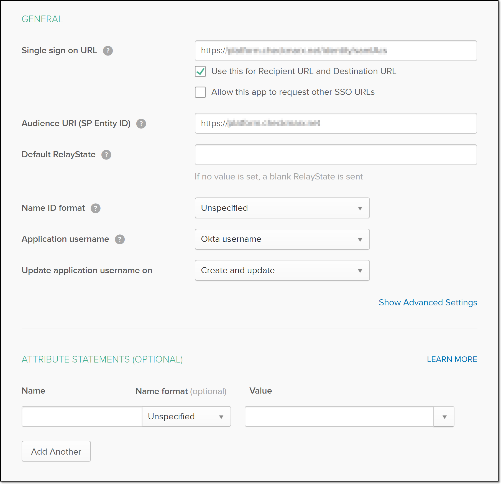<figcaption></figcaption></figure>

19. In the Okta portal, in the Attribute Statements (Optional) section, use the attribute names from the Checkmarx SCA Metadata file to map to the Okta values (as shown in the screenshot below) in the Value column. In the Name column, enter the attribute name from Checkmarx SCA. In the Value column, use the dropdown arrow to choose the appropriate Okta option. In the Name format column, choose Basic for each Name.

    You will need to click Add Another each time you want to add an additional attribute name.

    
<figure>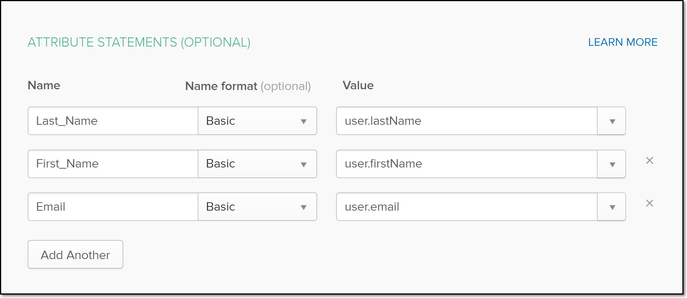<figcaption></figcaption></figure>

20. If you would like to set up **IdP Authorization** (i.e., enable login from the SCA app on the IdP desktop), enter the following information into the relay state field of your IdP: {application\_url}?tenant={tenantName}, where {application\_url} is the product URL, and {tenantName} is the name of your tenant account. For example: https://sca.scacheckmarx.com?tenant=john-doe-tenant.
21. Optionally edit the other fields in the Okta SAML section.
22. In the Okta portal, click Next.

    The Feedback tab opens.

    
<figure>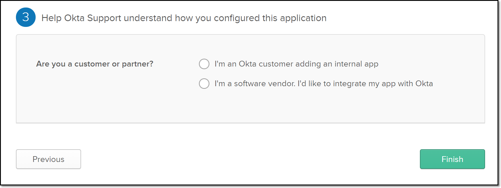<figcaption></figcaption></figure>

23. Select the appropriate radio button and click Finish.

    The application is created, and the configuration page for the new application is displayed.

    
<figure>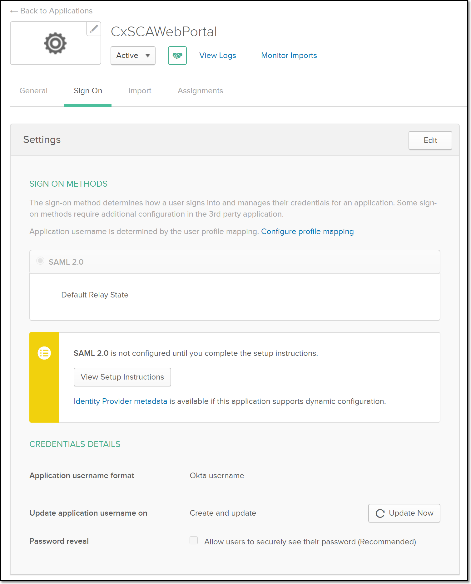<figcaption></figcaption></figure>

#### Step 2: Assign People to the Application

Now that you have created an application for Checkmarx SCA in Okta, you can assign users to this application. This will enable them to access the Checkmarx SCA web portal via Okta. You can either assign specific people or groups.

Each user that you would like to assign to Checkmarx SCA must have a user profile in Okta that has the following attributes filled in: **First Name**, **Last Name**, and **Email**.

To assign users to Checkmarx SCA:

1. In Okta, on the Checkmarx SCA application page, click on the Assignments tab.
2.  Click Assign, and then select from the dropdown menu either Assign to People or Assign to Groups (depending on how you want to assign access to Checkmarx SCA).

    
<figure>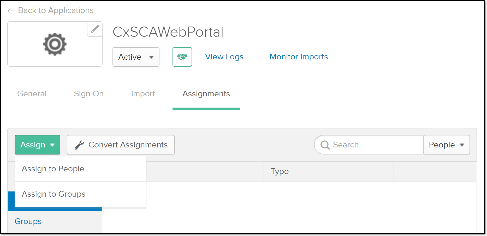<figcaption></figcaption></figure>

3.  In the Assign window that opens, select each user or group that you want to grant access to, by clicking the Assign button in that row.

    Each time that you assign the App to an individual user, a window opens specific to that user, enabling you to optionally modify that user’s profile information.
4. Click Save and Go Back.
5. Repeat the above procedure for each user and/or group that you would like to assign.
6. Click Done.

#### Step 3: Configure the SAML Profile in Checkmarx SCA Web Platform

1. In the Okta console, go to Applications > \[Your SAML Application] > Sign On.
2.  Click the View Setup Instructions button.

    
<figure>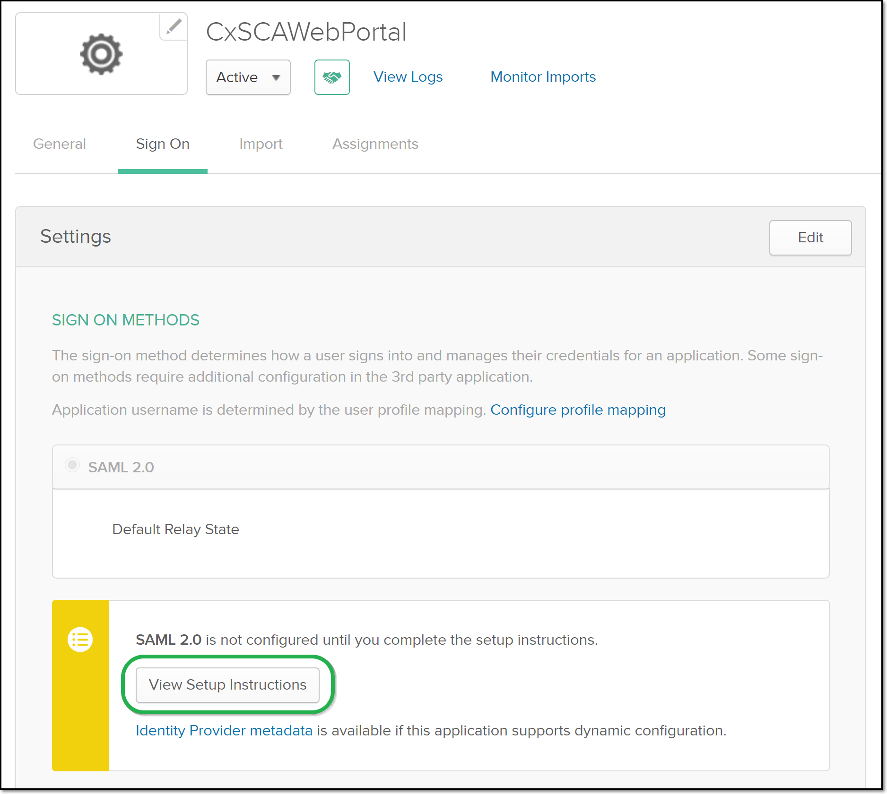<figcaption></figcaption></figure>

    The Setup instructions are shown.

    
<figure>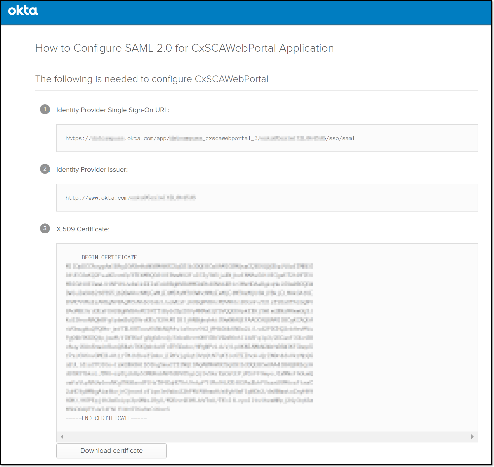<figcaption></figcaption></figure>

3.  In Checkmarx SCA, on the SAML subtab of the User Management (Access Control) > Settings tab, click the Identity Providers subtab.

    
<figure>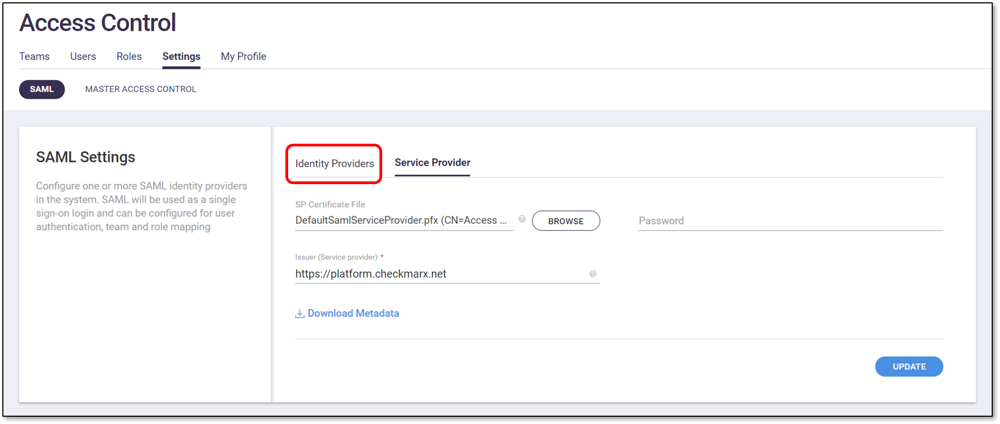<figcaption></figcaption></figure>

4.  Click Add Identity Providers.

    
<figure>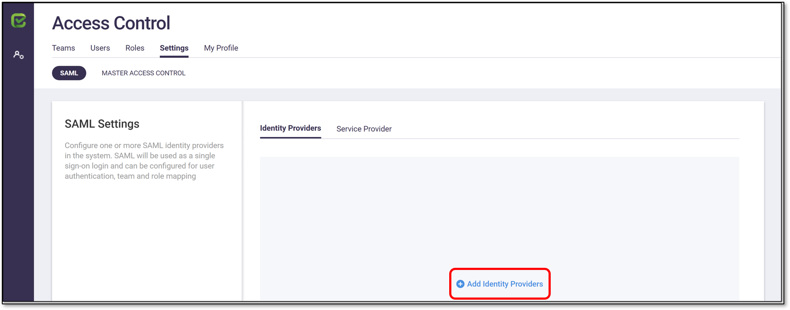<figcaption></figcaption></figure>

    The Add New SAML Identity Provider form is shown.

    
<figure><figcaption></figcaption></figure>

5. Verify that the Enable SAML toggle is on (to the right).
6.  In the Identity provider display name field, enter the name of the SSO provider you are using, e.g., “Okta”.

    This is the name that will be shown on the SSO button on the login screen.
7. In the Okta console Setup Instructions, copy the Identity Provider Issuer to your clipboard.
8. In the Checkmarx SCA portal, paste the Identity Provider Issuer in the Issuer (Identity provider) field.
9. In Okta, copy the Identity Provider Single Sign-On URL to your clipboard.
10. In Checkmarx SCA, paste the Identity Provider Single Sign-On URL in the Single Sign-On URL field.
11. In Checkmarx SCA, you can optionally enter your desired URLs in the Logout Redirect URL and Error Redirect URL fields.
12. In Okta, click the Download certificate button.

    
<figure>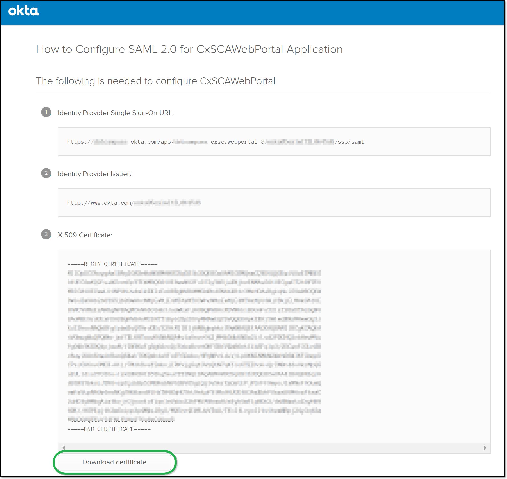<figcaption></figcaption></figure>

    Make a note of where the IdP certificate (X.509 certificate) is saved.
13. In Checkmarx SCA, click Browse next to the IdP Certificate file field and navigate to the IdP Certificate file.

    
<figure>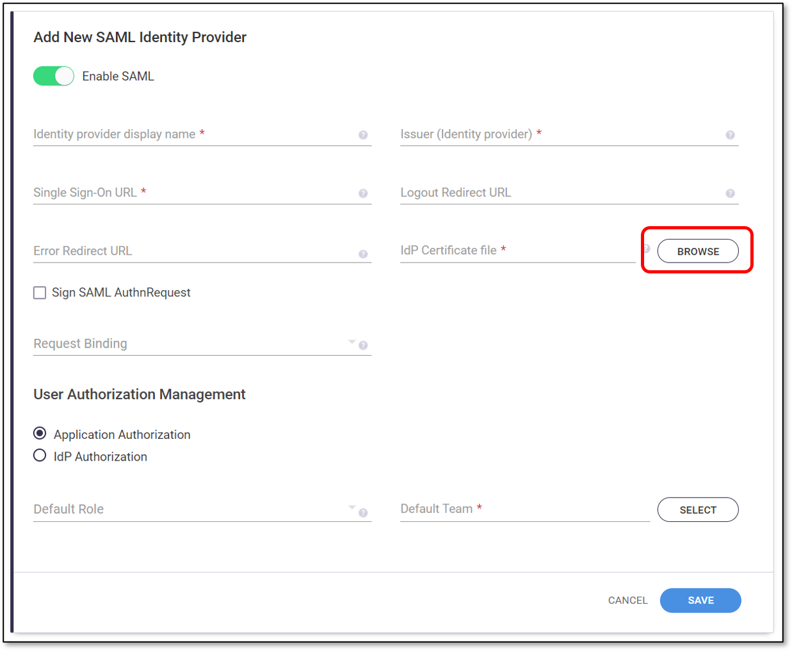<figcaption></figcaption></figure>

14. Optionally select the checkbox next to Sign SAML AuthnRequest.
15. In the Request Binding field, optionally select from the dropdown list the SAML Protocol binding used for sending the request. Options are: **HTTP-Redirect** and **HTTP-Post**.
16. In the User Authorization Management section, select the desired authentication method, options are:
    * Application Authorization - users log in via the Checkmarx SCA login page by clicking on the IdP button.
    * IdP Authorization - users log in from a Checkmarx SCA app button on the IdP desktop.
17. In the Default Role field, optionally select from the dropdown list the role that you would like to assign by default to all users that access Checkmarx SCA via the identity provider. Options are: **Admin**, **Access Control Manager**, **User Manager**, **SCA Admin**, **SCA Manager**, **SCA Scanner**, **SCA Viewer**, and **SCA External Platform User**.

    

If no role is specified, then users will initially be able to access the web platform but will not have any privilege's in the system.

    

If you want to assign a specific or additional role (other than the default role) to a user, you can do this through the Checkmarx SCA web platform’s User Management after the user has initially signed on through the IdP. If you are using the <strong>IdP Authorization</strong> method, you can also map specific roles directly from the IdP.

18. Click on the Select button next to the Default Team field.

    The Select Team window is shown.

    
<figure>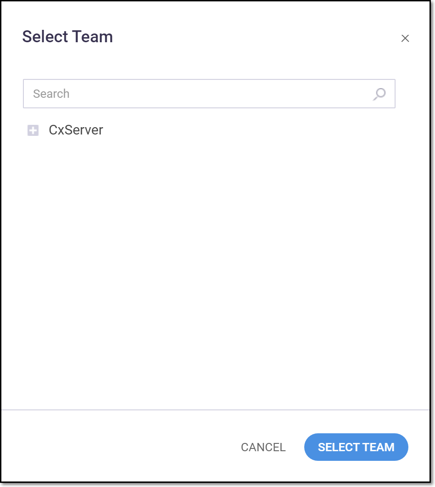<figcaption></figcaption></figure>

19. Select a Team from the expandable tree. You can search for the desired Team using the search box.
20. Click Select Team.

    

If you want to assign a specific or additional team (other than the default team) to a user, you can do this through the Checkmarx SCA web platform’s User Management after the user has initially signed on through the IdP. If you are using the <strong>IdP Authorization</strong> method, you can also map specific Teams directly from the IdP.

21. If IdP Authorization was selected, then you have the option to map roles and Teams for specific users directly from the IdP. If you would like to map roles and Teams, use the following procedure:
    1. Verify that the Enable IDP mapping toggle is on (to the right).
    2. In the SAML IdP role mapping attribute field, enter a name to use for the Checkmarx SCA role attribute, e.g., “CxSCA\_Role”.
    3. In the SAML IdP team mapping attribute field, enter a name to use for the Checkmarx SCA Team attribute, e.g., “CxSCA\_Team”.
    4. In the IdP console, configure the attribute mapping using the names that you designated above.
22. At the bottom of the form click Save.

    The SAML identity provider is added to the system.

    
<figure>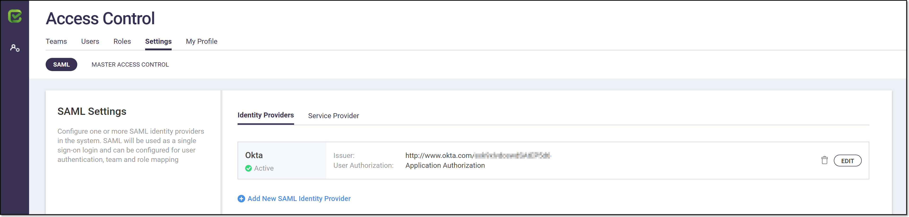<figcaption></figcaption></figure>

    The SSO configuration is completed. When users access your login screen, they will be shown an option to log in using your SSO provider (e.g., Okta).

    
<figure>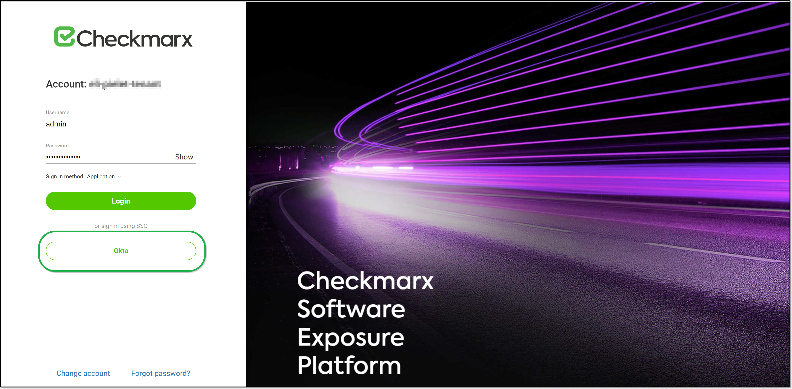<figcaption></figcaption></figure>

    If you set up IdP initiated login in Step 1, you will be able to log in to your Checkmarx SCA account by clicking on the corresponding icon in your Okta Apps page, without needing to access the Checkmarx SCA login page.

    
<figure>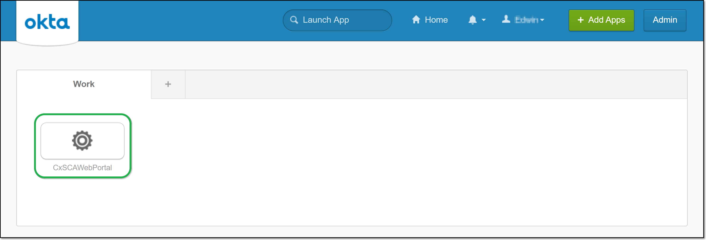<figcaption></figcaption></figure>

