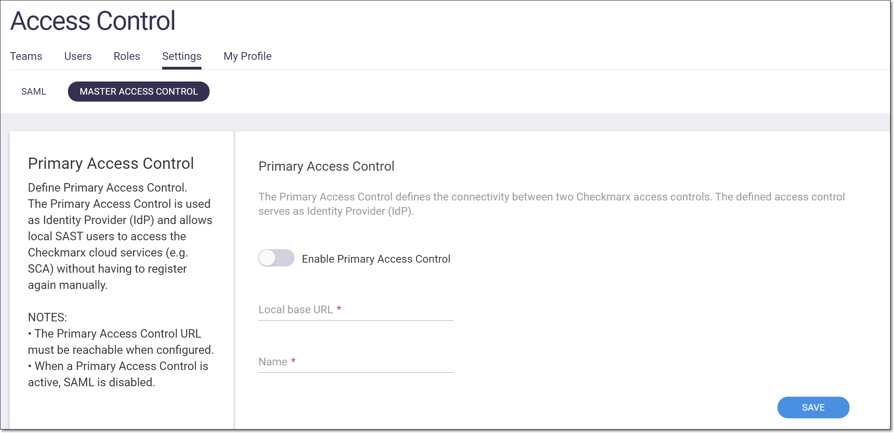
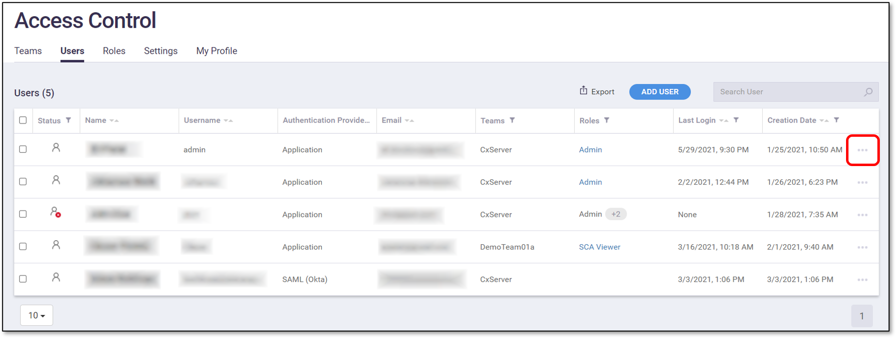
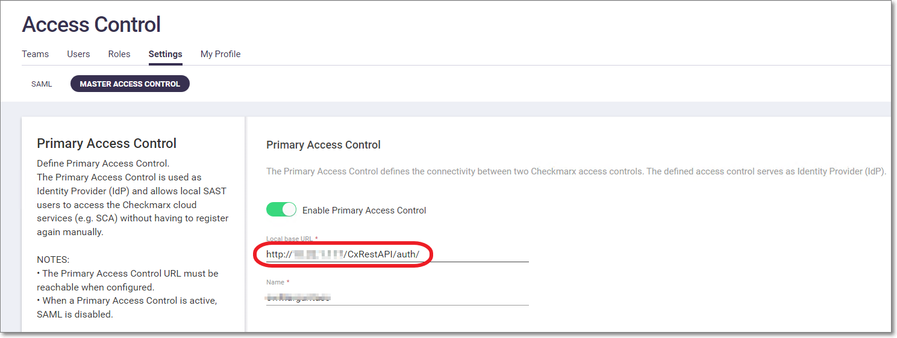

# Using Master Access Control (Replica Mode)

If you are running SAST on premise along with SCA integration, you can use the **Primary Access Control** associated with your SAST account, to manage your SCA users and Teams. This makes it easy to give existing SAST users access to SCA, and to manage Teams across systems.


Users added through Master Access Control can access SCA through the web application as well as via the CLI Tool or Checkmarx plugins. To learn about using Master Access Control to authenticate in the CLI, see below [Using Master Access Control with the CLI](using-master-access-control--replica-mode-.md#UUID-b4dd0419-0ddb-8d1d-4544-0461b8fb28bf).


## Prerequisites

* You have an installation of SAST version 9.0/9.2 with Access Control v2.0.1.116+, or SAST version 9.3/9.4 with Access Control v2.1.0.2223+
* The initial integration must be done on a network that can access your SAST instance and the SCA web portal.
* Disable all SSO connections that are running in SCA.


You have the option of connecting an SSO to the Master Access Control.


## Workflow

The workflow for using Master Access Control integration involves the following steps:

1. An SCA admin Configures Master Access Control integration on your SCA Access Control console. This enables all SAST users to login to SCA using their SAST credentials.
2. Each SAST user can now log in to SCA via the Master Access Control. A new user account is created in the SCA Access Control console for each SAST user that logs in. Similarly, all SAST Teams with members that log in to SCA are created in the SCA AC. User roles are automatically mapped to the equivalent SCA permissions.
3. User permissions for SCA users can now be configured either in the Master Access Control console or in the SCA Access Control console. Some SCA related roles can only be added in the SCA Access Control console.

## Step 1 - Configure Master Access Control Integration

To Configure Master Access Control for SCA:

1. Log in to the SCA web platform as an admin.
2.  In the main navigation, click User Management.

    The Access Control screen opens in a new tab.
3. On the Access Control screen select the Settings tab.
4. Click on the SAML sub-tab and make sure that all SAML connections are disabled.
5.  Click on the Master Access Control sub-tab.

    The Primary Access Control form opens.

    <div align="left"><figure><figcaption></figcaption></figure></div>
6. Toggle the Enable… switch to the right (On).
7.  In the Local base URL field, enter the URL of the Primary Access Control instance.

    <div data-gb-custom-block data-tag="hint" data-style="info" data-icon="pencil" class="hint hint-info"><p>You can copy the URL from your browser when you have the Primary Access Control console opened. Make sure to use the actual IP or a domain name that is recognized by the machine that is being used, e.g., &#x3C;SAST_on_prem_base_url>/CxRestAPI/auth/, for example, “https://checkmarx.hostedcustomer.com/CxRestAPI/auth/”.</p></div>

    <div data-gb-custom-block data-tag="hint" data-style="info" data-icon="pencil" class="hint hint-info"><p>The following requirements apply to the base URL:</p><ul><li>The Local Base URL is case sensitive.</li><li>If you will be using Master Access Control for authentication in the CLI, then the URL must end with a "/" character.</li><li>The Local Base URL must be reachable at the time you configure the Primary Access Control.</li><li><p>The Local Base URL protocol should be 'HTTPS', If the protocol is 'HTTP', refer to <a href="https://checkmarx.atlassian.net/wiki/spaces/PlarformServices/pages/1812103918/Setting+up+Primary+Access+Control+using+the+API">Setting up Primary Access Control using the API</a> or allow mixed content via the browser configuration, using the appropriate procedure for your browser:</p><ul><li>Chrome: Click the lock icon -> Site settings -> Insecure content -> Allow</li><li>Firefox: Open menu -> Options -> Privacy and Security -> HTTPS-Only Mode -> Don’t enable HTTPS-Only Mode</li><li>Edge: Click the lock icon -> Site permissions -> Insecure content -> Allow</li></ul><p>Once Master Access Control integration has been completed, you can disable the mixed content setting on your browser.</p></li></ul></div>
8. In the Name field, enter a name for the Master Access Control integration, e.g., “Master Access Control”. This name will appear in the button on the SCA login page that is used for Master Access Control login.
9. Click Save.


The integration is implemented. However, the SAST users aren’t added to SCA Access Control until they actually log in to SCA using Master Access Control.


## Step 2 - Activating user accounts

After setting up the integration, the SCA admin should inform all relevant SAST users that they can now access the SCA web portal using their SCA credentials. Send them an introductory email that includes the following:

*   URL for accessing SCA

    (For a US environment: [https://sca.checkmarx.net](https://sca.checkmarx.net/). For an EU environment: [https://eu.sca.checkmarx.net](https://eu.sca.checkmarx.net/))
* your organization’s SCA **Account Name**
* an explanation of the initial login procedure, as described below.

To login using Master Access Control credentials:

1. Go to the SCA login screen. (For a US environment: [https://sca.checkmarx.net](https://sca.checkmarx.net/). For an EU environment: [https://eu.sca.checkmarx.net](https://eu.sca.checkmarx.net/))
2.  Click on the master access control button that was created for your integration, e.g., “Master Access Control”.

    The SAST login screen opens.
3. Enter your SAST credentials. You will then be redirected to the SCA web portal.


For subsequent logins, if you are already logged in to SAST you won’t need to re-enter your credentials.


For each user who accesses SCA via Master Access Control a user account is created in the SCA AC. The user is assigned parallel roles to their SAST roles, based on the mapping shown in the table below. In addition, any Teams in which they are members are created in the SCA AC.


If a Team with the identical name and hierarchy path already exists in SCA, then the user is automatically assigned to that Team.


Roles Mapping from SAST to SCA

When using Master Access Control, users who are assigned roles in Checkmarx SAST will automatically be assigned equivalent roles in Checkmarx SCA. For detailed info about how the roles and permissions are mapped from Checkmarx SAST to Checkmarx SCA, see [Mapping Roles and Permissions from Checkmarx SAST to Checkmarx SCA](using-master-access-control--replica-mode-.md#UUID-7886acc2-966e-6acc-122d-fc59186d1201).

## Step 3 - Editing user info (assigning roles and Teams)

Once a SAST user has logged in to SCA, the user account is shown in the SCA Access Control console. A SCA Admin or a Global Admin can now use the SCA Access Control console to edit the user’s account details, including assigning the user to Teams and adjusting the user’s roles.

To edit a user account:

1.  In the SCA web portal main navigation, click the User Management icon.

    The Access Control screen opens in a new browser tab.
2. On the Access Control screen select the Users tab (default).
3.  On the Users tab, click on the context menu at the end of the row for the desired user account.

    <div align="left"><figure><figcaption></figcaption></figure></div>
4.  In the context menu, select Edit User.

    <div align="left"><figure><figcaption></figcaption></figure></div>

    The Edit User window opens, showing the current account details.
5.  In the General tab, adjust the user info as desired.

    <div data-gb-custom-block data-tag="hint" data-style="info" data-icon="pencil" class="hint hint-info"><p>The Username and Authentication Provider fields cannot be edited.</p></div>
6. If you would like to change the user’s Team/s, then in the Teams tab, select the checkbox for the desired Team or Teams. For more info, see [Teams](teams.md).
7. If you would like to change the user’s role/s, then in the Roles tab, select the checkbox for the desired role or roles. For more info, see [Roles](roles.md).
8. Click Save.

## Mapping Roles and Permissions from Checkmarx SAST to Checkmarx SCA

When using Master Access Control, users who are assigned roles in Checkmarx SAST will automatically be assigned equivalent roles in Checkmarx SCA. This article shows the permissions associated with each Checkmarx SAST role and how it maps out to the roles and permissions in Checkmarx SCA.

### Role Mapping

The following table shows how the predefined roles that are used for SAST are mapped out to SCA.


Roles that relate to "Access Control" and "Management and Orchestration" are system wide roles that don't provide permission for any specific Checkmarx SAST activities. Therefore, for these roles there is no mapping to specific Checkmarx SCA permissions. In other words, an Access Control Manager will have the exact same permission whether the Master Access Control is integrated with Checkmarx SCA or not. As opposed to a Checkmarx SAST Admin who will be mapped out to have the additional role of Checkmarx SCA Admin when Master Access Control is integrated with Checkmarx SCA.


| Roles in Checkmarx SAST    | Description                                                                                                               | Checkmarx SCA Roles<sup>1]</sup>                                                                    | Access Control/M\&O Permissions                                                                                                                                                       | SAST Permissions                                                                                                                                                                                                                                                        | SCA Permissions                                                                                     |
| -------------------------- | ------------------------------------------------------------------------------------------------------------------------- | --------------------------------------------------------------------------------------------------- | ------------------------------------------------------------------------------------------------------------------------------------------------------------------------------------- | ----------------------------------------------------------------------------------------------------------------------------------------------------------------------------------------------------------------------------------------------------------------------- | --------------------------------------------------------------------------------------------------- |
| **Admin**                  | Checkmarx products global administrator                                                                                   | SCA Admin                                                                                           | All Access Control permissions + All Management and Orchestration permissions<sup>2]</sup>                                                                                            | All SAST permissions<sup>2]</sup>                                                                                                                                                                                                                                       | All SCA permission                                                                                  |
| **SAST Admin**             | Full SAST permissions                                                                                                     | SCA Admin                                                                                           |                                                                                    | All SAST permissions (excluding use-cxaudit)                                                                                                                                                                                                                            | All SCA permissions                                                                                 |
| **SAST Auditor**           | Permissions to manage vulnerability queries and use CxAudit                                                               | Custom role: Can scan and create projects                                                           |                                                                                    | <p>use-cxaudit</p><p>create-preset</p><p>update-and-delete-preset</p><p>manage-custom-description</p><p>save-sast-scan</p><p>save-project</p>                                                                                                                           | <p>scan</p><p>create-project</p>                                                                    |
| **SAST Data Cleaner**      | Permissions to delete projects and scans                                                                                  | Custom role: Can view and delete projects                                                           |                                                                                    | <p>delete-sast-scan</p><p>delete-project</p>                                                                                                                                                                                                                            | <p>delete-scan</p><p>delete-project</p>                                                             |
| **SAST Results Updater**   | Permissions to update the properties of scan results                                                                      | Custom role: Can view and manage risks                                                              |                                                                                    | <p>manage-results-state-and-assignee</p><p>(Replaced in 9.3.0 HF13 with manage-result-assignee)</p><p>manage-result-comment</p><p>manage-result-severity</p>                                                                                                            | manage-risk                                                                                         |
| **SAST Results Verifier**  | Permissions to set the state of scan results to "Not Exploitable"                                                         | Custom role: Can delete projects and manage risks                                                   |                                                                                    | <p>manage-result-exploitability</p><p>Replaced in 9.3.0 HF13 with the following:</p><p>set-result-state-notexploitable</p><p>set-result-state-toverify</p><p>set-result-state-confirmed</p><p>set-result-state-urgent</p><p>set-result-state-proposednotexploitable</p> | manage-risk                                                                                         |
| **SAST Reviewer**          | Read-only permissions to view scan results and generate reports                                                           |  |                                                                                    | <p>manage-result-comment</p><p>manage-data-analysis-templates</p><p>generate-scan-report</p><p>export-scan-results</p><p>see-support-link</p>                                                                                                                           |  |
| **SAST Scanner**           | Permissions to create and manage projects, and run scans                                                                  | Custom role: has permissions of "SCA Scanner" except for delete-projects                            |                                                                                    | <p>save-sast-scan</p><p>save-osa-scan</p><p>open-issue-tracking-tickets</p><p>save-project</p><p>create-project</p><p>view-failed-sast-scan</p><p>download-scan-log</p><p>see-support-link</p>                                                                          | <p>scan</p><p>create-project</p><p>edit-project</p>                                                 |
| **Access Control Manager** | Manages users, authentication and system settings                                                                         |  | <p>All Access Control Permissions, includes:</p><p>manage-authentication-providers</p><p>manage-clients</p><p>manage-roles</p><p>manage-system-settings</p><p>manage-users</p>        |                                                                                                                                                                      |  |
| **User Manager**           | Manages the users in the system                                                                                           |  | manage-users                                                                                                                                                                          |                                                                                                                                                                      |  |
| **Security Risk Manager**  | Grants permissions to manage the security risk at scale, manage policies, KPIs, business applications, weights, and more. |  | <p>All Management and Orchestration permissions, includes:</p><p>manage-global-policies-settings</p><p>manage-policies</p><p>manage-remediation-intelligence</p><p>view-analytics</p> |                                                                                                                                                                      |  |
| **Security Risk Viewer**   | Grants permissions to track the security risk, and view policy violations and KPIs.                                       |  | view-analytics                                                                                                                                                                        |                                                                                                                                                                      |  |

1] For roles that do not map out to a pre-configured Checkmarx SCA role, a custom role is created in SCA with the appropriate permissions. In this case, no Checkmarx SCA role is shown in the Master Access Control web application under the role column.

2] M\&O and Checkmarx SAST roles are only available for on-prem instances, not for cloud deployment.

### Permission Mapping

The following table shows how specific Checkmarx SAST permissions map out to Checkmarx SCA permissions. If a user has a custom Checkmarx SAST role that includes one or more of these permissions, they are automatically assigned the specified Checkmarx SCA permission.

| SAST Permission                          | SCA Permission               |
| ---------------------------------------- | ---------------------------- |
| save-sast-sca                            | scan                         |
| save-osa-sca                             | scan                         |
| save-project                             | create-project, edit-project |
| delete-project                           | delete-project               |
| delete-sast-scan                         | delete-scan                  |
| manage-result-exploitability             | manage-risk                  |
| manage-result-severity                   | manage-risk                  |
| manage-result-state-and-assignee         | manage-risk                  |
| manage-policies (requires customization) | manage-policy                |

## Using Master Access Control with the CLI

If you would like to enable users to use the CLI tool via Master Access Control, after configuring Master Access Control in the web portal as described in [Using Master Access Control (Replica Mode)](using-master-access-control--replica-mode-.md), do the following procedure to configure the CLI tool.

1. In the web portal go to Access Control > Settings > Master Access Control.
2.  In the Local base URL field, make sure that the base URL ends with a "/" character, then copy the value of the Local base URL.

    <div align="left"><figure><figcaption></figcaption></figure></div>
3. In the CLI plugin folder, open ...\CxConsolePlugin-.1.10\config\cx\_console.properties.
4.  Go to the `scan.sca.accesscontrol.url` attribute and paste the value of the Local base URL. For example:

    ```
    scan.sca.accesscontrol.url=http://<HOST_IP>/CxRestAPI/auth/
    ```
5. Save the changes to the database.
6.  Run the following query:

    ```
    USE [CxDB]
    GO

    DECLARE @name AS VARCHAR(50)
    SET @name = 'cxarm_api'

    IF NOT EXISTS(SELECT * FROM [accesscontrol].[ApiResources] WHERE [Name] = @name)
    BEGIN

    	INSERT INTO [accesscontrol].[ApiResources] ([Description],[DisplayName],[Enabled],[Name],[Created],[LastAccessed],[NonEditable],[Updated])
    		VALUES(NULL,NULL,1,@name,GETDATE(),NULL,0,NULL)

    	INSERT INTO [accesscontrol].[ApiScopes]
    	SELECT R.[Id], NULL, NULL, 0, @name, 0, 1
    	FROM [CxDB].[accesscontrol].[ApiResources] R
    	LEFT JOIN [accesscontrol].[ApiScopes] S ON R.[Name] = S.[Name]
    	where R.[Name] = @name
    	AND S.[Name] IS NULL

    END
    ```

Once this procedure is completed, SAST users can run SCA scans in the CLI using their SAST username and password. The following is a sample CLI command using Master Access Control.

```
java -jar CxConsolePlugin-CLI-1.1.10.jar ScaScan -v -Projectname "demoProject" -locationtype folder -locationpath "C:\Users\margarital\Desktop\Source\SastAndOsaAndNuget\SastAndOsaSource" -scaUsername <SASTUserName> -scaPassword <SASTPassword> -scaAccount <scaAccountName>
```
