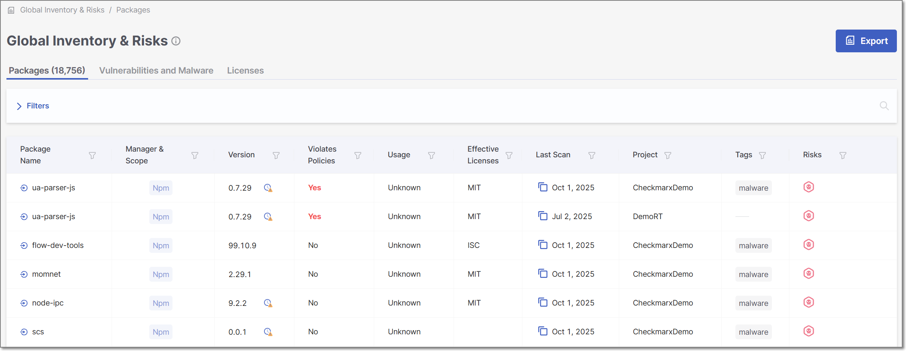
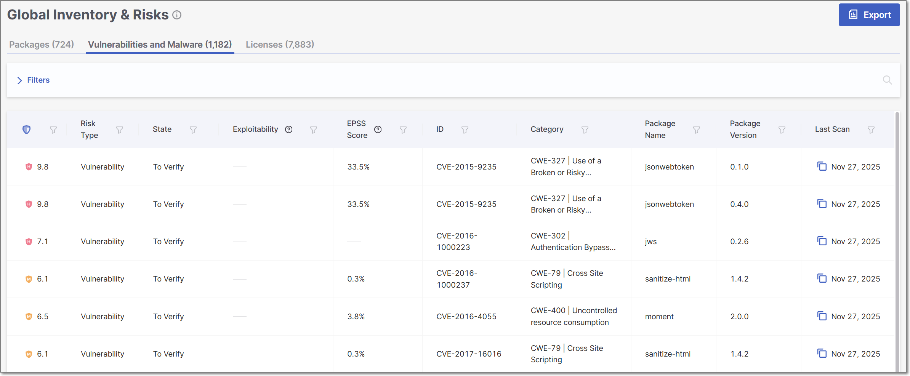
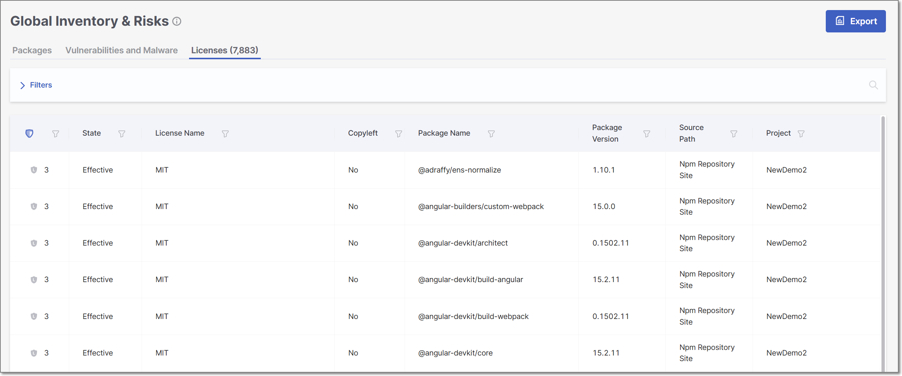

# Viewing the Global Inventory and Risks Page

The Global Inventory & Risks page displays a comprehensive list of the packages identified in your account as well as the risks associated with those packages. This info includes vulnerabilities, outdated versions, policy violations, etc. By showing info for all Projects, this screen enables you to prioritize remediation of risks and vulnerable packages by seeing which ones are affecting multiple Projects across your organization. It also helps you to coordinate efforts between different development teams.


The info shown on the Global Inventory & Risks page includes packages and risks identified in Projects to which the current user is not assigned. However, users can only open the Scan Results page for items that were identified in Projects to which that user is assigned.


<figure><figcaption></figcaption></figure>

The Global Inventory & Risks page is opened by clicking on the Global Inventory & Risks icon in the left navigation pane on the Dashboard (**Home page)**.

The screen includes three tabs:

* Packages (default) – shows info about all of the packages used in all the Projects in your organization.
* Risks – shows info about all of the vulnerabilities, operational, and legal risks across all the Projects in your organization.
* Licenses - shows info about all of the licenses that are associated with the open source packages used by your projects.

You can customize the report content by specifying which sections to include and applying the sorting and filters of the current display.

## Global Inventory and Risks Page - Packages Tab

The Global Inventory & Risks tab shows detailed info about the packages identified by the scans of all of your Projects. This info includes policy violations, vulnerabilities, outdated versions, etc. The total number of packages is shown in parentheses in the tab title.


If a package is used by multiple Projects, a separate record (row) is shown for each instance.


You can search for **Package Name**, **Violates Policies**, **License**, and **Project** using the search box. You can also set filters and sort by several key column headers.

You can export the data on this page as a CSV file. There is an option to export all data or only data shown based on the current filters.

Click on a specific row to open the Package Details page for that package in the Risk Report for the Project. For more information, see [Package Details Page](project-page-tabs.md#UUID-dcde0b63-2db7-9d78-09a4-dcc92d4a8d3d).


You can only open the Package Details page for packages that were identified in Projects which are assigned to your Team.


<figure><figcaption></figcaption></figure>


You may need to scroll horizontally to view all columns.


The following table describes the info shown in the Packages tab of the Global Inventory & Risks page.

<table data-header-hidden><thead><tr><th></th><th></th><th></th></tr></thead><tbody><tr><td><strong>Item</strong></td><td><strong>Description</strong></td><td><strong>Possible Values</strong></td></tr><tr><td><strong>Package Name</strong></td><td>
The name of a package used in one or more of the Projects in the organization.

Next to the package name, an icon is shown indicating how the package is used by the Project.

<strong>Tip</strong>

If the package name is used in more than one Project, it will appear on the list multiple times, one time for each Project that uses it.
</td><td>
e.g., javax.annotation:javax.annotation-api

 - <em>Direct</em> – the package is called directly by your source code

 - <em>Transitive</em> – the package is accessed indirectly, through other dependencies
</td></tr><tr><td><strong>Manager and Scope</strong></td><td>
Shows labels that Checkmarx applied to the package. There is a label indicating the package manager used for package resolution. In addition, the label “Test” is applied to all packages that have the word “test” in their file path.

Additional labels are applied to special types of dependencies.
</td><td><ul><li><strong>Package Manager</strong> - shows the package manager that was used for resolution, e.g., Maven, Pip, Nuget, Npm etc.</li><li><strong>Dev</strong> - is applied to dev dependencies.</li><li><strong>Test</strong> - is applied to all packages that have the word "test" in their file path.</li><li><strong>NPM Verified</strong> - is applied to packages for which the signatures were verified using <code>npm audit signatures</code>.</li><li><strong>Plugin</strong> - is applied to packages that relate to a plugin.</li></ul></td></tr><tr><td><strong>Version</strong></td><td>
The version of the package. Hover over the display to show the date of your version, and (if available) the version number and date of the latest version as well as the number of new versions since your most recent update.

If the version is outdated, an icon is shown next to the version number. If no icon is shown, the package is up to date.
</td><td>
e.g., 2.0.0

The package is outdated.
</td></tr><tr><td><strong>Violates Policies</strong></td><td>Indicates whether or not the package violates policies.</td><td>Yes, No</td></tr><tr><td>
<strong>Usage</strong>

(for Projects with Exploitable Path activated)
</td><td>Indicates whether or not this package is used (called) by your project’s source code.</td><td><ul><li><strong>Used</strong> - This package is used by your project’s source code.</li><li><strong>Potentially</strong> - This package is a dependency of a direct package that is used by your project’s source code.</li><li><strong>Unused</strong> - No usage of this package was found.</li><li><strong>Unknown</strong> - Checkmarx SCA could not determine whether the package is used.</li><li><strong>No SAST data</strong></li><li><strong>Package source code not available</strong></li><li><strong>Unsupported language</strong></li></ul></td></tr><tr><td><strong>Effective Licenses</strong></td><td>Shows all effective licenses that you have that are associated with this package. For multiple effective licenses, hover over the display to show all licenses.</td><td>e.g., GPL 2.0, Apache 2.1</td></tr><tr><td><strong>Last Scan</strong></td><td>
Last scan date of the <strong>primary branch</strong> of the Project containing the package.

<strong>Tip</strong>

If the Project has no primary branch, the date will reflect the last scan of the Project.

Click on the  icon to copy the scan ID.
</td><td>e.g., May 17, 2024</td></tr><tr><td><strong>Project</strong></td><td>
The name of the Checkmarx One Project where the package was identified.

<strong>Tip</strong>

If a package is used by multiple Projects, a separate record (row) is shown for each instance.
</td><td>e.g., Demo01</td></tr><tr><td><strong>Tags</strong></td><td>Shows both the scan tags and project tags associated with the most recent scan in which the package was identified.</td><td>e.g., Branch:v0.1.2</td></tr><tr><td><strong>Risks</strong></td><td>
A color coded bar graph indicating the number of vulnerabilities of each severity level.

Malicious Packages and Suspected Malware are indicated by the malicious icon .

You can set a filter to show only packages that contain the specified types and with the specified severity levels.
</td><td>
e.g.,

</td></tr><tr><td><strong>Secure Version</strong></td><td>Indicates whether or not a remediated version (i.e, a version with no vulnerabilities) of this package exists.</td><td><ul><li>Available</li><li>Not Available</li></ul></td></tr><tr><td colspan="3"><strong>Context Menu (top right of table)</strong></td></tr><tr><td>
<strong>Export CSV</strong>

</td><td>
Click on this option to download all of the information in this table (other than <em>Violates Policies</em> ) as a CSV file.

<strong>Tip</strong>

You can customize the report content by specifying which sections to include and applying the sorting and filters of the current display.
</td><td></td></tr></tbody></table>

## Global Inventory and Risks Page - Vulnerabilities and Malware Tab

The Vulnerabilities and Malware tab shows detailed info about all of the risks identified by the scans of all of your Projects. This info includes risk type, ID, publication date, etc. The total number of risks is shown in parentheses in the tab title.


If a risk applies to multiple Projects, a separate record (row) is shown for each instance.


You can search for **ID**, **Package**, and **Project** using the search box. You can also sort by column headers and set filters for each column (except for **Risk Type**).

You can export the data on this page as a CSV file. The file content is based on the current sorting and filtering of the table display.

Click on a specific row to open the Vulnerability Details page for that vulnerability in the Scan Results page for the Project. For more information, see [Risk Details Page](project-page-tabs.md#UUID-07a21b5d-72d7-69da-9320-fc8d5e505317).


You can only open the Vulnerability Details page for packages that were identified in Projects which are assigned to your Team.


<figure><figcaption></figcaption></figure>

The following table describes the info shown in the Risks tab of the Reports page.

<table data-header-hidden><thead><tr><th></th><th></th><th></th></tr></thead><tbody><tr><td><strong>Item</strong></td><td><strong>Description</strong></td><td><strong>Possible Values</strong></td></tr><tr><td><strong>Risk Level</strong></td><td>The severity level of the vulnerability, based on its CVSS score in the NVD.</td><td><ul><li><strong>HIGH</strong> - 7.0-10.0</li><li><strong>MEDIUM</strong> - 4.0-6.9</li><li><strong>LOW</strong> - 0.0-3.9</li></ul>
For more info see <a href="https://app.gitbook.com/s/XSPACE_PRODUCT_INFO/severity-levels">Severity Levels</a>.
</td></tr><tr><td><strong>Risk Type</strong></td><td>The type of risk.</td><td><em>Vulnerability</em>, <em>Operational</em>, or <em>Legal</em></td></tr><tr><td><strong>State</strong></td><td>Indicates the state of the vulnerability.</td><td><ul><li><strong>To Verify</strong> - This is the initial state of all vulnerabilities and suspected malware risks, indicating that it is a new finding that hasn’t yet been assessed by your AppSec team.</li><li><strong>Not Exploitable</strong> - Indicates that your team has determined that this risk doesn’t pose a threat to your application (and isn’t expected to cause a risk at any time in the future).</li><li><strong>Proposed Not Exploitable</strong> - Indicates that your team has suggested tentatively that this risk doesn’t pose a threat to your application.</li><li><strong>Confirmed</strong> - Indicates that your team has confirmed that this risk <strong>does</strong> pose a threat and requires mitigation.</li><li><strong>Urgent</strong> - Indicates that your team has determined that this risk poses an imminent threat and requires urgent mitigation.</li></ul></td></tr><tr><td><strong>Exploitability</strong></td><td>Shows which exploitability indicators apply to this vulnerability.</td><td><ul><li>
<strong>Exploitable Path</strong> - indicates that a path was detected from your source code to the vulnerable method in the package, enabling attackers to exploit the vulnerability.

<strong>Tip</strong>

Results are only returned if Exploitable Path was activated for this project and the project uses a language that is supported for Exploitable Path.
</li><li><strong>Known</strong> - This vulnerability is cataloged by CISA as a <a href="https://www.cisa.gov/known-exploited-vulnerabilities-catalog">Known Exploited Vulnerability</a> (KEV), indicating that it poses a severe and imminent threat.</li><li><strong>PoC</strong> - A Proof of Concept (POC) for exploiting this vulnerability is available in the wild, making it easy for threat actors to implement an exploitation of this vulnerability. We draw this info from Offensive Security's <a href="https://www.exploit-db.com/">Eploit Database</a>.</li></ul></td></tr><tr><td><strong>EPSS Score</strong></td><td>The EPSS (Exploit Prediction Scoring System) is a risk score provided by <a href="https://first.org">First</a>, indicating the likelihood of a vulnerability being exploited. The score is presented as a percentage, representing the likelihood of this vulnerability to be exploited within the next 30 days. Hovering over the score will display a percentile indicating the ranking of this risk relative to other vulnerabilities.</td><td>e.g., 2.1%</td></tr><tr><td><strong>ID</strong></td><td>
The ID of the CVE listing. The ID consists of the CVE prefix followed by the year that the CVE was discovered and the serial counter for that year's CVE listings.

<strong>Tip</strong>

Vulnerabilities discovered by the Checkmarx Vulnerability Research Team which are net yet catalogued as CVEs, are indicated by the “Cx” prefix.
</td><td>e.g., CVE-2019-12384</td></tr><tr><td><strong>Category</strong></td><td>The category of the vulnerability. For CWEs, the CWE is given as well as a brief description of the vulnerability.</td><td>e.g., CWE-89|SQL Injection, Malicious, Chainjacking etc.</td></tr><tr><td><strong>Package Name</strong></td><td>The name of the package in which the vulnerability was identified.</td><td>e.g., com.fasterxml.jackson.core:jackson-databind</td></tr><tr><td><strong>Package Version</strong></td><td>The version of the package in which the vulnerability was identified.</td><td>e.g., 2.9.8</td></tr><tr><td><strong>Last Scan</strong></td><td>
Last scan date of the <strong>primary branch</strong> of the Project containing the package.

<strong>Tip</strong>

If the Project has no primary branch, the date will reflect the last scan of the Project.

Click on the  icon to copy the scan ID.
</td><td>e.g., Jun 9, 2024</td></tr><tr><td><strong>Project</strong></td><td>
The name of the Project in the organization that has the risk.

<strong>Tip</strong>

If a risk applies to multiple Projects, a separate record (row) is shown for each instance.
</td><td>e.g., Demo01</td></tr><tr><td><strong>Detection/Publication</strong></td><td>
Click on the desired header to alternate between the detection and publication dates.
<ul><li><strong>Detection</strong> - the date that the risk was first detected in this project. For vulnerabilities that were first identified in this scan, the NEW label is shown next to the date.</li><li><strong>Publication</strong> - the date that this vulnerability was first officially published on a supported public Security Advisory.</li></ul></td><td>e.g., Jun 24, 2019</td></tr><tr><td><strong>Secure Version</strong></td><td>
Indicates whether or not a remediated version of the package where this vulnerability was identified exists.

<strong>Tip</strong>

In the context of the Risks tab, a version is considered secure as long as this particular vulnerability is remediated, even if the package has other vulnerabilities.
</td><td><ul><li>Available</li><li>Not Available</li></ul></td></tr><tr><td colspan="3"><strong>Context Menu (top right of table)</strong></td></tr><tr><td><strong>Export CSV</strong></td><td>
Click on this option to download all of the information in this table (in addition to <em>Risk Score</em>) as a CSV file.

<strong>Tip</strong>

You can customize the report content by specifying which sections to include and applying the sorting and filters of the current display.
</td><td>-</td></tr></tbody></table>

## SCA Global Inventory and Risks Page - Licenses Tab

The Licenses tab shows info about all of the licenses that are associated with the open source packages used by your project.

You can search for **License Name**, **Package Name**, and **Package Version** using the search box. You can also set filters and sort by column headers (except for **Project**).

You can export the data on this page as a CSV file. There is an option to export all data or only data shown based on the current filters.

Click on a specific row to open the Licenses page for that license in the Scan Results page for the Project. For more information, see [License Details Page](../../document/preview/365461/#UUID-8e77d945-c90d-a0ea-9716-ac65ef53f9dc).

<figure><figcaption></figcaption></figure>

The following table describes the info shown in the Licenses tab of the Global Inventory & Risks page.

<table data-header-hidden><thead><tr><th></th><th></th><th></th></tr></thead><tbody><tr><td><strong>Item</strong></td><td><strong>Description</strong></td><td><strong>Possible Values</strong></td></tr><tr><td><strong>Risk Level</strong></td><td>
Shows the severity level and score indicating the overall risk level associated with this license.

<strong>Tip</strong>

If this isn't the effective license for this package, then a high license score doesn't necessarily pose a legal risk.
</td><td><ul><li>High - 6-10</li><li>Medium - 4-5</li><li>Low - 1-3</li><li>Info - 0</li></ul></td></tr><tr><td><strong>State</strong></td><td>Indicates whether or not this license is the "effective" license for your organization's use of this package. Also, if the package to which the license applies has been muted or snoozed, this is indicated in the State column.</td><td><ul><li>To Verify</li><li>Effective</li><li>Not Effective</li><li>Muted Package</li><li>Snoozed Package</li></ul></td></tr><tr><td><strong>License Name</strong></td><td>The name of the license.</td><td>e.g., GPL 3.0, MIT etc.</td></tr><tr><td><strong>Copyleft</strong></td><td>The category of the license.</td><td><ul><li>No Copyleft</li><li>Full - Copyleft applies</li><li>Partial - Copyleft applies on modifications only</li><li>Empty</li></ul></td></tr><tr><td><strong>Package Name</strong></td><td>The name of the package in which the vulnerability was identified.</td><td>e.g., com.fasterxml.jackson.core:jackson-databind</td></tr><tr><td><strong>Package Version</strong></td><td>The version of the package in which the vulnerability was identified.</td><td>e.g., 2.9.8</td></tr><tr><td><strong>Source Path</strong></td><td>The source from which the license was identified.</td><td>
e.g., Manifest File, Npm Repository Site, Official Website, Statically Observed etc.

<strong>Tip</strong>

The category "Statically Observed" indicates that the license was identified in the source code (e.g., README files) using regex and other identification methods.
</td></tr><tr><td><strong>Project</strong></td><td>
The name of the Project in the organization that has the risk.

<strong>Tip</strong>

If a risk applies to multiple Projects, a separate record (row) is shown for each instance.
</td><td>e.g., Demo01</td></tr><tr><td colspan="3"><strong>Context Menu (top right of table)</strong></td></tr><tr><td><strong>Export CSV</strong></td><td>
Click on this option to download all of the information in this table (in addition to <em>Risk Score</em>) as a CSV file.

<strong>Tip</strong>

You can customize the report content by specifying which sections to include and applying the sorting and filters of the current display.
</td><td>-</td></tr></tbody></table>
