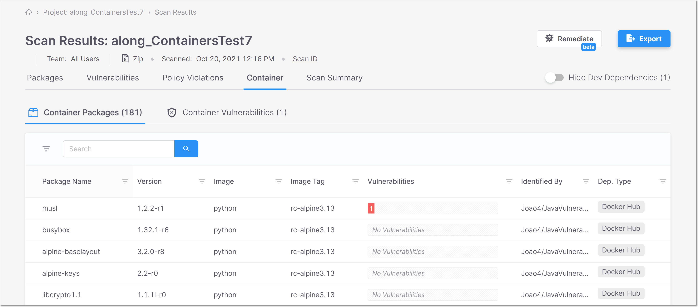

# Checkmarx SCA Release Notes December 2021

We are excited to announce important improvements in our Checkmarx SCA web application…

## Key improvements

### Container Scanning

<figure><figcaption></figcaption></figure>

In addition to scanning the packages in your source code, Checkmarx SCA now also scans the containers (i.e., Docker image files) on which your source code runs. Checkmarx SCA identifies each of the Docker files being used, extracts all layers of each Image file and identifies the packages used by each layer.

Detailed info about the vulnerabilities and vulnerable packages associated with containers are now shown in a separate Containers tab on the scan results page.

See full documentation [here](https://app.gitbook.com/s/XSPACE_USER_GUIDE/viewing-results/viewing-the-project-page/project-page-tabs#UUID-cb7b834c-d2fc-5c05-7b96-6955938c4e1a).

<figure><figcaption></figcaption></figure>

### Software Bill of Materials (SBOM)

Software Bill of Materials (SBOM), is a list of all components of a software product. SBOM reports follow a standard format that includes detailed information about each involved component. Checkmarx currently supports the CycloneDx standard and plans on adding additional standards soon.

Checkmarx SCA leverages our existing infrastructure for identifying vulnerabilities as well as license and supply chain risks to supplement the standard SBOM info. This creates an SBOM that provides real insight into the risks associated with your 3rd party components.

See full documentation [here](https://app.gitbook.com/s/XSPACE_USER_GUIDE/generating-sca-reports/sbom-reports).

Generate an SBOM report on the Project page for the relevant Project.

<figure><figcaption></figcaption></figure>

### Checkmarx SCA Resolver Updates

We have released several new versions of Resolver with a wide range of improvements and bug fixes. The most recent release is 1.5.68.

The following are some highlights from the recent releases:

* Nuget projects can now be resolved through Nuget CLI when resolution through dotnet is not available.
* For Carthage, we implemented a client balancer to support more Github tokens.
*   Container Scan - The new container scan feature is also available for scans run via Checkmarx SCA Resolver. To run the containers scan, you need to add the `--scan-containers` flag to the run command.

    

We are in the process of rolling-out this feature, so it is not yet available yet for all tenant accounts.

## Improvements

| Status | Item                   | Description                                                                                                                  |
| ------ | ---------------------- | ---------------------------------------------------------------------------------------------------------------------------- |
| UPDATE | Show CVSS v2.0/3.0/3.1 | Checkmarx SCA now shows the CVSS score and additional data for v3.1 in addition to previously supplied data for 2.0 and 3.0. |

## Bug Fixes

| Status | Item                                          | Description                                                                                                                                      |
| ------ | --------------------------------------------- | ------------------------------------------------------------------------------------------------------------------------------------------------ |
| FIXED  | Apache Licenses                               | Fixed problem with missing Apache licenses.                                                                                                      |
| FIXED  | Exploitable Path using Checkmarx SCA Resolver | When a scan is initiated via Resolver for a Project with Exploitable Path enabled in the web console, the Exploitable Path now runs as expected. |
| FIXED  | Policy Management                             | Fixed issue that creating rules based on CVE ID hadn’t been working properly.                                                                    |
