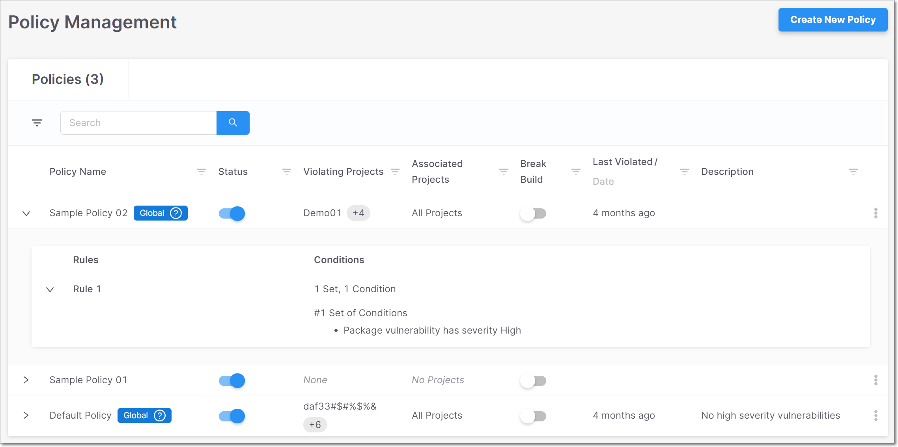
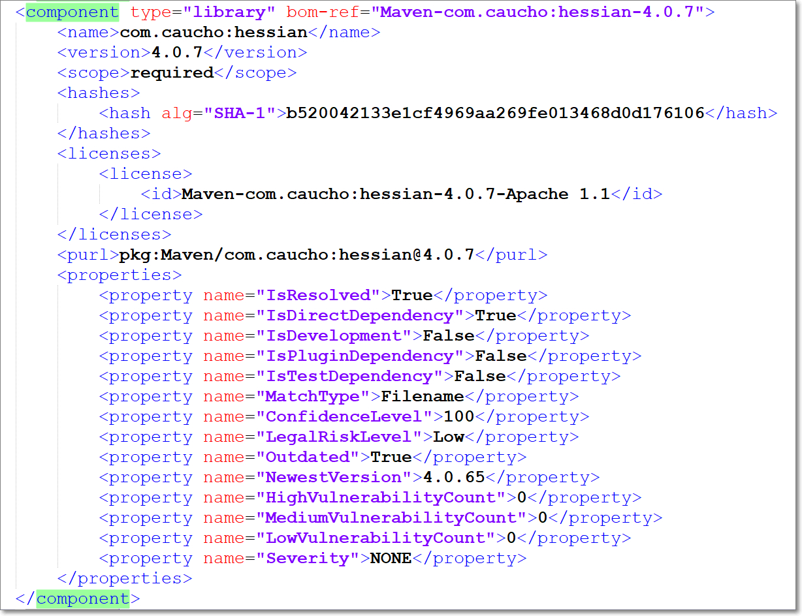

# Checkmarx SCA Release Notes November 2021

We are excited to announce important improvements in our Checkmarx SCA web application. We have added a new [Policy Management](checkmarx-sca-release-notes-november-2021.md#UUID-85e5045b-fc57-8249-72f1-239d23df2881_id_CheckmarxSCAReleaseNotesNovember2021-PolicyManagement) feature that enables creation of customized compliance policies. We also added support for [GO Language](checkmarx-sca-release-notes-november-2021.md#UUID-85e5045b-fc57-8249-72f1-239d23df2881_id_CheckmarxSCAReleaseNotesNovember2021-SupportforGoLanguage), and made various other improvements.

## Key improvements

### Policy Management

We added a Policy management feature that enables you to apply customized security rules to the open source packages in your Projects. This makes it easy to identify Projects that are non-compliant with your self-defined security policies. Each Policy consists of a series of rules that define a custom compliance threshold.

The system comes with default Policies that are automatically applied to all Projects in your account. You can also create custom Policies, which you then assign to specific Projects or apply “Globally” to all Projects in your account. For more info about Policies, see [Policy Management](https://app.gitbook.com/s/XSPACE_USER_GUIDE/policy-management).

<figure><figcaption></figcaption></figure>

### Support for Go Language

We added support for Go language projects, using manifest files`go.mod` and `go.sum`.


Currently, Go is only supported when using Checkmarx SCA Resolver. For Checkmarx SCA Resolver installation procedures, see [Go Support in Checkmarx SCA](https://app.gitbook.com/s/XSPACE_RESOLVER/checkmarx-sca-resolver-download-and-installation/installing-supported-package-managers-for-resolver#UUID-6a56714b-6836-a1e0-3c21-d1fbb411cf4d_id_InstallingSupportedPackageManagersforResolver-GoSupportinCheckmarxSCA).


### Checkmarx SCA Resolver Updates

We have released several new versions of Resolver with a wide range of improvements and bug fixes. The most recent release is 1.5.57.

The following are some highlights from the recent releases:

* The Checkmarx SCA Resolver installation files are created using a new method that adds the necessary dependencies to the zip for execution.
* Windows binaries are now signed by Checkmarx
* Added ability to export an SBOM report (CycloneDx format)

For additional details, see [Checkmarx SCA Resolver Changelog](https://app.gitbook.com/s/XSPACE_RESOLVER/checkmarx-sca-resolver-changelog).

<figure><figcaption></figcaption></figure>

## Bug Fixes

| Status | Item                | Description                                                                      |
| ------ | ------------------- | -------------------------------------------------------------------------------- |
| FIXED  | License correlation | Removed mistaken correlation for EPL 1.0.                                        |
| FIXED  | Hide failed scans   | Fixed issue that couldn’t hide failed scans when the most recent scan succeeded. |
