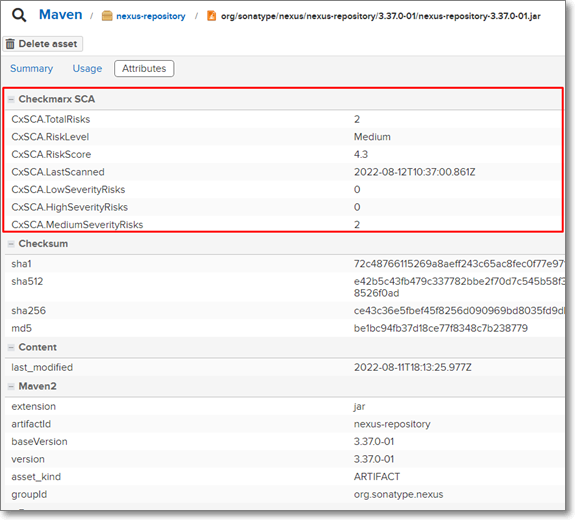

# Checkmarx SCA Release Notes November 2022

We are excited to announce important improvements in our Checkmarx SCA web application…

## Key improvements

### Nexus Plugin

We have released a new plugin for running Checkmarx SCA scans on the artifacts in your Nexus Repository Manager. This integrates scanning of artifacts into your DevOps workflow, providing easy visibility into possible risks that could make your applications vulnerable.

The plugin uses the scan results to enrich the attributes shown in the Nexus UI.

<figure><figcaption></figcaption></figure>

You can set a risk threshold so that artifacts with risks of a specified severity level will automatically be blocked from download. When you install the plugin, Checkmarx scans all artifacts currently in your repository. In addition, each time that an artifact is downloaded, the plugin runs a Checkmarx SCA scan on that artifact. You can also create a custom task to run scheduled SCA scans.


This is a FREE tool. No Checkmarx account required.


To learn more about the plugin, see [Checkmarx SCA Plugin for Nexus](../../document/preview/127324/#UUID-a1dd9aaf-156a-43bf-dc1c-0cbe92571db5).

## Improvements and Bug Fixes

| Status | Item               | Description                                                                             |
| ------ | ------------------ | --------------------------------------------------------------------------------------- |
| FIXED  | Nuget dependencies | Resolved issue that "CentralTrasitive" type dependencies weren't being parsed in Nuget. |
| FIXED  | Yarn in cloud      | Resolved issue that Checkmarx SCA wasn't identifying certain cloud instances of Yarn.   |

## Checkmarx SCA Resolver Updates

We have released several new versions of Resolver with a wide range of improvements and bug fixes. Download the latest version of SCA Resolver [here](https://app.gitbook.com/s/XSPACE_RESOLVER/checkmarx-sca-resolver-download-and-installation).

### Improvements in Version 1.14.2

*   We changed the format of the configuration file from .ini to .yml.

    

We temporarily continue to support .ini format. However, once version 2.0 is released (scheduled for end of February) this format won't be supported. Please make sure to migrate the configuration files in all of your environments to the yaml format by that time.

* Added Syft integration. Use the `--use-syft` flag in order to use Syft for container image resolution.
* Uses image resolver version 1.0.11.
* Enable adding tags to projects (`--project-tags`) and scans (`--scan-tags`) .
* The project teams flag (`-t`| `--project-teams`) flag can now be used to update the teams assigned to an existing project. (Previously, it could only assign teams to a new project.)
