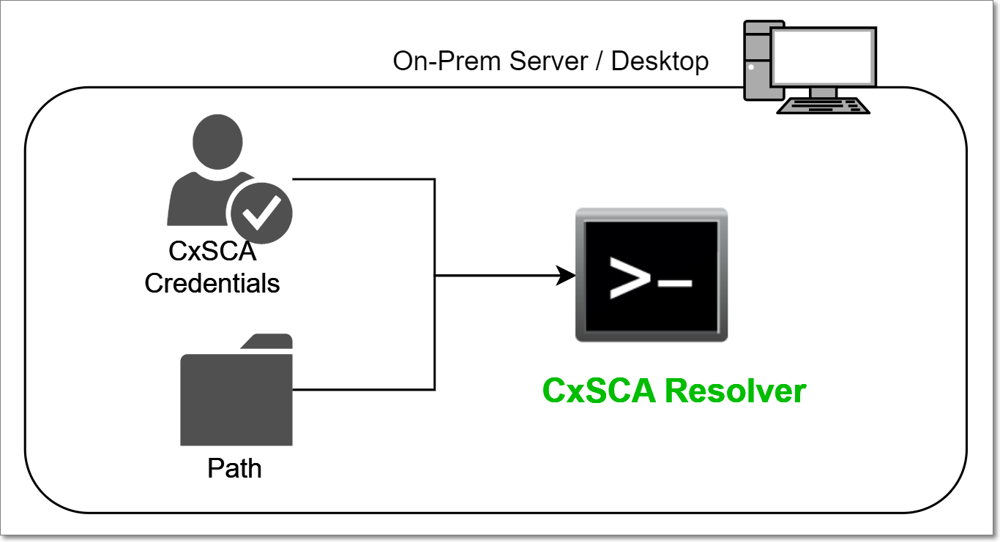
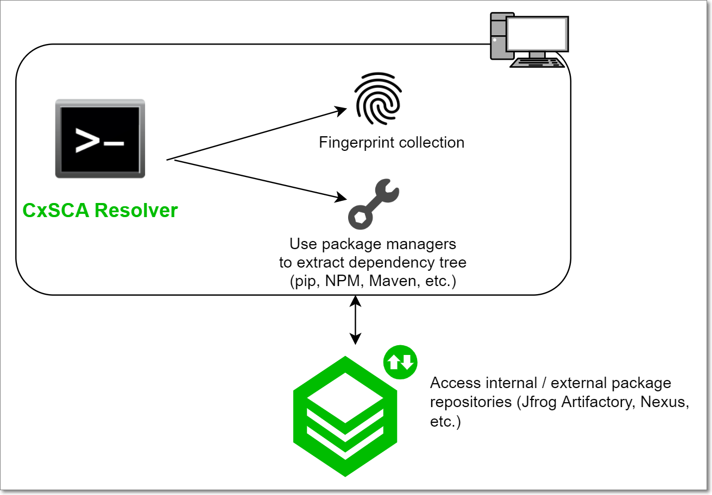
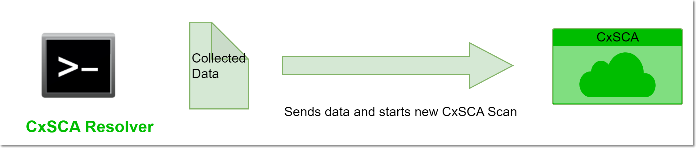
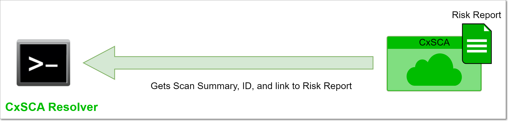

# Checkmarx SCA Resolver

Checkmarx SCA Resolver is an on-prem utility that enables you to resolve and extract dependencies and fingerprints from your source code and send them to the Checkmarx SCA cloud platform for risk analysis. The Resolver uses command line interface (CLI) commands to configure and scan your Projects.


Checkmarx SCA Resolver enables you to run a comprehensive SCA scan without the need to send your actual source code to the cloud. It also enables you to scan private (local) dependencies that aren’t accessible to the Checkmarx SCA cloud platform.


## Overview of the Checkmarx SCA Resolver Process Flow

This section gives you a quick overview of how the Checkmarx SCA Resolver works.

### Stage 1: Run Resolver On-Prem

Run Checkmarx SCA Resolver on your local computer, specifying the path to the source code folder and your Checkmarx SCA credentials.

<figure><figcaption></figcaption></figure>

### Stage 2: Resolver Collects Data

Checkmarx SCA Resolver collects fingerprints and dependency trees, using pre-installed package managers.

<figure><figcaption></figcaption></figure>

### Stage 3: Resolver Sends Data to the Cloud

Checkmarx SCA Resolver sends the collected data to the Checkmarx SCA Cloud and initiates a scan.

<figure><figcaption></figcaption></figure>

### Stage 4: Checkmarx SCA Returns the Scan Results

The scan results, provided by the Checkmarx SCA Cloud, are displayed in the CLI, in the form of a brief Risk Report Summary. You can also view a detailed Risk Report in the Checkmarx SCA web portal.

<figure><figcaption></figcaption></figure>

## What data is sent to the Checkmarx SCA Cloud?

After the File Analysis and Dependency Resolution are completed on-prem, the output of the analysis, the “evidence files”, are sent to the cloud for the final process of Evidence Analysis.


In Online mode this occurs immediately, and in Offline mode this occurs when the Upload command is run.


- The project name
- List of all file names and relative paths (except the ones that were excluded from the scan)
- Various checksums of the files (SHA-1, SHA-1 on content without spaces, etc.)
- Manifest files (except for scans run via Resolver with the `--no-upload-manifest` flag)


The complete list of files that are sent to the cloud can be seen in [Files Used for Manifest Resolution](files-used-for-manifest-resolution.md).


- Names of dependencies extracted from manifest files
- Scan errors and warnings such as “Failed resolving dependencies”. Each warning message may contain a file path as an argument.
- SAST Exploitable Path Query result (for Exploitable Path scans)
