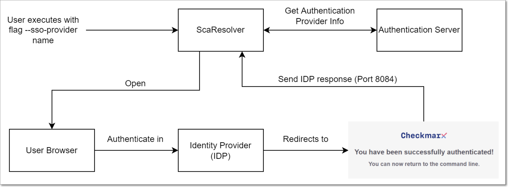

# SAML Authentication for Checkmarx SCA Resolver

In order to run Checkmarx SCA Resolver in Online or Upload mode, you need to provide authentication credentials. For the standard authentication method, this is done by providing your Checkmarx SCA username and password. Alternatively, if you have integrated your Checkmarx SCA account with a SAML provider (see [SSO Authentication](https://app.gitbook.com/s/XSPACE_USER_GUIDE/user-management-and-access-control/sso-authentication)), you can authenticate for Checkmarx SCA Resolver via your SAML provider.

In order to use SAML authentication, you need to provide the name of your SSO provider in the Resolver execution command. When the command is run, a browser will open, prompting you to authenticate with your SAML provider. Once the authentication has been completed you can resume using Checkmarx SCA Resolver from the Command interface.


Because the browser interaction is a necessary part of the SAML authentication process, we don’t recommend using SAML authentication in pipelines.


<div align="left"><figure><figcaption></figcaption></figure></div>

## Run Command for SAML Authentication

In order to use SAML authentication for Checkmarx SCA Resolver, in the run command for Online and Upload modes, use the following arguments:

`-a | --account: your Checkmarx SCA account name`

`--sso-provider: the name of your SAML provider`


The following arguments, which are used for standard authentication, are not used with SAML authentication:

`-u : your username`

`-p : your password`


The following example shows a run command in Online mode using SAML authentication:



```
./ScaResolver -s /Users/DemoUser/MyApp -n MyApp -a Checkmarx --sso-provider okta
```



```
./ScaResolver.exe -s C:\Users\DemoUser\MyApp -n MyApp -a Checkmarx --sso-provider okta
```


